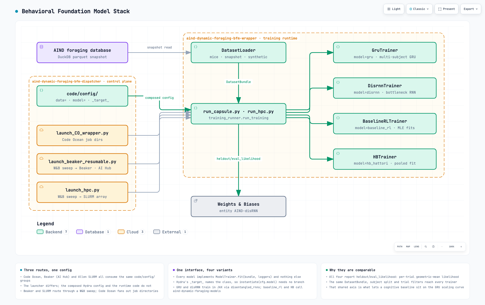
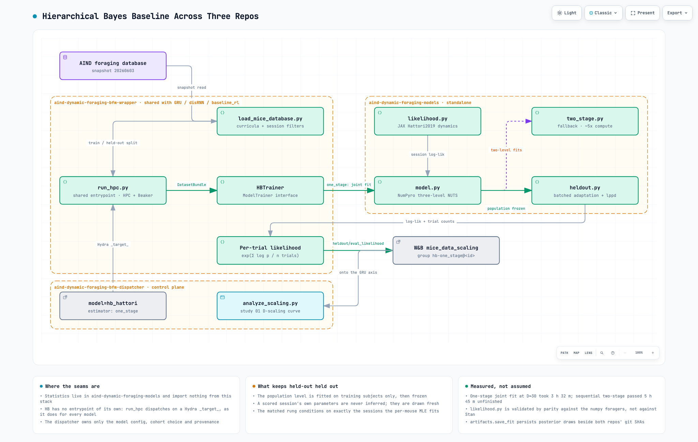

# Diagrams

Architecture diagrams for the stack as a whole. These describe how the repos fit together
and stay true regardless of which studies exist, which is why they live here rather than in
any one `studies/<study>/figures/` — those hold a study's own results.

Each diagram is a typed JSON source plus a generated HTML viewer and a PNG still.
Regenerate after editing the source, from the repository root:

    ARCHIFY=<path to the archify skill>/bin/archify.mjs   # e.g. ~/.claude/skills/archify/...

    node "$ARCHIFY" deliver architecture \
      docs/diagrams/<name>.architecture.json docs/diagrams/<name>.html --quality showcase
    node "$ARCHIFY" visual-check docs/diagrams/<name>.html

`visual-check` needs Chrome and writes the screenshots the PNG is cropped from; it reports
`skipped` on hosts without it (the HPC login node, for one), so regenerate stills on a
machine that has a browser. The committed `<name>.png` is the `2048x1320.light` capture
with the trailing background band trimmed; the raw `<name>.visual-check.<W>x<H>.<theme>.png`
files are intermediates and are not committed.

**Re-render after editing a source.** The `.html` and `.png` are build outputs, so a source
edit that is not followed by `deliver` leaves the picture readers see contradicting the
source — which is exactly how the pre-rename repo names survived in these diagrams until
[#111](https://github.com/AllenNeuralDynamics/aind-dynamic-foraging-bfm-dispatcher/issues/111).

GitHub renders neither the HTML nor inline SVG, so the PNG is what appears inline below and
each one links through to the interactive viewer via
[raw.githack](https://raw.githack.com/AllenNeuralDynamics/aind-dynamic-foraging-bfm-dispatcher/main/docs/diagrams/).

| diagram | subject |
|---|---|
| `bfm-stack` | The whole behavioral foundation model stack: three launch routes onto one Hydra config, and all four model variants — GRU, disRNN, baseline RL, HB — behind one `ModelTrainer` interface |
| `hb-stack` | The hierarchical Bayes baseline across dispatcher, wrapper and models: which repo owns which part of the fit, and where the held-out boundary sits |

## bfm-stack

## hb-stack

