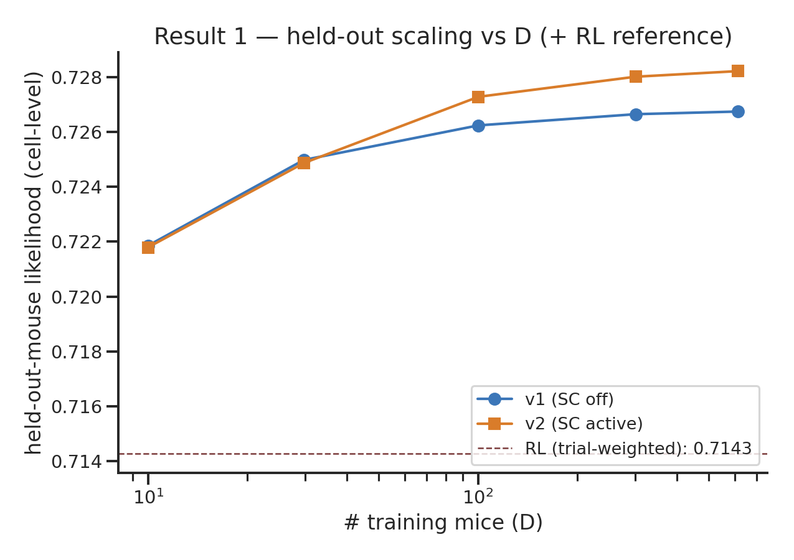

# Result 1 — held-out scaling curve (cell-level, n=15 matched pairs)

| D | v1 (SC off) | v2 (SC on) | Δ(v2−v1) |
|---|---|---|---|
| 10 | 0.7219 | 0.7218 | −0.00006 |
| 30 | 0.7250 | 0.7249 | −0.00011 |
| 100 | 0.7262 | 0.7273 | +0.00104 |
| 300 | 0.7267 | 0.7280 | +0.00137 |
| 614 | 0.7268 | 0.7282 | +0.00148 |

Paired across 15 cells: mean Δ=**+0.00074**, 12/15 positive, paired t p=**0.0015**, Wilcoxon p=**0.0043**. Curve is saturating over this D range. RL reference (trial-weighted pooled **0.7143**, dashed line on figure) is below every GRU cell — see [r8](r8-gru-vs-rl-baseline.md) for the paired test.

## Related

- [[r2-per-mouse-repeated-measures]] — per-mouse pairing for the same effect.
- [[r3-bootstrap-cis]] — CIs on the shape of this curve.
- [[r8-gru-vs-rl-baseline]] — RL reference paired test.
