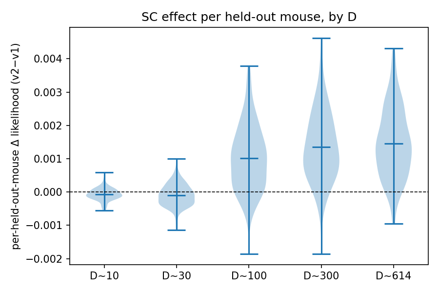

# Result 2 — per-held-out-mouse repeated measures (n=149 mice/D, paired by mouse)

| D | mean Δ | median Δ | % mice improved | Wilcoxon p |
|---|---|---|---|---|
| 10 | −0.00007 | −0.00008 | 34% | 3.2e-06 |
| 30 | −0.00010 | −0.00010 | 36% | 3.3e-04 |
| 100 | +0.00102 | +0.00096 | 85% | 1.3e-20 |
| 300 | +0.00135 | +0.00124 | 93% | 7.5e-24 |
| 614 | +0.00146 | +0.00138 | 95% | 1.5e-24 |

Per-mouse pairing makes the effect overwhelmingly significant (p~1e-20–1e-24) and shows the shape: **neutral-to-slightly-negative at small D** (D=10: 34% improve), then robustly positive and increasing (85%→95% as D 100→614). The small-D per-mouse Δ matches the independent cell-level aggregate (both ≈−0.0001 at D=10) — a consistency check.

> **Dedup note.** Offline per-subject re-runs had duplicate runs for 10/30 (variant,ratio,seed) cells (validation + mass-launch + BLAS retries); `build_report.py` keeps one run/cell. This corrected D=10 from a spurious +0.00031/68% (double-counted v1 seed-0) to −0.00007/34%; large-D unchanged. The cell-level test ([r1](r1-heldout-scaling-curve.md)) was never affected.

## Related

- [[r1-heldout-scaling-curve]] — independent cell-level aggregate.
- [[r3-bootstrap-cis]] — CIs on per-mouse increments.
- [[r4-zeroshot-vs-adapted]] — adaptation vs. zero-shot decomposition.
