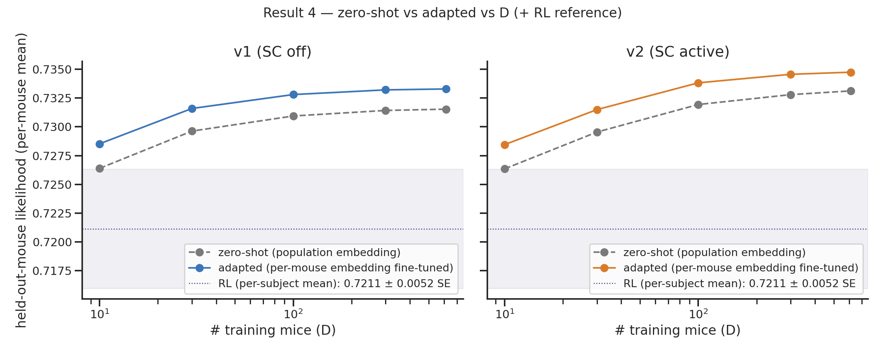

# Result 4 — zero-shot vs adapted held-out generalization

Zero-shot = held-out mouse assigned the **population-mean embedding**, no adaptation. Adapted = embedding fine-tuned on ~half its sessions (test on the other half). Per-mouse means.

| D | v1 zero | v1 adapt | gap | v2 zero | v2 adapt | gap |
|---|---|---|---|---|---|---|
| 10 | 0.7264 | 0.7285 | +0.0021 | 0.7264 | 0.7285 | +0.0021 |
| 100 | 0.7309 | 0.7328 | +0.0019 | 0.7319 | 0.7338 | +0.0019 |
| 614 | 0.7315 | 0.7333 | +0.0018 | 0.7331 | 0.7347 | +0.0016 |

- **Adaptation buys ~+0.002 and the gap is flat across D** — the "average mouse" already predicts a new mouse to within ~0.3% of full adaptation. Subject-specific adaptation barely matters ⇒ few-shot efficiency is unlikely to be the scaling win.
- **Zero-shot scales with D** (v1 +0.0051, v2 +0.0068 over D=10→614) but **saturates ~D=100**, same shape as adapted.
- **SC's large-D edge shows even at zero-shot** (v2>v1 ~+0.0016 at D=614) — the frozen shared session-conditioning generalizes better when trained on more mice.
- RL reference (per-subject mean **0.7211** ± 0.0052 SE, dotted band on figure) sits **below the zero-shot GRU curve at every D ≥ 30** — even a brand-new mouse with only the population embedding beats fitting that mouse's own data with a per-mouse Q-learner (see [r8](r8-gru-vs-rl-baseline.md) for the paired test).

## Related

- [[r5-fewshot-adaptation]] — what happens between K=0 (zero-shot) and K=full (adapted).
- [[r8-gru-vs-rl-baseline]] — paired RL comparison referenced here.
