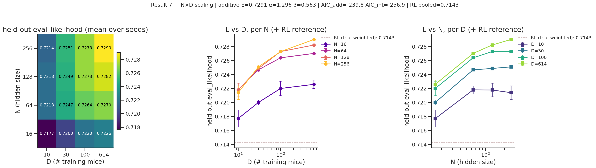

# Result 7 — N × D joint scaling grid (Chinchilla-style)

<!-- BEGIN result-7 -->
[regenerated by `analysis/update_final_report_nxd.py` — do not edit by hand]

*Heatmap and paired slices through the N×D grid. D saturates by ~100 mice at each hidden size, while the fixed-D N gain grows modestly from D=10 to D=614.*

Grid: N (hidden_size) ∈ {16, 64, 128, 256} × D ∈ {10, 30, 100, 614} × 3 seeds (16 (N,D) cells). H128 column re-used from `v2-sc-active`; D=30 for H16/H64/H256 comes from the g6e gap-fill. Metric: aggregate `heldout/final/eval_likelihood` across the same fixed held-out mouse set (~149 mice).

Mean L grid (held-out eval likelihood):

| N | D=10 | D=30 | D=100 | D=614 | Δ (D100→D614) | frac of D-gain by D=100 |
|---|---|---|---|---|---|---|
| 16 | 0.7177 | 0.7200 | 0.7220 | 0.7226 | +0.0006 | 88% |
| 64 | 0.7218 | 0.7247 | 0.7264 | 0.7270 | +0.0006 | 88% |
| 128 | 0.7218 | 0.7249 | 0.7273 | 0.7282 | +0.0009 | 85% |
| 256 | 0.7214 | 0.7251 | 0.7273 | 0.7290 | +0.0017 | 77% |

- *D saturates by ~100 across every N tested* (mean 85% of D-gain captured by D=100). Saturation is *not* a hidden-size artifact — it persists from H=16 to H=256.
- *N-axis gain at fixed D grows weakly with D* (Chinchilla-style interaction). N=16→256 gain: +0.0037 at D=10, +0.0064 at D=614 (1.7×). Qualitative support for an N×D synergy, but absolute magnitudes are small (<0.01 nats/trial).
- Additive fit `L = E + A·N^{-α} + B·D^{-β}`: E≈0.729 (single irreducible floor), α≈1.30 (N), β≈0.56 (D); N-axis dominates within this grid.
- Interaction-term fit ΔAIC vs additive: -17.1; log-log interaction p=0.311. Treat the nonlinear interaction fit as descriptive because the grid remains small relative to the number of fit parameters.
- *Verdict*: same predictability ceiling story as Result 1; adding D=30 fills the low-data bend but does not by itself create new headroom. RL reference (trial-weighted pooled **0.7143**, dashed line on slice panels) sits below every (N, D) cell. See `nxd_scaling_verdict.md` for the fit details.

Source W&B groups: `nxd-grid@20260623-102649`, `nxd-grid@20260624-141106`, `v2-sc-active@20260622-144622`.
<!-- END result-7 -->

## Related

- [[r1-heldout-scaling-curve]] — 1-D D-axis scaling at fixed H=128 (this report's D=128 column reuses that data).
- [[r3-bootstrap-cis]] — CI on the D-axis shape this grid extends.
- [[r8-gru-vs-rl-baseline]] — RL reference band overlaid on this figure.
- `nxd_scaling_verdict.md` — fit details (R², additive vs interaction models).
