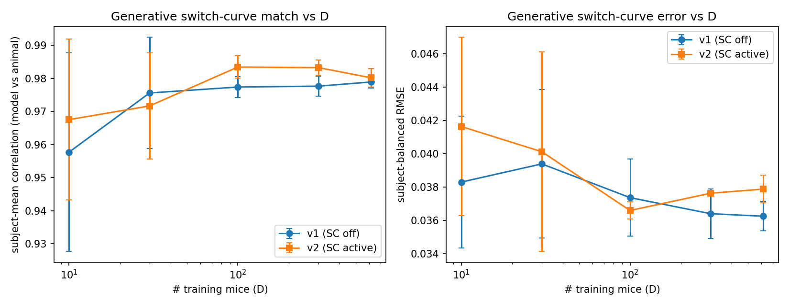
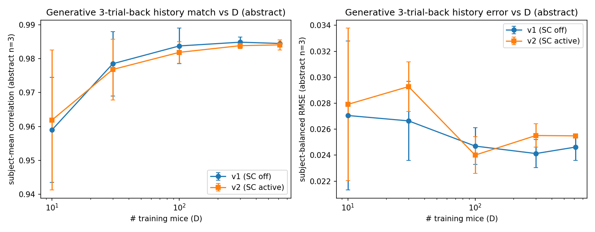

# Result 9 — generative model-vs-animal behavioral match vs D (2nd-order validation)

Roll each trained GRU out as a generative agent on the curriculum task and compare two model-vs-animal behavioral curves to the real mouse. Headline = subject-mean Pearson correlation; companion = subject-balanced RMSE (√ of MSE over per-subject mean deltas). Both on the **combined** session partition. 30 runs = 5 D × 3 seeds × {v1 SC off, v2 SC active}. Source W&B groups `generative-v{1,2}@20260623-18074*`. Wrapper 916d3b4.

## Figures

*Switch-triggered curve: P(switch | reward at t × preceding run length). 4 bins. The corr~0.96 headline.*

*History-pattern curve: P(switch | last 3 trials' (choice, reward) sequence), abstract encoding (32 bins).*

## Methods — what the two curves are

**Switch-triggered (`post_switch_by_reward_and_run_length`)** — for every **choice switch** (`choice[t] ≠ choice[t−1]`; block info is stripped, so "switch" here means a left↔right flip, **not** a block reversal), bin by (reward on the switch trial t: rewarded / unrewarded) × (length of the preceding same-choice run: 1 / >1). Per bin, report **P(switch on t+1)** — the probability the mouse keeps switching one more trial. 4 bins. Implemented in `aind-disrnn-wrapper/code/post_training_analysis/generative_analysis.py:1962-2019`.

**History-dependent (`history_dependent`)** — encode each trial as one of `{L, l, R, r}` (uppercase = rewarded, L/R = left/right). For each trial t ≥ N, the **history pattern** is the concatenation of the last N trials' chars. Per pattern, report **P(switch on t)** = P(choice[t] ≠ choice[t−1]). Two encodings stored in parallel: `abstract` canonicalises the first trial of the pattern to `A` (so `LrR` and `Rlr` collapse to `AbA`); `detailed` keeps L/R identity. `n_back ∈ {1, 2, 3}` (wrapper default `_DEFAULT_HISTORY_MAX_TRIALS_BACK = 3`). Pattern counts: abstract `{n=1: 2, n=2: 8, n=3: 32}`; detailed `{n=1: 4, n=2: 16, n=3: 64}`. Implemented in `generative_analysis.py:953-1080, 2032-2121`.

For every (variant, D) cell the correlation and RMSE below are means of the 3-seed cells; SDs in the JSON.

## Results

<!-- BEGIN result-9 -->
[regenerated by `analysis/generative_match.py` — do not edit by hand]

**(a) Switch-triggered curve — `post_switch_by_reward_and_run_length` (4 bins; subject-mean correlation):**

| D | v1 corr | v2 corr | v1 RMSE | v2 RMSE |
|---|---|---|---|---|
| 10  | 0.9577 | 0.9675 | 0.0383 | 0.0416 |
| 30  | 0.9756 | 0.9717 | 0.0394 | 0.0401 |
| 100 | 0.9774 | 0.9834 | 0.0374 | 0.0366 |
| 300 | 0.9777 | 0.9833 | 0.0364 | 0.0376 |
| 614 | 0.9789 | 0.9802 | 0.0362 | 0.0379 |

**(b) History-pattern curve — `history_dependent`, abstract encoding (subject-mean correlation):**

| D | n=1 corr | n=2 corr | n=3 corr | n=1 RMSE | n=2 RMSE | n=3 RMSE |
|---|---|---|---|---|---|---|
| v1 10  | 1.0000ⁿ | 0.9932 | 0.9590 | 0.0209 | 0.0233 | 0.0271 |
| v1 30  | 1.0000ⁿ | 0.9935 | 0.9785 | 0.0248 | 0.0241 | 0.0266 |
| v1 100 | 1.0000ⁿ | 0.9958 | 0.9838 | 0.0237 | 0.0228 | 0.0247 |
| v1 300 | 1.0000ⁿ | 0.9963 | 0.9849 | 0.0223 | 0.0219 | 0.0241 |
| v1 614 | 1.0000ⁿ | 0.9960 | 0.9845 | 0.0224 | 0.0223 | 0.0246 |
| v2 10  | 1.0000ⁿ | 0.9935 | 0.9619 | 0.0219 | 0.0238 | 0.0279 |
| v2 30  | 1.0000ⁿ | 0.9940 | 0.9768 | 0.0253 | 0.0249 | 0.0293 |
| v2 100 | 1.0000ⁿ | 0.9953 | 0.9819 | 0.0230 | 0.0222 | 0.0240 |
| v2 300 | 1.0000ⁿ | 0.9955 | 0.9838 | 0.0200 | 0.0222 | 0.0255 |
| v2 614 | 1.0000ⁿ | 0.9956 | 0.9841 | 0.0209 | 0.0225 | 0.0255 |

ⁿ abstract n=1 has only 2 bins (`A` rewarded last vs `a` unrewarded last) → Pearson r is mathematically ±1; ignore that column.

**(c) History-pattern curve — `history_dependent`, detailed encoding (subject-mean correlation):**

| D | n=1 corr | n=2 corr | n=3 corr | n=1 RMSE | n=2 RMSE | n=3 RMSE |
|---|---|---|---|---|---|---|
| v1 10  | 0.9568 | 0.9849 | 0.9369 | 0.0204 | 0.0238 | 0.0257 |
| v1 30  | 0.9900 | 0.9924 | 0.9746 | 0.0244 | 0.0238 | 0.0253 |
| v1 100 | 0.9966 | 0.9946 | 0.9834 | 0.0225 | 0.0224 | 0.0238 |
| v1 300 | 0.9982 | 0.9958 | 0.9872 | 0.0215 | 0.0217 | 0.0229 |
| v1 614 | 0.9987 | 0.9959 | 0.9881 | 0.0214 | 0.0223 | 0.0239 |
| v2 10  | 0.9560 | 0.9831 | 0.9333 | 0.0201 | 0.0236 | 0.0258 |
| v2 30  | 0.9879 | 0.9935 | 0.9712 | 0.0252 | 0.0249 | 0.0268 |
| v2 100 | 0.9919 | 0.9932 | 0.9808 | 0.0228 | 0.0217 | 0.0234 |
| v2 300 | 0.9979 | 0.9951 | 0.9857 | 0.0201 | 0.0222 | 0.0239 |
| v2 614 | 0.9990 | 0.9957 | 0.9872 | 0.0210 | 0.0226 | 0.0237 |

**D=10 → D=614 correlation gain (v1, headline metrics):** 4-bin switch curve +0.021; abstract n=3 (32 bins) +0.026; detailed n=1 (4 bins, WSLS-equivalent) +0.042; **detailed n=3 (64 bins) +0.051**. Fine-grained history metrics surface a ~2× larger D-scaling signal than the coarse 4-bin curve, while still saturating by D≈100.
<!-- END result-9 -->

## Findings

- **Match is high at every D** on every metric (corr ≥ 0.93, RMSE ≤ 0.04 even at D=10). The model is already a good behavioral generator with as few as 10 training mice — this is the corr~0.96 headline, generalised across metrics.
- **All metrics saturate by D ≈ 100**, mirroring the held-out-LL scaling shape (r1). Late-D incremental gain (D=100→614) is tiny on every metric (≤ +0.005 corr, ≤ 0.001 RMSE).
- **Fine-grained history metrics show a larger D-scaling signal.** The 4-bin switch-curve sees a +0.021 corr gain from D=10→614; the 64-bin `detailed n=3` history pattern sees +0.051. Bin count alone partly explains this (more rows → noisier r at small D), but the **same monotonic shape** across n_back ∈ {1,2,3} suggests the GRU's 3-trial-back conditional structure genuinely sharpens with more training data — just not enough to break the D≈100 saturation.
- **SC (v2) edge is small and mixed across both metrics.** Slight v2 advantage in 4-bin correlation at D≥100 (0.983 vs 0.977), no consistent advantage in the history-pattern panels. RMSE is comparable or marginally higher under v2 at small D. Same conclusion as in r1: SC adds a real but small bump; this 2nd-order check does not amplify it.
- **No new headroom revealed.** The 2nd-order generative check corroborates the 1st-order LL story — saturating-by-D≈100, near-ceiling absolute fit, small SC bump — rather than exposing a regime where data-scaling pays off more.

## Available generative metrics (what the JSON contains)

The wrapper writes `model_vs_animal_quantitative_summary.json` per session partition (`train/eval/combined`), and the launcher flattens all numeric leaves to W&B summary keys. Four top-level branches; this report uses the **bolded** scalars:

| branch | shape (after pooling/aggregation level) | leaf metrics |
|---|---|---|
| `switch_triggered.quantitative_summary` | `{pooled, subject_mean, session_mean} × {post_switch_by_reward, post_switch_by_reward_and_run_length, overall}` | `n_rows, total_weight, mae, rmse, bias, ` **`correlation`** `, weighted_mae, weighted_rmse` |
| `switch_triggered.delta_significance_summary` | `× {post_switch_by_reward, post_switch_by_reward_and_run_length}` | Wilcoxon + `subject_balanced_error_summary/`**`mean_squared_error`**, `condition_balanced_error_summary/...`, `subject_condition_error_summary/...`, `significant_conditions_summary/...` |
| `history_dependent.quantitative_summary` | `{pooled, subject_mean, session_mean} × {detailed, abstract} × {1, 2, 3, overall}` | same 8 leaves; **`correlation`** + sqrt(MSE) used in this report |
| `history_dependent.delta_significance_summary` | `× {detailed, abstract} × {1, 2, 3}` | same Wilcoxon + balanced-error structure |

The other un-pulled scalars (`mae`, `bias`, `weighted_*`, `session_mean`, `pooled`, all `train/`/`eval/` partition variants) are available in W&B for any (variant, D, seed) run and can be added to `generative_match.py` with one extra `s.get(...)` per scalar.

What does **not** exist anywhere in the wrapper: no win-stay-lose-shift (`wsls`), no logistic / history-regression on choices, no choice autocorrelation. The N=1 `detailed` history (4 bins `L/l/R/r`) functionally subsumes WSLS — its column in table (c) is the closest you'll get to a WSLS scaling curve.

## Caveats

- **Rollout task is matched to the curriculum *family* (default block/reward params), not the session's stage-specific params** (`launch_generative.py:64-68`; `--rollout-mode curriculum_matched`). This confound is baked into every D point but does not affect the vs-D trend.
- **"Switch" in `switch_triggered` is a choice flip, not a block reversal.** Block info is stripped from the snapshot before this analysis (`generative_analysis.py:418-426`). Naming follows the wrapper.
- **abstract n=1 correlation is degenerate** (2 bins → r=±1). Use abstract-n=1 RMSE for D-scaling at that resolution, or use `detailed n=1` (4 bins) for an informative Pearson r.
- **Subject-mean aggregation discards within-subject variance.** Pooled / session_mean leaves are available in the JSON if a different aggregation is desired.

## Related

- [[r1-heldout-scaling-curve]] — 1st-order (next-trial LL) D-scaling that this 2nd-order check corroborates.
- [[r7-nxd-joint-scaling-grid]] — `nxd_scaling_verdict.md:53` and `nxd_scaling.py:406` already cite "generative behavioral-match (corr~0.96+) corroborates the near-ceiling claim from a 2nd metric".
- `generative_match_verdict.md` — pre-promotion verdict notes (switch-triggered only).
- `studies/data-scaling-law/FUTURE_DIRECTIONS.md` §5 — original motivation for this 2nd-order check, and the stage-matching caveat above.
- `studies/data-scaling-law/launch_generative.py` — launcher that produced the `generative-v{1,2}@*` W&B groups.
