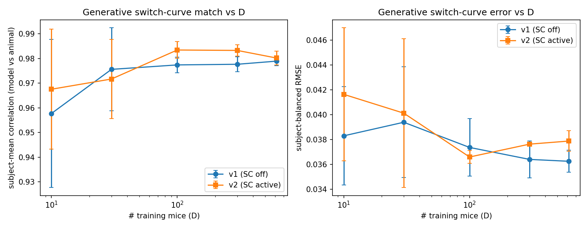
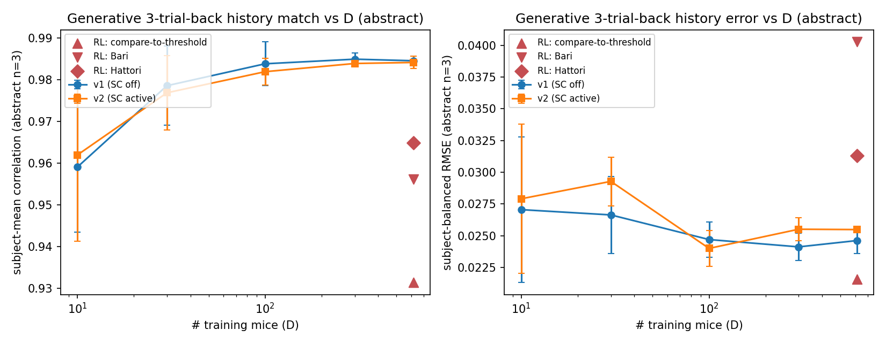
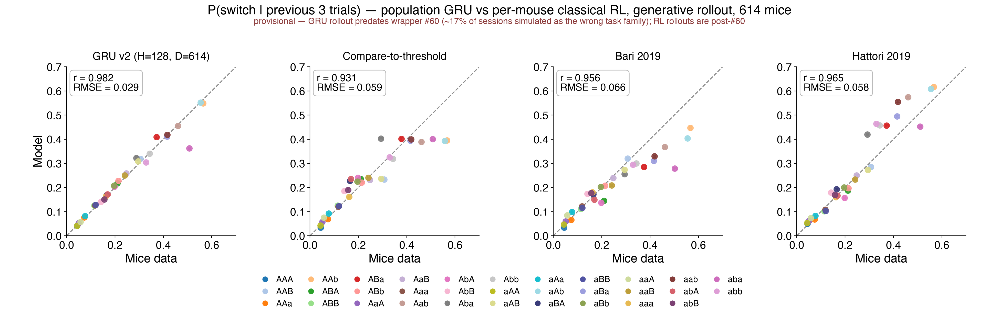
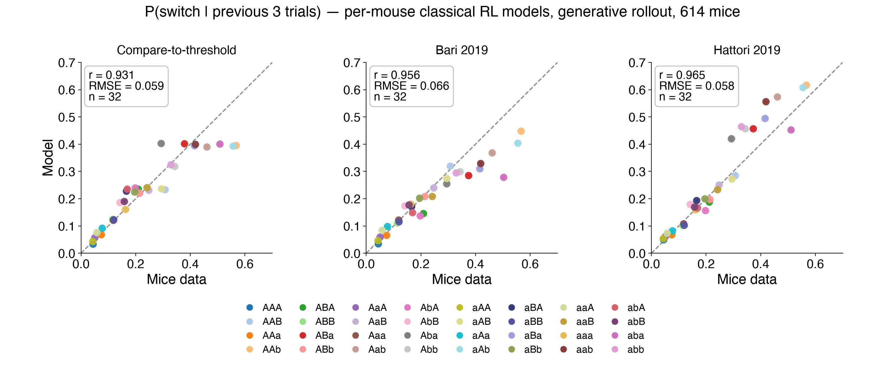

# Result 9 — generative model-vs-animal behavioral match vs D (2nd-order validation)

Roll each trained GRU out as a generative agent on the curriculum task and compare two model-vs-animal behavioral curves to the real mouse. Headline = subject-mean Pearson correlation; companion = subject-balanced RMSE (√ of MSE over per-subject mean deltas). Both on the **combined** session partition. 30 runs = 5 D × 3 seeds × {v1 SC off, v2 SC active}. Source W&B groups `generative-v{1,2}@20260623-18074*`. Wrapper 916d3b4.

**Added 2026-07-15:** three per-mouse classical RL baselines (compare-to-threshold, Bari, Hattori — this study's own `rl-baseline-{bari,ctt,hattori}` fits, the same fits behind r8 and study 05's r1), rolled out generatively under study 05's [`generative-rl-baseline`](../../../05-disrnn-scaling-law/variants/generative-rl-baseline/notes.md) variant (which reads these fits cross-study) through the identical task-construction code path, and plotted here as single reference points at D=614 (a per-subject fit over all 614 mice, not a D-sweep). See the ⚠️ caveat below on wrapper-version asymmetry before reading the absolute RL numbers.

## Figures

*Switch-triggered curve: P(switch | reward at t × preceding run length). 4 bins. The corr~0.96 headline.*

*History-pattern curve: P(switch | last 3 trials' (choice, reward) sequence), abstract encoding (32 bins).*

*The 2nd-order comparison this report exists to make, as a scatter: P(switch | previous 3
trials) for the population GRU (v2, H=128, D=614, seed 0) against the three per-mouse classical
RL baselines, one dot per abstract 3-back pattern, subject-mean ± SEM over the same 614 mice,
`combined` session partition. The GRU roughly **halves** the across-pattern RMSE (0.029 vs
0.058-0.066) and sits above all three on correlation (0.982 vs 0.931-0.965). The panels also
localise each model's failure, which the scalars hide: compare-to-threshold **saturates** near
P(switch) ≈ 0.40 and cannot follow mice past it; Bari sits below the diagonal at the high end
(under-switching); Hattori overshoots there; the GRU tracks the diagonal throughout, with one
clear miss on `aba` (~0.51 animal vs ~0.36 model — under-switching on alternate-then-lose
histories). **Provisional, and the figure says so on its face:** the GRU rollout predates
wrapper #60 and the RL rollouts do not, so the two sides were not simulated on the same task
families. Producer `analysis/pswitch_history_patterns.py`.*

*The scatter behind the history-pattern column of table (e): P(switch | previous 3 trials) for
each of the three per-mouse classical RL baselines, one dot per abstract 3-back pattern (32),
subject-mean ± SEM over the 614 fitted mice, identity line dashed. Same aggregation level,
annotation contents and 32-colour map as the wrapper's own
`combined/history_pattern_comparison_abstract` panels logged on the GRU generative runs, so the
two can be read side by side — but they are **not quantitatively pairable**: the GRU panels are
pre-#60 and these are post-#60, so the two sides do not share task-family construction (see
Caveats). Producer `analysis/pswitch_history_patterns.py`; see
Provenance below for where the coordinates came from and why the box RMSE differs from table
(e)'s RMSE column.*

## Methods — what the two curves are

**Switch-triggered (`post_switch_by_reward_and_run_length`)** — for every **choice switch** (`choice[t] ≠ choice[t−1]`; block info is stripped, so "switch" here means a left↔right flip, **not** a block reversal), bin by (reward on the switch trial t: rewarded / unrewarded) × (length of the preceding same-choice run: 1 / >1). Per bin, report **P(switch on t+1)** — the probability the mouse keeps switching one more trial. 4 bins. Implemented in `aind-disrnn-wrapper/code/post_training_analysis/generative_analysis.py:1962-2019`.

**History-dependent (`history_dependent`)** — encode each trial as one of `{L, l, R, r}` (uppercase = rewarded, L/R = left/right). For each trial t ≥ N, the **history pattern** is the concatenation of the last N trials' chars. Per pattern, report **P(switch on t)** = P(choice[t] ≠ choice[t−1]). Two encodings stored in parallel: `abstract` canonicalises the first trial of the pattern to `A` (so `LrR` and `Rlr` collapse to `AbA`); `detailed` keeps L/R identity. `n_back ∈ {1, 2, 3}` (wrapper default `_DEFAULT_HISTORY_MAX_TRIALS_BACK = 3`). Pattern counts: abstract `{n=1: 2, n=2: 8, n=3: 32}`; detailed `{n=1: 4, n=2: 16, n=3: 64}`. Implemented in `generative_analysis.py:953-1080, 2032-2121`.

For every (variant, D) cell the correlation and RMSE below are means of the 3-seed cells; SDs in the JSON.

## Results

<!-- BEGIN result-9 -->
[all numbers below are read verbatim off `analysis/generative_match.py`'s console output /
`generative_match.json` — this script does not write the tables into the report automatically,
so update them by hand when re-running produces new numbers]

**(a) Switch-triggered curve — `post_switch_by_reward_and_run_length` (4 bins; subject-mean correlation):**

| D | v1 corr | v2 corr | v1 RMSE | v2 RMSE |
|---|---|---|---|---|
| 10  | 0.9577 | 0.9675 | 0.0383 | 0.0416 |
| 30  | 0.9756 | 0.9717 | 0.0394 | 0.0401 |
| 100 | 0.9774 | 0.9834 | 0.0374 | 0.0366 |
| 300 | 0.9777 | 0.9833 | 0.0364 | 0.0376 |
| 614 | 0.9789 | 0.9802 | 0.0362 | 0.0379 |

**(b) History-pattern curve — `history_dependent`, abstract encoding (subject-mean correlation):**

| D | n=1 corr | n=2 corr | n=3 corr | n=1 RMSE | n=2 RMSE | n=3 RMSE |
|---|---|---|---|---|---|---|
| v1 10  | 1.0000ⁿ | 0.9932 | 0.9590 | 0.0209 | 0.0233 | 0.0271 |
| v1 30  | 1.0000ⁿ | 0.9935 | 0.9785 | 0.0248 | 0.0241 | 0.0266 |
| v1 100 | 1.0000ⁿ | 0.9958 | 0.9838 | 0.0237 | 0.0228 | 0.0247 |
| v1 300 | 1.0000ⁿ | 0.9963 | 0.9849 | 0.0223 | 0.0219 | 0.0241 |
| v1 614 | 1.0000ⁿ | 0.9960 | 0.9845 | 0.0224 | 0.0223 | 0.0246 |
| v2 10  | 1.0000ⁿ | 0.9935 | 0.9619 | 0.0219 | 0.0238 | 0.0279 |
| v2 30  | 1.0000ⁿ | 0.9940 | 0.9768 | 0.0253 | 0.0249 | 0.0293 |
| v2 100 | 1.0000ⁿ | 0.9953 | 0.9819 | 0.0230 | 0.0222 | 0.0240 |
| v2 300 | 1.0000ⁿ | 0.9955 | 0.9838 | 0.0200 | 0.0222 | 0.0255 |
| v2 614 | 1.0000ⁿ | 0.9956 | 0.9841 | 0.0209 | 0.0225 | 0.0255 |

ⁿ abstract n=1 has only 2 bins (`A` rewarded last vs `a` unrewarded last) → Pearson r is mathematically ±1; ignore that column.

**(c) History-pattern curve — `history_dependent`, detailed encoding (subject-mean correlation):**

| D | n=1 corr | n=2 corr | n=3 corr | n=1 RMSE | n=2 RMSE | n=3 RMSE |
|---|---|---|---|---|---|---|
| v1 10  | 0.9568 | 0.9849 | 0.9369 | 0.0204 | 0.0238 | 0.0257 |
| v1 30  | 0.9900 | 0.9924 | 0.9746 | 0.0244 | 0.0238 | 0.0253 |
| v1 100 | 0.9966 | 0.9946 | 0.9834 | 0.0225 | 0.0224 | 0.0238 |
| v1 300 | 0.9982 | 0.9958 | 0.9872 | 0.0215 | 0.0217 | 0.0229 |
| v1 614 | 0.9987 | 0.9959 | 0.9881 | 0.0214 | 0.0223 | 0.0239 |
| v2 10  | 0.9560 | 0.9831 | 0.9333 | 0.0201 | 0.0236 | 0.0258 |
| v2 30  | 0.9879 | 0.9935 | 0.9712 | 0.0252 | 0.0249 | 0.0268 |
| v2 100 | 0.9919 | 0.9932 | 0.9808 | 0.0228 | 0.0217 | 0.0234 |
| v2 300 | 0.9979 | 0.9951 | 0.9857 | 0.0201 | 0.0222 | 0.0239 |
| v2 614 | 0.9990 | 0.9957 | 0.9872 | 0.0210 | 0.0226 | 0.0237 |

**D=10 → D=614 correlation gain (v1, headline metrics):** 4-bin switch curve +0.021; abstract n=3 (32 bins) +0.026; detailed n=1 (4 bins, WSLS-equivalent) +0.042; **detailed n=3 (64 bins) +0.051**. Fine-grained history metrics surface a ~2× larger D-scaling signal than the coarse 4-bin curve, while still saturating by D≈100.

**(d) RL baselines at D=614 — switch-triggered curve** (this study's own `rl-baseline-{bari,ctt,hattori}` fits — the same fits behind r8 — rolled out generatively through the same task construction; not a D-sweep — one row per model, fit on all 614 mice):

| model | switch corr | switch RMSE |
|---|---|---|
| GRU v1 (D=614, for reference) | 0.9789 | 0.0362 |
| GRU v2 (D=614, for reference) | 0.9802 | 0.0379 |
| Hattori | **0.9884** | 0.0452 |
| compare-to-threshold | 0.9770 | 0.0369 |
| Bari | 0.9425 | 0.0831 |

**(e) RL baselines at D=614 — history-pattern curve, abstract encoding:**

| model | n=1 corr | n=2 corr | n=3 corr | n=1 RMSE | n=2 RMSE | n=3 RMSE |
|---|---|---|---|---|---|---|
| Hattori | 1.0000ⁿ | 0.9944 | 0.9648 | 0.0153 | 0.0235 | 0.0313 |
| compare-to-threshold | 1.0000ⁿ | 0.9939 | **0.9313** | 0.0156 | 0.0237 | 0.0216 |
| Bari | 1.0000ⁿ | 0.9836 | 0.9561 | 0.0201 | 0.0363 | 0.0403 |

**(f) RL baselines at D=614 — history-pattern curve, detailed encoding:**

| model | n=1 corr | n=2 corr | n=3 corr | n=1 RMSE | n=2 RMSE | n=3 RMSE |
|---|---|---|---|---|---|---|
| Hattori | 0.9987 | 0.9937 | 0.9656 | 0.0163 | 0.0241 | 0.0301 |
| compare-to-threshold | 0.9945 | 0.9924 | **0.9321** | 0.0167 | 0.0247 | 0.0207 |
| Bari | 0.9991 | 0.9855 | 0.9619 | 0.0208 | 0.0359 | 0.0369 |

**No RL model is uniformly more mouse-like than the GRU, and their internal ranking flips across metrics.** Hattori edges out both GRU variants on the switch curve (0.9884 vs 0.980) but trails on history (n=3: 0.965 vs 0.984). compare-to-threshold is competitive with the GRU on switch (0.977) but is the **worst model in every table above** on 3-trial-back history — abstract and detailed agree (0.9313 / 0.9321), both well below even the GRU's D=10 point (0.959–0.962). Bari trails the GRU on every metric and carries ~2× everyone else's RMSE on the switch curve (0.083) despite a mid-table correlation — its curve *shape* tracks the animal, its absolute *level* does not. Full discussion (finding 4): study 05's [r4](../../../05-disrnn-scaling-law/analysis/reports/r4-generative-behavioral-match.md) (same rollouts, disRNN comparison).
<!-- END result-9 -->

## Findings

- **Match is high at every D** on every metric (corr ≥ 0.93, RMSE ≤ 0.04 even at D=10). The model is already a good behavioral generator with as few as 10 training mice — this is the corr~0.96 headline, generalised across metrics.
- **All metrics saturate by D ≈ 100**, mirroring the held-out-LL scaling shape (r1). Late-D incremental gain (D=100→614) is tiny on every metric (≤ +0.005 corr, ≤ 0.001 RMSE).
- **Fine-grained history metrics show a larger D-scaling signal.** The 4-bin switch-curve sees a +0.021 corr gain from D=10→614; the 64-bin `detailed n=3` history pattern sees +0.051. Bin count alone partly explains this (more rows → noisier r at small D), but the **same monotonic shape** across n_back ∈ {1,2,3} suggests the GRU's 3-trial-back conditional structure genuinely sharpens with more training data — just not enough to break the D≈100 saturation.
- **SC (v2) edge is small and mixed across both metrics.** Slight v2 advantage in 4-bin correlation at D≥100 (0.983 vs 0.977), no consistent advantage in the history-pattern panels. RMSE is comparable or marginally higher under v2 at small D. Same conclusion as in r1: SC adds a real but small bump; this 2nd-order check does not amplify it.
- **No new headroom revealed.** The 2nd-order generative check corroborates the 1st-order LL story — saturating-by-D≈100, near-ceiling absolute fit, small SC bump — rather than exposing a regime where data-scaling pays off more.

## Available generative metrics (what the JSON contains)

The wrapper writes `model_vs_animal_quantitative_summary.json` per session partition (`train/eval/combined`), and the launcher flattens all numeric leaves to W&B summary keys. Four top-level branches; this report uses the **bolded** scalars:

| branch | shape (after pooling/aggregation level) | leaf metrics |
|---|---|---|
| `switch_triggered.quantitative_summary` | `{pooled, subject_mean, session_mean} × {post_switch_by_reward, post_switch_by_reward_and_run_length, overall}` | `n_rows, total_weight, mae, rmse, bias, ` **`correlation`** `, weighted_mae, weighted_rmse` |
| `switch_triggered.delta_significance_summary` | `× {post_switch_by_reward, post_switch_by_reward_and_run_length}` | Wilcoxon + `subject_balanced_error_summary/`**`mean_squared_error`**, `condition_balanced_error_summary/...`, `subject_condition_error_summary/...`, `significant_conditions_summary/...` |
| `history_dependent.quantitative_summary` | `{pooled, subject_mean, session_mean} × {detailed, abstract} × {1, 2, 3, overall}` | same 8 leaves; **`correlation`** + sqrt(MSE) used in this report |
| `history_dependent.delta_significance_summary` | `× {detailed, abstract} × {1, 2, 3}` | same Wilcoxon + balanced-error structure |

The other un-pulled scalars (`mae`, `bias`, `weighted_*`, `session_mean`, `pooled`, all `train/`/`eval/` partition variants) are available in W&B for any (variant, D, seed) run and can be added to `generative_match.py` with one extra `s.get(...)` per scalar.

What does **not** exist anywhere in the wrapper: no win-stay-lose-shift (`wsls`), no logistic / history-regression on choices, no choice autocorrelation. The N=1 `detailed` history (4 bins `L/l/R/r`) functionally subsumes WSLS — its column in table (c) is the closest you'll get to a WSLS scaling curve.

## Provenance — the RL history-pattern scatter (added 2026-08-31)

Tables (d)-(f) landed 2026-07-15 as scalars only; the scatter behind them could not be drawn
from the repo until now. Nothing was re-simulated and nothing was re-fit — this is a recovery
of data that already existed.

**Why it was missing.** Study 05's `reanalyze_stats_only.py` computed the full
`history_dependent_switch_stats` dict but skipped `_save_*_figures()` wholesale, because the
*per-session* scatters (18,124 points) cost 20-25 min apiece and had already killed two jobs
on wall clock. The cheap pattern-comparison scatter went down with them. Only the trimmed
`quantitative_summary` / `delta_significance_summary` blocks were committed to
`rl_rollout_summaries/`, and those carry r, RMSE and per-pattern *deltas* — not the two
absolute coordinates (`animal_mean`, `simulated_mean`) a model-vs-animal scatter needs.

**Where the coordinates came from.** The full stats dicts survived on the shared filesystem
at `/allen/aind/scratch/han.hou/tmp/rlgen/<alias>/analysis/<wrapper_alias>/history_dependent_switch_stats_no_figures.json`
(~1.5 GB each, written 2026-07-15).
[`extract_history_patterns.py`](../../../05-disrnn-scaling-law/variants/generative-rl-baseline/extract_history_patterns.py)
streams each file and lifts out the `config` / `comparison` / `subject_aggregate` /
`session_aggregate` blocks (~177 KB per alias), committed as
`rl_rollout_summaries/{ctt,bari,hattori}_history_patterns.json`. Each carries a `_meta` block
with the source path, byte count, **sha256 of the 1.5 GB source**, and the baseline's W&B run
id ([`lmg1i9yd`](https://wandb.ai/AIND-disRNN/mice_data_scaling/runs/lmg1i9yd) /
[`bg3nzqz9`](https://wandb.ai/AIND-disRNN/mice_data_scaling/runs/bg3nzqz9) /
[`unhmbrk4`](https://wandb.ai/AIND-disRNN/mice_data_scaling/runs/unhmbrk4)) as the immutable
key. The extractor asserts that its `subject_aggregate.abstract["3"].summary` reproduces the
already-committed `quantitative_summary.subject_mean.abstract["3"]` values exactly; that
assertion passed for all three. The per-mouse `subject_level` rows (the bulk of the 1.5 GB)
were deliberately left on the cluster.

**Error bars are present but sub-marker.** Each dot carries `animal_sem` on x and
`simulated_sem` on y, drawn at `capsize=2.5`. They are invisible at this scale by construction,
not by omission: SEM over ~614 mice is 0.0033 (median) to 0.0062 (max) in probability units,
which at the rendered panel size is a half-bar of 0.8-1.4 pt against a 4 pt marker radius. The
paired within-subject `delta_sem` (median 0.0034, max 0.0077) is the more informative
uncertainty for "does this dot sit off the diagonal" and is available in the same rows if a
deviation panel is ever wanted.

**The panel box RMSE is not table (e)'s RMSE.** Two different quantities, both stored:

| model | r (both) | panel box: RMSE across the 32 pattern rows | table (e): sqrt(subject-balanced MSE) |
|---|---|---|---|
| compare-to-threshold | 0.9313 | 0.0590 | 0.0216 |
| Bari | 0.9561 | 0.0661 | 0.0403 |
| Hattori | 0.9648 | 0.0584 | 0.0313 |

The box annotates `quantitative_summary.subject_mean.abstract["3"].rmse` — deviation from the
diagonal averaged over *patterns*, which is what the wrapper's own panel prints — so the box is
at least the same *statistic* the GRU media panels annotate, even though the pre-/post-#60 split
means the two are not measured on the same simulated task families. Table (e) reports
`delta_significance_summary.abstract["3"].subject_balanced_error_summary.mean_squared_error`,
square-rooted — deltas averaged within each mouse first, then across mice, so pattern-level
scatter partly cancels and the values are roughly half as large. **They rank the models
differently**: compare-to-threshold is the best model on the subject-balanced RMSE (0.0216) and
mid-pack on the across-pattern RMSE (0.0590), while remaining the worst on correlation
(0.9313). Cite one and name which.

### The GRU side, recovered from Beaker (2026-08-31)

The GRU rows are not in W&B and never were: `launch_generative.py`'s in-container step logs
only the flattened numeric leaves of `model_vs_animal_quantitative_summary.json` plus
`figures/*.png`. But the task's `--output-dir` is `/results`, which **is** its Beaker result
dataset, so `history_dependent_switch_stats.json` was on S3 the whole time.
[`analysis/fetch_gru_history_patterns.py`](../fetch_gru_history_patterns.py) walks
W&B → Beaker → dataset storage and streams it.

The launch records for these two groups were never committed, so the resolved ids live in that
script's `TASKS` table and in every output's `_meta`:

| | v2 (session conditioning **active**) | v1 (declared, never activated) |
|---|---|---|
| W&B group | `generative-v2@20260623-180750` | `generative-v1@20260623-180747` |
| W&B run | [`bfdmcyfd`](https://wandb.ai/AIND-disRNN/mice_data_scaling/runs/bfdmcyfd) | [`yqjbjiq5`](https://wandb.ai/AIND-disRNN/mice_data_scaling/runs/yqjbjiq5) |
| Beaker experiment | `01KVVJPKT31HTFWA4Y9SRY141M` | `01KVVJPGA55QSMHJMSRFA5WMHK` |
| Beaker job | `generative-v2-d1-0-s0` | `generative-v1-d1-0-s0` |
| result dataset | `01KVVJPN3M6S3QA8KWF8SDMC1G` | `01KVVJPJMHZH5D8JREBF4X90C7` |
| source pretrain exp | `01KVRMSAAJTRSJMFV5JT7JAP6X` | `01KVQ7EJ3C5YJ8FJVNJB8C8N36` |
| streamed | 1,554,869,831 B | 1,555,005,621 B |
| r / RMSE (abstract n=3, subject-mean) | 0.98212 / 0.02850 | 0.98301 / 0.02894 |

Frozen to `analysis/gru_history_patterns/v{1,2}_d614_s0_combined_history_patterns.json`
(~177 KB each), same four blocks and same `_meta` discipline as the RL extracts, keyed by the
sha256 of the streamed source. The 1.55 GB never lands on disk: the extractor streams the
response and lifts the four top-level blocks out of the byte stream.

**What "D=614, H=128" means here, and why there is no choice.** Every task in both groups was
trained with `model.architecture.hidden_size=128` (read off the source pretrain task spec), and
D is `subject_ratio × 614`, so D=614 is `subject_ratio=1.0`. The N×D grid at
N ∈ {16, 64, 128, 256} is a **separate** Beaker experiment with no generative rollouts, so H=128
is the only hidden size for which this figure can exist at all. v1 and v2 both declare
`session_encoding_type=scalar`; only v2 carries the schedule that activates it
(`session_n_pretrain_steps=30000`, `session_n_warmup_steps=20000`). Seed 0 of 3; the figure
shows v2 only, and v1 is committed alongside because the two agree to within 0.001 in r and
0.0005 in RMSE — consistent with this report's finding that SC adds little at 2nd order.

**Cross-check.** The streamed `subject_aggregate.abstract["3"].summary` reproduces the
`model_vs_animal_quantitative_summary.json` scalars fetched independently over the same API
(0.98212 / 0.02850), so the two recovery paths agree.

⚠️ **These rows are pre-#60** — see the caveat below. The comparison figure is a provisional
look, not a result; re-running the D=614 generative task on current wrapper main (tracked in
r4) is what makes it publishable, and would emit the stats JSON directly.

## Caveats

- **Rollout task is matched to the curriculum *family* (default block/reward params), not the session's stage-specific params** (`launch_generative.py:64-68`; `--rollout-mode curriculum_matched`). This confound is baked into every D point but does not affect the vs-D trend.
- **"Switch" in `switch_triggered` is a choice flip, not a block reversal.** Block info is stripped from the snapshot before this analysis (`generative_analysis.py:418-426`). Naming follows the wrapper.
- **abstract n=1 correlation is degenerate** (2 bins → r=±1). Use abstract-n=1 RMSE for D-scaling at that resolution, or use `detailed n=1` (4 bins) for an informative Pearson r.
- **Subject-mean aggregation discards within-subject variance.** Pooled / session_mean leaves are available in the JSON if a different aggregation is desired.
- ⚠️ **The RL reference rows (d)-(f) run on a NEWER wrapper than this report's own GRU rollouts.**
  This report's GRU rollouts predate wrapper
  [#60](https://github.com/AllenNeuralDynamics/aind-disrnn-wrapper/pull/60): off-curriculum
  sessions were silently simulated as a default *uncoupled-baiting* task regardless of the family
  the mouse actually ran (~17% of sessions in the D=10 cohort; the affected fraction at other D is
  untested here). The RL rollouts added below run **after** #60 and do not carry this bug. That
  makes the GRU-vs-RL comparison in (d)-(f) asymmetric — an unknown amount of the GRU's numbers
  reflect wrong-task rollouts that the RL numbers don't. It does **not** affect the RL-vs-disRNN
  comparison in study 05's r4, which runs both models on the same post-#60 code. Re-running this
  report's own GRU rollouts on the fixed wrapper is tracked (see r4) but not yet done.
  - *Scope of the 17%, since it is easy to over-read (added 2026-08-31):* it is the share of the
    **D=10** cohort's 249 sessions whose `curriculum_name` was stored as the literal string
    `'None'` (40) or as null (2), measured in `65f621d`. It is **not** a D=614 number, and the
    D=614 fraction has never been measured. The only D=614 count on record is from `e477074`:
    Random Walk sessions, 9 sessions / 3 subjects / 8,284 trials. Quantifying the D=614 share
    would mean tabulating `curriculum_name` over that cohort's sessions.
  - *What #60 fixed, in three commits:* `ba9fa5f` — sessions whose `curriculum_name` is NaN
    (off-curriculum mice) **crashed** the rollout; now the pseudo-curriculum is rebuilt from the
    subject's most-common `task`, the same rule the data split already used. `65f621d` — the
    silent half: `curriculum_name` stored as the literal string `'None'` matched no family and
    fell through to a default uncoupled-baiting task with no warning. `e477074` — Random Walk
    sessions likewise fell through to that default; now they build the gym's `RandomWalkTask`,
    and an unknown family raises instead of defaulting.
  - *What #60 did NOT fix, and still has not been:* the task is matched to the curriculum
    **family only**, with the gym's **default** block/reward (and random-walk) parameters. The
    session's stage-specific parameters are still ignored — `current_stage_actual` is logged and
    unused — so a curriculum spanning several stages collapses into one generic task. This is
    flagged as an `IMPORTANT LIMITATION (TODO)` in `_build_curriculum_matched_task` and tracked
    in `FUTURE_DIRECTIONS.md` §5. It applies to **both** sides of every figure in this report,
    pre- and post-#60 alike, and is the reason absolute "how mouse-like" statements are softer
    than the correlations suggest.

## Open — deferred, not forgotten (2026-08-31)

Noted here rather than fixed; none of it blocks reading the figures above, and each item names
what it would take.

1. **Measure the D=614 wrong-task fraction.** The `~17%` in the Caveats is a D=10 number; the
   D=614 share is unmeasured, which is why the comparison figure says "fraction at D=614
   unmeasured" rather than quoting a value. `resolved_run.json` sits in each generative task's
   Beaker result dataset (3.4 MB) and should carry per-session `curriculum_name`; tabulating it
   over the D=614 cohort turns the open-ended caveat into a number. Minutes, no rerun.
2. **Re-run the D=614 GRU rollout on post-#60 wrapper main** (tracked in study 05's r4). This is
   what makes the GRU-vs-RL figure publishable rather than provisional, and it emits the
   per-pattern stats JSON directly — no Beaker stream-extraction needed. Worth folding item 3
   into the same job.
3. **Raise `n_rollouts_per_session` above 1.** Both this report's GRU rollouts and the RL
   rollouts used a single replicate per session. The machinery for more already exists
   (`derive_session_seed(..., rollout_index)`, and every *simulated* aggregation runs with
   `average_rollouts_by_source=True`), so it is a flag, not a code change. It would cut
   within-mouse sampling noise and — more importantly — stop mice being excluded from a dot
   because one stochastic rollout happened not to produce 5 instances of a rare pattern, which
   currently confounds real behavioral differences with single-rollout luck (Bari loses 79 mice
   on `aba`, Hattori 15). Cost scales linearly; the RL side (4-6 h/model at k=1) binds.
4. **Document the ignore-trial asymmetry in the history statistic.** Trials with no response are
   *deleted* rather than left as gaps, and the pattern window is built over the compacted
   sequence — so "previous 3 trials" means *previous 3 responded trials* for the animal and the
   literal previous 3 for the model, and the two sides of each dot differ by ~10% in trial count
   (8.71 M animal vs 9.60 M simulated at 3-back). The wrapper's 3-way mode would remove it; these
   runs are 2-action.
5. **Stage-specific task parameters** — the limitation #60 did *not* address (see Caveats).
   Tracked in `FUTURE_DIRECTIONS.md` §5.

## Related

- [[r1-heldout-scaling-curve]] — 1st-order (next-trial LL) D-scaling that this 2nd-order check corroborates.
- [[r7-nxd-joint-scaling-grid]] — `nxd_scaling_verdict.md:53` and `nxd_scaling.py:406` already cite "generative behavioral-match (corr~0.96+) corroborates the near-ceiling claim from a 2nd metric".
- `generative_match_verdict.md` — pre-promotion verdict notes (switch-triggered only).
- `studies/01-gru-scaling-law/FUTURE_DIRECTIONS.md` §5 — original motivation for this 2nd-order check, and the stage-matching caveat above.
- `studies/01-gru-scaling-law/launch_generative.py` — launcher that produced the `generative-v{1,2}@*` W&B groups.
- [study 05 r4](../../../05-disrnn-scaling-law/analysis/reports/r4-generative-behavioral-match.md) — the disRNN counterpart of this report; same RL baselines, same rollout code path, disRNN-vs-GRU-vs-RL comparison at D=614.
- [`05-disrnn-scaling-law/variants/generative-rl-baseline`](../../../05-disrnn-scaling-law/variants/generative-rl-baseline/notes.md) — methodology and provenance for the RL rollouts added in (d)-(f) above.
