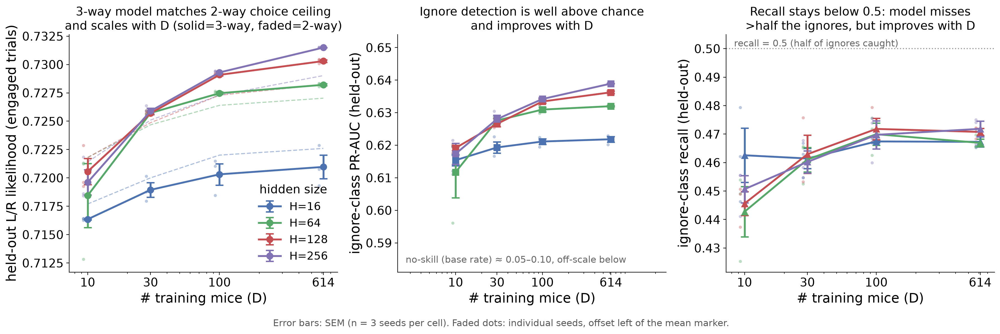

# Result 2 — Ignore-class detection is well above chance and improves with D

<!-- BEGIN result-2 -->
[regenerated by `analysis/update_reports.py` — do not edit by hand]

*Ignore-class detection on held-out mice vs D (middle + right panels of `fig_scaling.png`). PR-AUC is the headline detection metric (robust to the ~5–10% ignore base rate); recall characterises the operating point.*

Mean ignore-class **PR-AUC** (held-out):

| H | D=10 | D=30 | D=100 | D=614 |
|---|---|---|---|---|
| 16 | 0.6154 | 0.6193 | 0.6211 | 0.6218 |
| 64 | 0.6117 | 0.6276 | 0.6310 | 0.6320 |
| 128 | 0.6192 | 0.6266 | 0.6334 | 0.6362 |
| 256 | 0.6174 | 0.6280 | 0.6342 | 0.6389 |

Mean ignore-class **recall** (held-out):

| H | D=10 | D=30 | D=100 | D=614 |
|---|---|---|---|---|
| 16 | 0.4626 | 0.4614 | 0.4674 | 0.4673 |
| 64 | 0.4427 | 0.4611 | 0.4700 | 0.4669 |
| 128 | 0.4456 | 0.4629 | 0.4718 | 0.4708 |
| 256 | 0.4507 | 0.4602 | 0.4697 | 0.4718 |

- **Ignore detection is well above chance and improves with D.** For the larger models (H≥64), PR-AUC rises ~0.612→0.639 from D=10 to D=614, far above the ~0.05–0.10 no-skill base rate.
- **Recall stays capped near 0.47** even at D=614 — the model is consistently conservative on ignore trials regardless of scale (a real detection ceiling, not a data-scarcity artifact).

Source W&B groups: `nxd-3way@20260704-205230`, `nxd-3way@20260704-205239`, `nxd-3way@20260707-075359`, `nxd-3way@20260707-075401`, `nxd-3way@20260707-075406`, `nxd-3way@20260707-075412`, `nxd-3way@20260707-110227`, `nxd-3way@20260707-110245`, `nxd-3way@20260708-231204`, `nxd-3way@20260708-231938`, `nxd-3way@20260709-231516`, `rerun_H16D10s2@20260705-104925`, `sweep-validate-capnsteps@20260710-183333`.
<!-- END result-2 -->

## Discussion

The engagement-aware target was the motivation for this study (roadmap #23): L/R
choice is near a predictability ceiling, so we asked whether a headroom-ier target
— predicting *whether* the mouse engages at all — shows a sustained D-slope. The
ignore class is rare (~5–10% base rate), so PR-AUC (not accuracy) is the honest
detection metric, and recall/precision describe the operating point the model
settles on.

Two findings: detection genuinely improves with D (PR-AUC well above the no-skill
base rate and still rising at D=614), but recall plateaus near 0.47 — the model
stays conservative about calling an ignore trial regardless of scale. That ceiling
is the interesting negative: more mice sharpen the *ranking* of ignore-likelihood
(PR-AUC) without moving the model off its cautious operating point.

## Related

- [[r1-lr-engaged-scaling]] — the choice-likelihood metric on the same grid.
