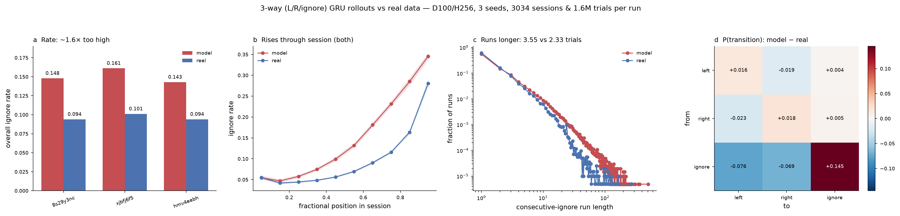
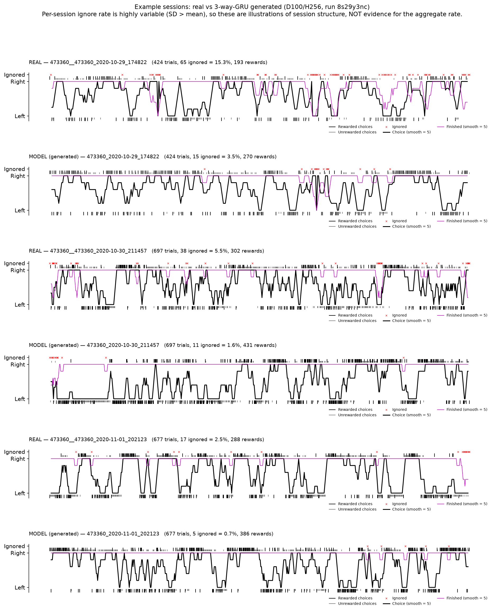
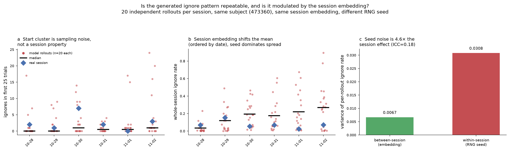

# Does the 3-way GRU generate realistic ignore trials?

**Question.** The include-ignore-trials model has a 3-way (L / R / ignore) output
head, so it can *generate* — not just predict — no-response trials. This asks
whether the ignore trials it produces in a free-running rollout are
statistically similar to real mouse behaviour.

**Setup.** Curriculum-matched generative rollout of a saved 3-way GRU over its
training split: D100/H256 cell, all three seeds (`8s29y3nc`, `xjbfj6f5`,
`hmv4eabh`), ~3000 sessions and ~1.6M generated trials per run. The model freely
samples L/R/ignore each trial; on an ignore it earns no reward and the foraging
task is not stepped (ignore = non-action), matching how a real no-response trial
is encoded. Real-side statistics come from the raw snapshot `animal_response`
(ignore preserved as class 2, not NaN-collapsed).

## Verdict: it generates ignores, but too many and too sticky

1. **Ignore trials are generated.** The 3-way head is functional — free rollouts
   contain ignore trials at a substantial rate.
2. **The rate is ~1.6× too high.** Generated **0.151** vs real **0.096**
   (means across 3 seeds; per-seed ratio 1.56). Every seed over-produces.
3. **Ignores over-persist — this is the actual defect.** Mean consecutive-ignore
   run length **3.55 vs 2.33** trials, and `P(ignore | prev ignore)` **0.720 vs
   0.575** (+0.145). In the transition matrix (panel d) the L/R block is nearly
   perfect (±0.02), while `ignore→ignore` is **+0.145** and `ignore→left` /
   `ignore→right` are **−0.076 / −0.069**. The model's error is almost entirely
   a failure to *exit* the ignore state, not a mis-timed entry into it.
4. **The within-session rise is captured.** Ignore rate climbs steeply through a
   session in *both* model and real data (~0.05 early → 0.28 real / 0.35 late),
   so the model does reproduce progressive disengagement/satiation — it just
   runs hot (panel b).
5. **Consistent across seeds.** All three seeds agree in direction and
   magnitude; this is a property of the model class, not seed noise.

## Example sessions

Standard `plot_foraging_session` view (from
`aind-dynamic-foraging-basic-analysis`), real vs generated, paired on the same
source session:

Two things are visible here that the aggregates don't show:

- **Real ignores come in dense bursts** separated by long fully-engaged
  stretches; the model's are more evenly scattered. So even though the model's
  runs are *longer* on average, the real animal's disengagement is more
  strongly clustered in time.
- **The model earns more reward** than the animal on the same schedule
  (270 vs 193, 431 vs 302, 386 vs 288 in these three) — it exploits more
  efficiently, as a well-fit but idealized agent would.

**Caveat on these three sessions:** per-session ignore rate is extremely
variable (SD 0.17 model / 0.12 real, i.e. larger than the mean). In these
particular sessions the model happens to produce *fewer* ignores than the
animal — the opposite of the aggregate. They illustrate session structure;
they are not evidence about the rate. The 3000-session aggregate is the
trustworthy number.

## Is this really a free-running rollout, not teacher forcing?

Checked explicitly, because both real and generated traces show an ignore
cluster in the first ~10–25 trials of a session (e.g. `2020-10-30_211457`:
model ignores at trials 0,2,4,5,8,10,12,13,20; real at 0,4,5,6,7,10,11), which
looks suspicious.

**It is a pure generative rollout.** Two independent checks:

- **Code.** `_run_batched_rollout` consumes only `curriculum_name`, `n_trials`,
  `seed`, `subject_id` and the session index from each lane — it never reads
  `choice_history` or `reward_history`. The fed-back input each trial is the
  model's *own* sampled choice plus the task's reward. The lane RNG seed is
  `sha256(seed:session_id:rollout_index)`, i.e. keyed to the session
  *identifier*, not its behaviour.
- **Statistics.** Testing whether model ignores fall on the *same trials* as
  real ones, against a circular-shift null (preserves each side's rate and burst
  structure, destroys trial alignment): overlap is **0–5 trials, mean z = +1.4**
  across the 6 example sessions. Teacher forcing would make the model's ignores
  essentially a subset of the animal's, with a very large z.

**Why did one generated session show a start-of-session ignore cluster?**
It was sampling noise, not structure. An earlier draft of this report attributed
it to the -1 padding sentinel at trial 0; that explanation was wrong, because the
sentinel is identical across all lanes yet only 1 of 6 example sessions showed a
start cluster.

A repeatability test (20 independent rollouts x 6 sessions, subject 473360, same
session embedding, different RNG seed per rollout) settles it:

| session | mean first-25 ignores | median | max | frac == 0 |
|---|---|---|---|---|
| 10-28 | 1.60 | 0 | 17 | 0.70 |
| 10-29 | 1.75 | 0 | 9 | 0.55 |
| 10-30 | 3.25 | 1 | 14 | 0.50 |
| 10-31 | 1.05 | 0.5 | 4 | 0.50 |
| 11-01 | 2.10 | 0.5 | 17 | 0.50 |
| 11-02 | 4.35 | 1 | 24 | 0.30 |

Every session is mostly zeros with a heavy tail; 11-02 has a *higher* start-cluster
mean than 10-30, and 11-01 reaches 17. The plotted single rollout was one draw
from a very wide distribution.

**A single rollout is not interpretable.** Within one session, whole-session
ignore rate spans ~0.01-0.9 across seeds: each trial samples the softmax, and the
+0.145 `ignore->ignore` stickiness amplifies any streak that starts. Behavioural
statistics from generated data must be pooled over many rollouts (as the main
3000-session result is) - never read off one session.

**Is ignore modulated by the subject / session embeddings?** Yes, architecturally:
`encode_inputs` builds the model input prefix as `[subject_index, session_index]`
(resolved via `_resolve_session_index`), so P(ignore) is conditioned on the
subject embedding and the session-delta term as well as the trial history. The
measured session effect is real but modest - per-session mean ignore rate rises
0.035, 0.119, 0.194, 0.177, 0.220, 0.268 across six consecutive dates - while
within-session (seed) variance is **4.6x** the between-session variance
(0.0308 vs 0.0067, ICC = 0.18). The **subject** effect could not be separated
here because all six sessions come from one mouse; that needs a multi-subject
version of the same test.

## Interpretation

The model captures *that* ignores happen and *when* they become more likely, but
its ignore state is too absorbing. Two plausible contributors, not tested here:

- **Exposure bias.** Teacher-forced training never requires the model to escape
  a self-generated ignore streak; a small per-step over-probability of staying
  compounds over a free-running rollout.
- **No task feedback on ignore.** By design an ignore doesn't advance the task,
  so nothing in the environment pushes the model back toward engaging — there is
  no corrective signal within a run.

A natural next test: measure `P(ignore|prev ignore)` in teacher-forced
(one-step-ahead) mode on real data. If it matches the animal there but not in
rollout, exposure bias is the cause rather than a mis-fit policy.

## Caveats

- **Cell.** D100/H256, not the best-overall D614/H256 — the D614 checkpoints
  exist only as W&B artifacts, not on HPC disk. D100/H256 is high-capacity and
  well-trained (LR-engaged ~0.729 in the scaling study).
- **Curriculum matching is family-level.** The rollout task uses the gym's
  default block/reward parameters for the curriculum *family*, not the exact
  per-stage parameters (a known limitation of the existing rollout code). This
  shapes the reward stream and could bias the engage/ignore balance.
- **`p_reward` not recovered** in the example-session dump, so the reward-schedule
  sub-panel is hidden in the session figure.

## Provenance

- Wrapper code merged to `main` via PR #62 (merge commit `6cdf1ab0`); branch tip was `4aa3aec6`,
  commits `eae5159`, `a68ac91`, `c446a2f`, `ba3e27a`.
- Code: `code/post_training_analysis/generative_analysis.py` (3-way rollout support),
  `ignore_statistics.py`, `ignore_generative_report.py`.
- Rollouts: SLURM job 25336319 (analysis) and job `f8b8d1d2` (example-session dump),
  HPC `aind` partition, `disrnn-cpu`, `JAX_PLATFORMS=cpu`.
- All numbers in this report and both figures are computed from the harvested
  per-seed `ignore_stats.json` files (job `3212925b`), not transcribed by hand.
