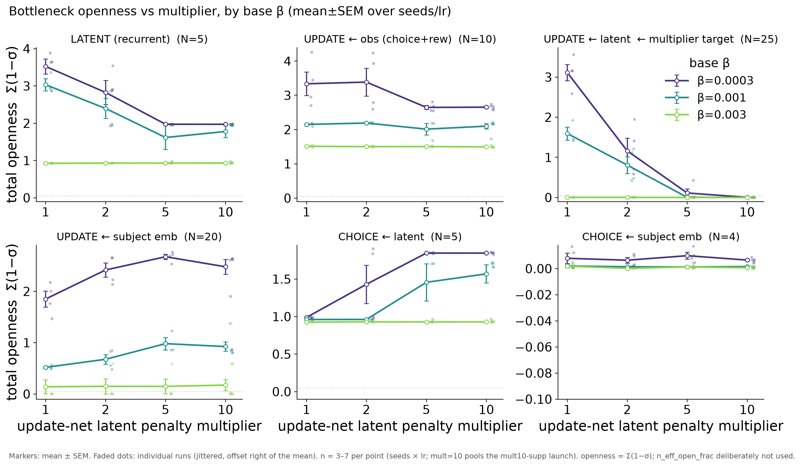

# Result 1 — the multiplier monotonically closes the interaction bottleneck; the model compensates

<!-- BEGIN result-1 -->
[regenerated by `analysis/update_reports.py` — do not edit by hand]

*Total openness Σ(1−σ) of each of the six disRNN bottlenecks vs the update-net latent penalty multiplier, per base β (mean±SEM over seeds/lr). Openness is the honest absolute scale (~0 = fully closed); `n_eff_open_frac` is deliberately not used (see [INDEX caveat](INDEX.md)).*

**Interaction bottleneck (update←latent, the multiplier's target)** — mean Σ(1−σ):

| base β | mult=1 | mult=2 | mult=5 | mult=10 |
|---|---|---|---|---|
| 0.0003 | 3.113 | 1.161 | 0.113 | 0.004 |
| 0.001 | 1.595 | 0.808 | 0.004 | 0.002 |
| 0.003 | 0.003 | 0.003 | 0.001 | 0.001 |

- **The multiplier monotonically closes its target.** At weak β=0.0003, update←latent openness falls 3.113→0.004 from mult=1→10 — monotone, not U-shaped (an earlier U-shape was an artifact of `n_eff_open_frac`).
- **Strong β=0.003 is already fully closed at every multiplier** (Σ(1−σ)≈0.003 at mult=1), so the multiplier has nothing left to compress.
- **The model compensates.** As the multiplier squeezes update←latent, the update←subject and choice←latent gates OPEN (information reroutes rather than disappears); the recurrent latent also closes (collateral over-regularization); update←obs stays the most open; choice←subject is shut throughout.

Source W&B groups: `updnet-ratio-100mice@20260703-200122`, `updnet-ratio-100mice-mult10-supp@20260706-093606`.
<!-- END result-1 -->

## Discussion

The update-net latent penalty **multiplier** (effective = `update_net_latent_penalty / beta`)
is the one real knob of this study: it scales the sparsity penalty on the
interaction (update←latent) bottleneck relative to the base β that regularizes
every other bottleneck. The scientific question is whether raising it actually
sparsifies the interaction — and at what collateral cost to the other five
bottlenecks.

**Metric correctness (carry into every reading).** Openness here is
`total_openness` = Σ(1−σ) over a family's channels — the *absolute* amount of
open capacity, which reads ~0 when a bottleneck is fully closed. We do **not**
headline `n_eff_open_frac` (the normalized participation ratio): because it is
scale-invariant, it reports a high value even when every channel is shut (it
characterizes how the vanishing residual weights are *distributed*, not how much
openness exists). On the raw grid that inverted the ranking of 19/43 runs and
manufactured a spurious U-shape on the multiplier axis. The honest Σ(1−σ) axis
shows the true monotone closure. `n_eff_open_frac` is retained in
`beta_scan_final_grid.csv` for reference only.

**The compensation story is the interesting one.** Squeezing update←latent does
not remove information from the model — it reroutes it: update←subject and
choice←latent *open* as the multiplier climbs, while the recurrent latent closes
as collateral. Total representational capacity is conserved, just redistributed.
That is why mult=2 (not 5 or 10) is the interpretable sweet spot — see r2 for the
held-out consequence.

## Related

- [[r2-heldout-transfer]] — the held-out transfer consequence of this sparsification.
- Study cover + Verdict: [../../README.md](../../README.md).
