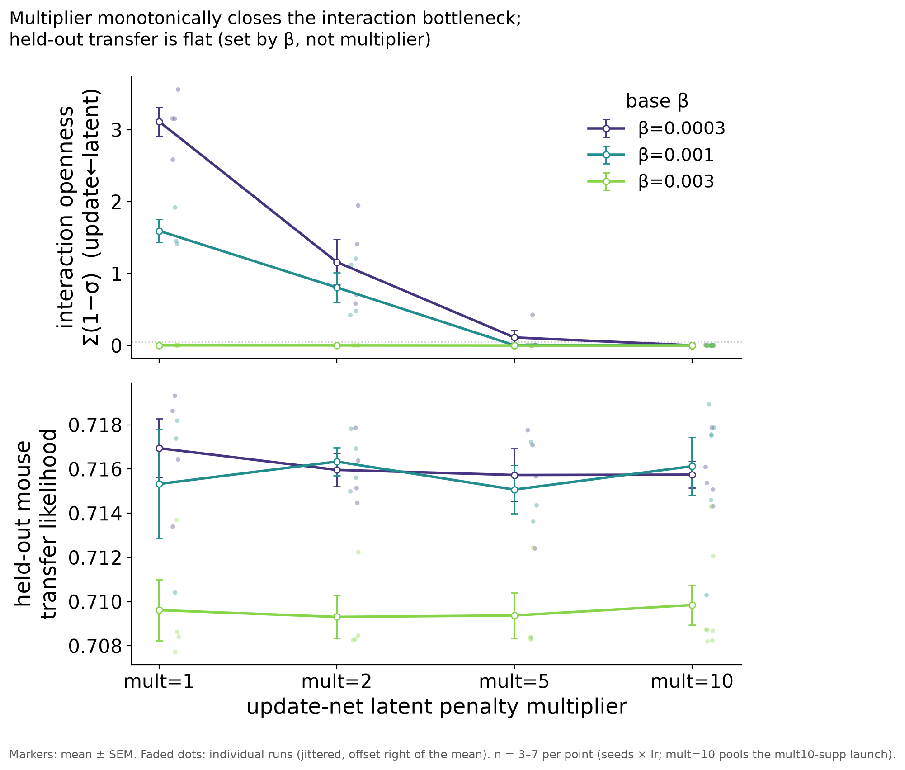

# Result 2 — held-out transfer is flat across the multiplier (no sparsity tax)

<!-- BEGIN result-2 -->
[regenerated by `analysis/update_reports.py` — do not edit by hand]

*Top: interaction-bottleneck openness Σ(1−σ) vs multiplier. Bottom: held-out mouse transfer likelihood vs multiplier, per base β (mean±SEM over seeds/lr).*

Mean held-out transfer likelihood:

| base β | mult=1 | mult=2 | mult=5 | mult=10 |
|---|---|---|---|---|
| 0.0003 | 0.7169 | 0.7160 | 0.7157 | 0.7157 |
| 0.001 | 0.7153 | 0.7163 | 0.7151 | 0.7161 |
| 0.003 | 0.7096 | 0.7093 | 0.7094 | 0.7098 |

- **Held-out transfer is flat across the multiplier** — full range across all 12 cells is only ~0.008 LL. Compressing the interaction bottleneck costs essentially nothing in transfer.
- **What little structure exists tracks base β, not multiplier:** weak β=0.0003 pools to 0.7161 vs strong β=0.003 at 0.7095 (strong β over-regularizes overall, ~0.005–0.01 lower everywhere).
- **Practical read:** mult=2 at weak/moderate β is the interpretable sweet spot — it compresses the interaction bottleneck substantially while keeping ~1 functional open channel, at no held-out cost; mult=5/10 over-collapse to zero open channels.

Source W&B groups: `updnet-ratio-100mice@20260703-200122`, `updnet-ratio-100mice-mult10-supp@20260706-093606`.
<!-- END result-2 -->

## Discussion

The figure of merit for the whole disRNN program is **held-out-mouse transfer**:
fine-tune only the subject embedding on a left-out mouse and predict its other
sessions (`auto_heldout_finetune`, enabled by default). This is the same metric
used by the `data-scaling-law` GRU study, so the two are directly comparable.

The headline is a **negative result in the useful direction**: sparsifying the
interaction bottleneck — the thing the multiplier does aggressively (r1) — costs
essentially nothing in held-out transfer. The full 12-cell range is a few
thousandths of a nat. Whatever predictive signal the interaction gate carried is
either redundant with what the compensating gates (update←subject, choice←latent)
pick up, or was never load-bearing for cross-mouse transfer in the first place.

**Where this leaves the study's motivating problem.** The original concern was
that the interaction bottleneck is *not sparse enough* at large mouse counts.
This scan shows we can compress it ~30× (mult=1→10 at weak β) at zero transfer
cost — so interpretability-driven sparsification of that gate is "free." The
catch from r1 is that mult=5/10 collapse it to *zero* open channels (nothing left
to interpret) and leak the representation into other gates. **mult=2 at weak/
moderate β is the recommended operating point**: a meaningful compression that
keeps ~1 functional open interaction channel, at no held-out cost.

For the absolute disRNN-vs-GRU comparison at matched mouse count (the ~0.011-nat
"disentanglement tax"), see the GRU-vs-disRNN figure in the project artifacts;
that comparison is out of scope for this β-scan and lives with the
`data-scaling-law` cross-reference.

## Related

- [[r1-bottleneck-sparsity-multiplier]] — the sparsification this transfer result is the consequence of.
- Study cover + Verdict: [../../README.md](../../README.md).
