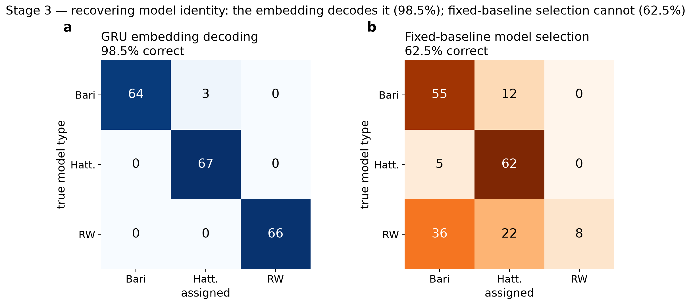
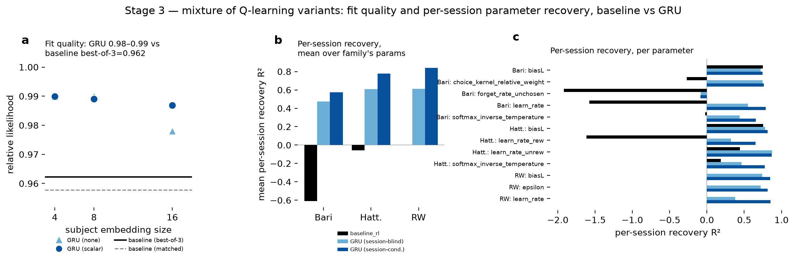
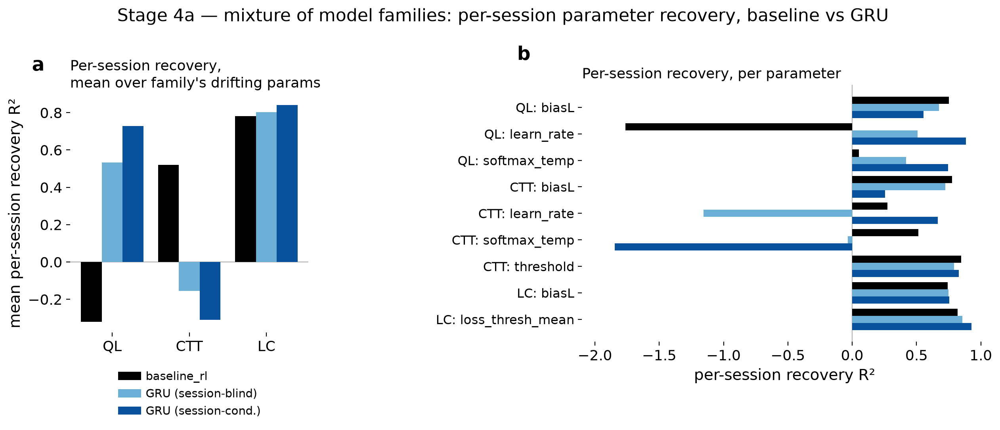

# Result 1 — the GRU embedding recovers generative structure where the correct-model baseline breaks

<!-- BEGIN result-1 -->
[regenerated by `analysis/recovery_report.py` — do not edit by hand]

*Relative likelihood (model NL / ground-truth NL, ceiling 1.0) of the GRU vs the correct-model-class baseline across the ladder. N=200.*

| stage | generator | GRU rel-LL | baseline rel-LL | recovery | value |
|---|---|---|---|---|---|
| 1 | static (no drift) | ~0.993 | ~0.993 | subject param R² (D=4) | 0.91–0.96 |
| 2 | mild monotonic drift | 0.9962 | 0.9929 | subject R² (scalar) / session-frac R² | 0.96 / up to 0.94 |
| 2b | strong + non-monotonic drift, tail held-out | 0.9924 | 0.9394 | session-position R² (non-monotonic) | 0.47 (was 0.94) |
| 3 | QL-variant mixture (Bari/Hattori/RW) | 0.986–0.990 | 0.749–0.752 | preset classification | 97.5–99.5% |
| 4a | family mixture (QL/CTT/LC) | 0.988–0.991 | 0.718–0.743 | family decoding (GRU) | 100% |
| 4b | per-session family switching (Dirichlet 0.5) | 0.984–0.988 | ~0.706 (CTT) | mix-weight R² @D16 / per-session family | 0.55 / 0.62 |

- **The baseline flip is the study's spine.** A correctly-specified baseline matches the GRU on stationary (S1) and interpolable (S2) data, then breaks under extrapolation (S2b: 0.94 vs GRU >0.987) and under mixed structure (S3 model-selection 47%, S4a 70%), while the GRU embedding recovers the true structure at 97.5–100%.
- **Embedding dimension is the identifiability knob** — recovery scales with D, not hidden-unit count; higher-diversity mixtures (S3/S4) need D=16.
- **Stage-4b** (per-session family switching): recovery lives at the SUBJECT level (mixture-weight R² 0.55 @D16), not the session level — session-conditioning adds nothing over subject identity for decoding a session's family (0.62 vs 0.63), because Dirichlet(0.5) subjects are concentrated (mean dominant weight 0.70).

### Per-stage figures

***Setup.** Each subject occupies a parameter subregion; sessions drift within it. The model must recover the subject-embedding table (between-subject) and the session-conditioning MLP (within-subject drift).*

***Stage 1 — static.** Fit quality relative to ground truth, all near the ceiling (a); mean parameter-recovery R² vs #subjects (b); per-parameter recovery R² at n=200 (c), baseline_rl vs GRU embed-2 vs embed-4. Fit likelihood saturates regardless of embedding size, but recovery separates them: embed-4 matches the correct-model baseline while embed-2 is under-capacity — embedding size, not network width, is the identifiability knob.*

***Stage 1 — embedding-size sweep.** Recovery R² vs cohort size for embedding size 4 (solid) vs 2 (dashed) at hidden_size=16 (a); recovered-vs-true scatter for the 200-subject / embed-4 cell, one square panel per parameter with the y=x identity line (b). Size-4 embeddings recover all three parameters near ceiling and are insensitive to network width; size-2 embeddings sit below the identifiability threshold. Single seed (42) per cell — no error bars. Produced offline by `analysis/stage1_recovery_figure.py` from committed CSVs.*

***Stage 2 — mild drift.** Fit quality relative to ground truth (a, all near ceiling), and PER-SESSION parameter recovery R² — how well each model's per-session prediction tracks the true drifting parameter — as the mean over parameters vs #subjects (b) and per-parameter at n=200 (c), for baseline_rl, GRU session-blind, and GRU session-conditioned (markers: baseline = square, GRU = circle; color: light blue = 4-d subject-only, dark blue = 4-d + session conditioning, black = baseline). Fixed per-subject estimates (baseline, session-blind) are broadcast to every session; only the session-conditioned GRU predicts a per-session value, and it recovers best (0.84–0.91) while the two fixed models trail together (0.76–0.85) — all three are moderate-to-high because the per-session parameter is dominated by the subject centroid, so session conditioning adds the drift-tracking edge. (Recovery of the drift POSITION itself, where session-blind is 0 by construction, is a separate story — see stage2_session_trajectory.png.) baseline_rl softmax-temperature uses a ROBUST R² (fitted inverse-temperature winsorized at 20, true ceiling ~18.6; Spearman 0.89–0.93). Single seed (42) per cell — no error bars.*

***Stage 2 — session trajectory.** Per-session parameter recovery R² at Stage 2 (n=200) for baseline_rl / GRU session-blind / GRU session-conditioned (a) — reads the same source values as the combined figure's panel c, so the bars agree exactly; session-position recovery, session-conditioned vs subject-only (b) — subject-only is 0 by construction, session conditioning recovers it at 0.94; embedding-space drift paths for 8 example subjects, colored by session position (c) — reconstructed via the training code's own `compute_session_conditioned_context_dataframe`, frozen to CSV once. Color: black = baseline, light blue = session-blind/subject-only, dark blue = session-conditioned; in (c), viridis = session position. Offline from committed CSVs.*

*Every stage's likelihood is a held-out-session likelihood (`eval_every_n=2`)
— Stages 1–2 just use an `interleaved` split (every 2nd session, scattered),
which a static per-subject fit can interpolate through, so it looks
uninformative. Stage 2b switches to a `tail` split (last 20% of each
subject's sessions, contiguous, `heldout_session_mode=tail`) that forces
extrapolation — that switch, not held-out evaluation appearing for the first
time, is what makes the likelihood axis discriminating below.*

***Stage 2b — the baseline flip.** Fit quality at N=200 by stage: static Q-learning collapses (0.939) under S2b held-out-tail extrapolation while both GRUs stay >0.987 (a); the S2b relative-LL gaps show where model separation lives (b). House palette: black = baseline, light blue = GRU session-blind, dark blue = GRU session-conditioned. Offline from committed CSV.*

***Stage 2b — session trajectory.** Per-session parameter recovery R² at Stage 2b (n=200) for baseline_rl / GRU session-blind / GRU session-conditioned (a) — the same 3-model, 3-bar format as the Stage-2 combined figure's panel c, for direct side-by-side comparison; session-position recovery, Stage 2 vs Stage 2b, subject-only vs session-conditioned (b) — subject-only is 0 by construction, and the session delta recovers position at 0.94 (S2) → 0.47 (S2b) as the drift turns non-monotonic (baseline_rl has no per-session position estimate, so it is not shown in b); embedding-space drift paths for 8 example subjects, colored by session position (c) — reconstructed via the training code's own `compute_session_conditioned_context_dataframe` (the same function (b) uses), frozen to CSV once. Color: black = baseline, light blue = session-blind/subject-only, dark blue = session-conditioned; in (b), stage is distinguished by saturation; in (c), viridis = session position. Offline from committed CSVs.*

***Stage 3 — QL-variant mixture.** Embedding-space PCA colored by true type (a), biasL (b), learn_rate (c); type decoded at 97.5–99.5% (d), confusion (e), within-family parameter recovery (f). Model TYPE → cluster; PARAMETERS → position within — but (b)/(c)'s within-cluster gradient strength is a 2D-PCA-projection artifact, not a measure of recovery quality: each type's true biasL-encoding direction in the full 4-d embedding aligns with the global top-2 PCA axes by chance (checked directly — RescorlaWagner's biasL direction is 82% aligned with local PC1, vs 7–11% for Bari/Hattori), so it looks clean for RescorlaWagner and scattered for Bari/Hattori despite (f)'s R² being uniformly high (0.89–0.96) for all three. (f) is the authoritative recovery number; (b)/(c) only show what any single 2D view happens to catch.*

***Stage 3 — model-identity confusion, baseline vs GRU.** GRU embedding decoding (a, 98.5% correct — same confusion data as stage3_recovery_combined.png panel e, isolated here for direct comparison) vs fixed-baseline model selection (b, 51.0% correct, n=200): fit all FOUR RL fitters (Bari/Hattori/CompareToThreshold/RescorlaWagner) per subject, assign to whichever gives the best held-out likelihood. RescorlaWagner now has its own matching fitter (baseline-rw-stage3 sweep, wandb run `qy9lof3x`) and is correctly assigned for 8/67 true-RW subjects — up from a structural 0/67 under the earlier 3-fitter setup, where no RW option existed at all. Most true-RW subjects (35/67) still get misassigned to Bari and 19/67 to Hattori, so RW's own fitter frequently does not win even on its own true subjects — pointing to RescorlaWagner being weakly identified relative to the softmax-QL family under this held-out-likelihood criterion, not merely "missing from the toolkit". Adding the correct fitter closed under half the gap to GRU (47.0%→51.0% vs GRU's 98.5%). Real per-subject data throughout, keyed by immutable committed CSVs (`s3_baseline_modelselection_4way.csv`; the historical 3-fitter version is retained as `s3_baseline_modelselection.csv`), replacing an earlier version of this figure whose baseline panel had been synthesized to match a remembered accuracy number rather than read from real per-subject fits.*

***Stage 3 — fit quality and per-session parameter recovery, baseline vs GRU.** Fills the same gap stages 2/2b already close: (a) relative held-out likelihood — the 6 GRU cells (0.978–0.990) vs baseline_rl's realistic best-of-4 model-selection likelihood (0.963, now including RescorlaWagner's own fitter) and its ceiling if the true model type were known (matched, now n=200 across all 3 families, 0.920). The matched ceiling DROPPED from 0.958 (n=134, Bari/Hattori only, RW excluded for lack of a fitter) to 0.920 once RW's own fitter is included — RW is fit-quality-poor even against its own true generative subjects (matched eval_likelihood 0.67 vs Bari/Hattori's 0.75–0.78), a weak-identifiability finding distinct from the earlier "RW has no fitter at all" gap; GRU still leads by a wide margin either way. (b,c) per-session parameter recovery (baseline_rl / GRU session-blind / GRU session-conditioned broadcasting a fixed per-subject estimate to every session, except session-conditioned which predicts a genuinely per-session value), mean over each family's own parameter set (b) and per-parameter (c). RescorlaWagner NOW has baseline_rl bars (RW's own fitter, wandb run `qy9lof3x`) and they are markedly negative (biasL/learn_rate/epsilon all R²<−1; Spearman rank correlation 0.26–0.88 remains positive, so subject ordering is partly preserved even though point estimates are off scale) — consistent with panel a's weak-identifiability finding, and a much worse per-session predictor than Bari/Hattori's fixed fits. Several baseline parameters (forget_rate_unchosen, learn_rate, learn_rate_rew, choice_kernel_relative_weight) show weak identifiability even after winsorizing near-degenerate MLE fits at the true parameter ceiling — consistent with this family's own previously-reported within-subject session-mean R² (forget_rate_unchosen was already negative there). GRU recovers every parameter session-conditioned > session-blind > baseline. Single seed (42) per cell — no error bars.*

**Why is GRU session-blind (also a single static value broadcast per subject) so much better than baseline_rl at the SAME task?** Both estimators produce one fixed per-subject value and broadcast it to every session — neither tracks drift — so the gap here isn't a drift-tracking story (that's the session-blind vs session-conditioned gap, discussed above). It's an estimation story: baseline_rl fits each subject's ~32 training sessions independently via differential evolution, with no information shared across subjects — so on weakly-identifiable parameters (forget_rate_unchosen, learn_rate_rew, softmax_inverse_temperature, choice_kernel_relative_weight) the per-subject optimizer can land on degenerate boundary values (fitted softmax_inverse_temperature up to ~100 vs a true ceiling of 15; forget_rate_unchosen at 1.0 vs a true ceiling of 0.4 — see the winsorizing note above). GRU's subject embedding, by contrast, is decoded by a readout trained JOINTLY across all 200 subjects, which acts as implicit regularization/shrinkage toward what's typical and well-constrained across the cohort — it can't run off to the same individual-fit extremes. biasL is the control case: it's strongly and cleanly identifiable from a single subject's choices alone, so baseline_rl and GRU session-blind are near-tied there (Bari 0.75 vs 0.72; Hattori 0.76 vs 0.78) — the gap opens specifically on the parameters where cross-subject pooling has the most to offer and independent per-subject MLE is most exposed.

***Stage 4a — family mixture.** Embedding-space PCA separating the three families (a,b); GRU embedding decodes family at 100% (c) vs 70% fixed-baseline model selection (d).*

***Stage 4a — per-session parameter recovery, baseline vs GRU.** (a) mean per-session recovery R2 over each family's drifting params: baseline_rl fails for QLearning (-0.60, correctly-specified generative model notwithstanding) and is flat/negative for CompareToThreshold (-0.03), while GRU session-conditioning helps every family (0.58, 0.83, 0.83). (b) per-parameter breakdown, including CompareToThreshold's static threshold (no drift block — shown as a subject-level recovery check, not drift tracking; excluded from panel a's mean). CompareToThreshold's softmax_inverse_temperature and learn_rate are weakly identified already at the session-blind level (R2 -0.04, -1.16) and session-conditioning makes them WORSE, not merely unhelpful (biasL 0.72→0.25, softmax -0.04→-1.85) — a bias/inverse-temperature confound was checked directly in the baseline_rl fits and ruled out (corr=0.13); 60.5% of CTT's 200 fitted threshold values also land outside the true range [0.2, 0.6], despite threshold's own recovery R2 being good (0.79–0.85) — R2 tracks preserved relative scale across subjects, which survives even biased point estimates. Likely explanation: the CompareToThreshold agent's lack of a choice-kernel term leaves its likelihood surface less constrained for the DE optimizer than QLearning/LossCounting have, not something specific to session-conditioning. biasL recovery drops under conditioning for BOTH QLearning (0.67→0.55) and CompareToThreshold (0.72→0.25) — a modest drop is not unique to CTT, but the magnitude is ~4x larger, and CTT's softmax drop is far more severe still (delta -1.81, the largest conditioning-induced degradation in the figure). learn_rate and threshold both improve with conditioning in every family that has them. Net: conditioning helps on average but a real minority of cells (both biasL columns, CTT's already-weak softmax) get worse, most severely where the underlying signal was already marginal.*

***Stage 4b — per-session family switching.** Mixture-weight recovery vs embedding size (a); subject-vs-session dissociation null (b); per-session family confusion (c).*
<!-- END result-1 -->

## Methods

All stages share one generator/estimator setup and differ only in the synthetic
generating process. Data: 40 sessions/subject × 650 trials, two-armed foraging
(random-walk reward probabilities, no baiting), single seed (42) per cell — so each
grid cell is one run and the figures carry no seed error bars. Training: multisubject
GRU, 50,000 steps, checkpoint every 5,000 steps. Stages with session conditioning
(2 onward) add `lambda_reg_session=1.0`; Stage 1 (`session_encoding_type=none`) has no
session term. The `baseline_rl` reference is the correctly-specified generating model
class, fit per subject. All runs are in W&B project `embedding_recovery` (entity `AIND-disRNN`).

**How the synthetic data is generated** (`data_loaders.hierarchical_synthetic.HierarchicalCognitiveAgents`,
wrapper repo). Two-armed foraging task, random-walk reward probabilities (no
baiting). For each subject:
1. **Centroid draw.** A per-subject parameter centroid (`biasL`, `learn_rate`,
   `softmax_inverse_temperature`, plus a preset/family label from Stage 3
   onward) is drawn from the population distribution in `subject_param_dist`
   (uniform ranges, e.g. `learn_rate ~ U[0.1, 0.9]`), using a per-subject RNG
   seeded as `agent_base_seed + subject_idx * subject_seed_stride`.
2. **Within-subject trajectory (optional, Stage 2+).** If `drift` is
   configured, each session's parameters are displaced from the centroid along
   a deterministic function of session position (`linear`, `toward_zero`,
   `multiplicative`, or `sinusoidal` — see the per-stage table below), plus
   optional per-session Gaussian `session_noise`. With `drift` empty (Stage 1)
   every session shares the centroid exactly.
3. **Trial simulation.** For each (subject, session), a `ForagerQLearning` (or
   preset-family) agent is simulated against the task for 650 trials, using
   two independent deterministic seed streams — one for the agent's choice
   sampling (`agent_base_seed + subject_idx * subject_seed_stride + 1 +
   session_idx`), one for the task's reward schedule (same form, `task_base_seed`)
   — so every row is independently regenerable from `(config, seed)` alone
   with no frozen dataset. Subject simulation is embarrassingly parallel and
   byte-identical regardless of worker count.
4. **Ground truth emitted alongside training data.** The loader writes a
   per-(subject, session) ground-truth parameter table (CSV, the recovery
   target) and computes the *generating policy's* own likelihood on the same
   held-out sessions the trained models are scored on — this is the
   `groundtruth_likelihood` denominator for `likelihood_relative_to_groundtruth`
   everywhere in this report.

Held-out sessions are selected by `heldout_session_mode` (`interleaved`,
Stages 1–2, vs `tail`, Stage 2b onward — see "Held-out evaluation" above) and
excluded from training identically for every model (GRU and `baseline_rl`).

**Recovery scoring** (`analysis/recovery_scoring.py`, model-agnostic). Two axes:
1. **Fit** — `likelihood_relative_to_groundtruth` = model NL ÷ generating-policy NL
   (ceiling 1.0), pulled from W&B.
2. **Recovery** — how well the learned subject-embedding table encodes the true
   generating parameters (`biasL`, `learn_rate`, `softmax_inverse_temperature`),
   scored as **cross-validated Ridge R²**: 5-fold CV R² predicting each true parameter
   from the standardized embedding (embedding → param, `Ridge(alpha=1)`) — the
   interpretable "can I read parameter X off the embedding?" score, robust to embedding
   dim ≠ 3. The stage-1 figure plots this for all three parameters (panel a vs cohort
   size; panel b recovered-vs-true, annotated R² is the same Ridge fit). Model-type /
   family recovery (Stages 3–4) is classification accuracy of a linear decoder on the
   embedding; session-position recovery (Stages 2/2b) is `GroupKFold`-CV
   LinearRegression R² of session phase, grouped by subject. (`recovery_scoring.py`
   also computes a canonical-correlation, CCA, summary as an internal cross-check that
   the embedding spans the parameter space; it saturates and is not dimension-comparable
   across embedding sizes, so it is neither reported nor plotted here.)

**Per-session vs per-subject recovery — and why per-session is the primary axis.**
Parameter recovery can be scored against two targets: each subject's *session-mean*
parameter (one value per subject) or each *session's* true (drifting) parameter (one
value per session). **Per-session recovery is the primary metric** — it is the more
complete question, asking whether the model tracks the parameter *as it actually varies*.
When there is no within-subject drift (Stage 1, static subjects), every session shares one
parameter, so per-session recovery **reduces exactly to per-subject recovery** — the two
targets coincide. They diverge only once drift is present (Stage 2 onward): there, a fixed
per-subject estimate (baseline_rl, and the session-blind GRU) is broadcast to all of a
subject's sessions, while only the session-conditioned GRU produces a genuinely per-session
prediction. All three still score moderate-to-high because the per-session parameter is
dominated by the between-subject spread of centroids (which a fixed per-subject value
captures); session conditioning adds the smaller within-subject drift-tracking component on
top. The stage-2 figure's panels b/c use this per-session target for all three models.
(Recovery of the drift *position* itself — 0→1 within a subject, where any fixed per-subject
model is 0 by construction — is a separate, model-specific diagnostic shown in
`stage2_session_trajectory.png`, not the parameter-recovery axis here.)

**Per-stage configuration.**

| stage | generator (`data/agent`) | between-subject structure | within-subject structure | GRU hidden / embedding sweep | session encoding |
|---|---|---|---|---|---|
| 1 | `hierarchical_rl_stage1` | static per-subject params | none | hidden {16,64,256} × embed {2,4,8}, N {50,100,200,300} | none |
| 2 | `hierarchical_rl_stage2` | static params | mild monotonic drift | hidden 16, embed 4, N {50,100,200,300} | none vs scalar |
| 2b | `hierarchical_rl_stage2b` | static params | strong, non-monotonic (sinusoidal) drift + noise, tail held out | hidden 16, embed 4, N=200 | none vs scalar |
| 3 | `hierarchical_rl_stage3` | mixture of QL variants (Bari/Hattori/RW), one preset/subject | per-preset drift | hidden 32, embed {4,8,16}, N=200 | none vs scalar |
| 4a | `hierarchical_rl_stage4a` | mixture of families (QL/CTT/LossCounting), one/subject | per-family drift | hidden 32, embed {4,8,16}, N=200 | none vs scalar |
| 4b | `hierarchical_rl_stage4b` | per-session family switching (Dirichlet 0.5) | family drawn each session | hidden 32, embed {4,8,16}, N=200 | none vs scalar |

Stage 1 settled the estimator config (hidden 16 / embed 4 recovers the static subject
centroid at ceiling; wider networks add nothing), which Stages 2–2b then fix; the
higher-diversity mixtures (Stages 3–4) sweep embedding size up to 16 because embedding
dimension — not hidden-unit count — is the identifiability knob.

## Discussion

The study climbs a ladder of increasingly rich synthetic generators, each with a
known ground truth, and at every rung compares the data-driven GRU against a
**correctly-specified** RL baseline (the same model class that generated the
data). The scientific point is not that the GRU beats a strawman — it is that a
correct baseline is *sufficient* only while the world is stationary or
interpolable, and the GRU's learned subject/session embedding keeps recovering
the true generative structure exactly where the baseline stops being sufficient:
under extrapolation (Stage-2b's tail-held-out non-monotonic drift) and under
mixed model structure (Stages 3/4).

The recovery axis is the complement of likelihood: even when several models sit
at the likelihood ceiling, only the GRU embedding linearly decodes the true
per-subject parameters, model variant, and model family. Embedding dimension —
not network width — is the identifiability knob; the higher-diversity mixture
generators (Stages 3/4) need D=16 to saturate recovery.

Stage-4b is the one rung where the recoverable signal sits entirely at the
subject level: with sparse Dirichlet(0.5) per-session family mixtures, subjects
are concentrated enough (mean dominant-family weight 0.70) that a session's
family is largely fixed by subject identity, so the session-conditioning MLP adds
nothing — a clean negative control against Stage-2b, where the session axis *did*
track a smooth within-subject trajectory.
