# Result 1 — the GRU embedding recovers generative structure where the correct-model baseline breaks

<!-- BEGIN result-1 -->
[regenerated by `analysis/recovery_report.py` — do not edit by hand]

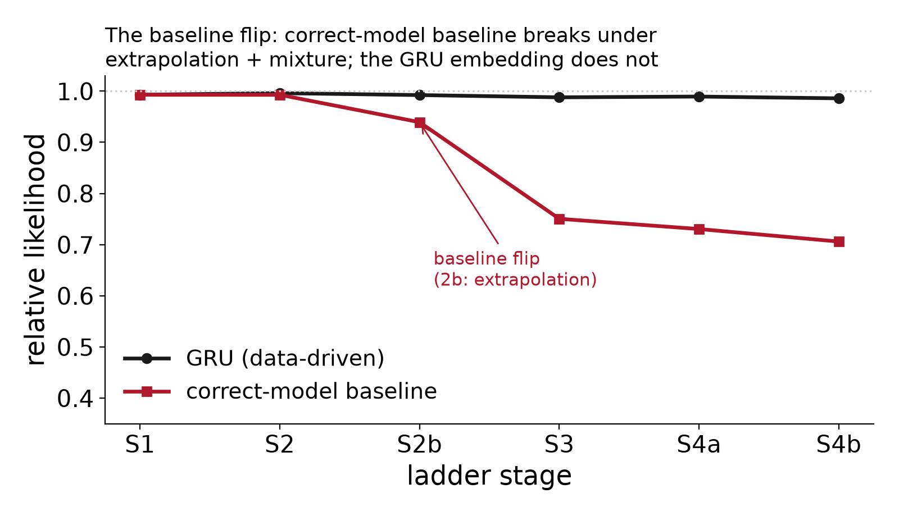

*Relative likelihood (model NL / ground-truth NL, ceiling 1.0) of the GRU vs the correct-model-class baseline across the ladder. N=200.*

| stage | generator | GRU rel-LL | baseline rel-LL | recovery | value |
|---|---|---|---|---|---|
| 1 | static (no drift) | ~0.993 | ~0.993 | subject param R² (D=4) | 0.91–0.96 |
| 2 | mild monotonic drift | 0.9962 | 0.9929 | subject R² (scalar) / session-frac R² | 0.96 / up to 0.94 |
| 2b | strong + non-monotonic drift, tail held-out | 0.9924 | 0.9394 | session-position R² (non-monotonic) | 0.47 (was 0.94) |
| 3 | QL-variant mixture (Bari/Hattori/RW) | 0.986–0.990 | 0.749–0.752 | preset classification | 97.5–99.5% |
| 4a | family mixture (QL/CTT/LC) | 0.988–0.991 | 0.718–0.743 | family decoding (GRU) | 100% |
| 4b | per-session family switching (Dirichlet 0.5) | 0.984–0.988 | ~0.706 (CTT) | mix-weight R² @D16 / per-session family | 0.55 / 0.62 |

- **The baseline flip is the study's spine.** A correctly-specified baseline matches the GRU on stationary (S1) and interpolable (S2) data, then breaks under extrapolation (S2b: 0.94 vs GRU >0.987) and under mixed structure (S3 model-selection 47%, S4a 70%), while the GRU embedding recovers the true structure at 97.5–100%.
- **Embedding dimension is the identifiability knob** — recovery scales with D, not hidden-unit count; higher-diversity mixtures (S3/S4) need D=16.
- **Stage-4b** (per-session family switching): recovery lives at the SUBJECT level (mixture-weight R² 0.55 @D16), not the session level — session-conditioning adds nothing over subject identity for decoding a session's family (0.62 vs 0.63), because Dirichlet(0.5) subjects are concentrated (mean dominant weight 0.70).

### Per-stage figures

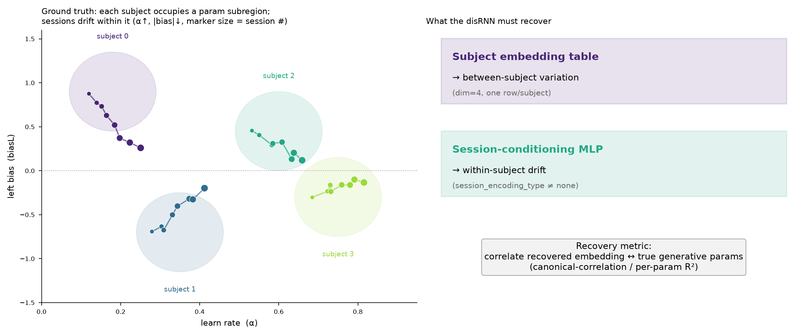

***Setup.** Each subject occupies a parameter subregion; sessions drift within it. The model must recover the subject-embedding table (between-subject) and the session-conditioning MLP (within-subject drift).*

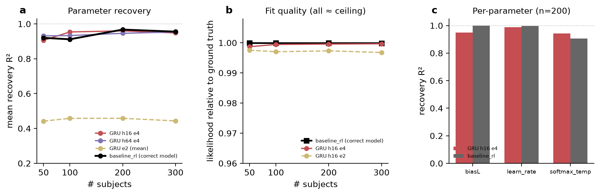

***Stage 1 — static.** Fit quality relative to ground truth, all near the ceiling (a); mean parameter-recovery R² vs #subjects (b); per-parameter recovery R² at n=200 (c), baseline_rl vs GRU embed-2 vs embed-4. Fit likelihood saturates regardless of embedding size, but recovery separates them: embed-4 matches the correct-model baseline while embed-2 is under-capacity — embedding size, not network width, is the identifiability knob.*

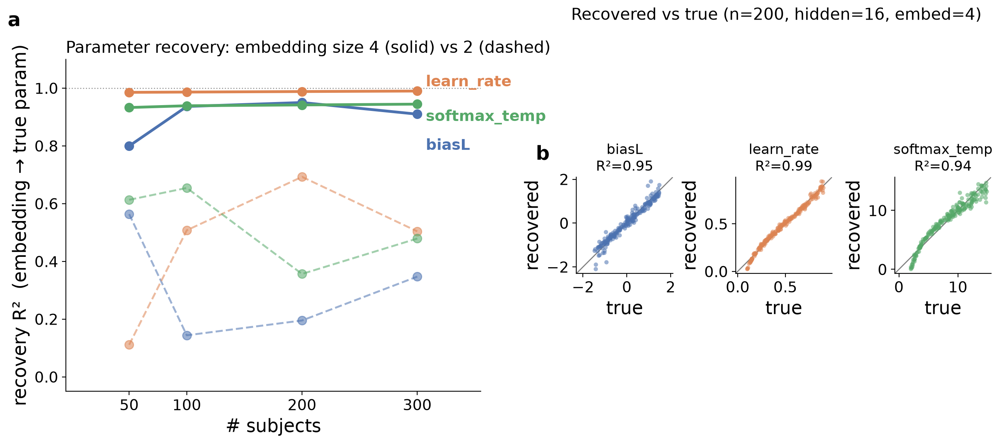

***Stage 1 — embedding-size sweep.** Recovery R² vs cohort size for embedding size 4 (solid) vs 2 (dashed) at hidden_size=16 (a); recovered-vs-true scatter for the 200-subject / embed-4 cell, one square panel per parameter with the y=x identity line (b). Size-4 embeddings recover all three parameters near ceiling and are insensitive to network width; size-2 embeddings sit below the identifiability threshold. Single seed (42) per cell — no error bars. Produced offline by `analysis/stage1_recovery_figure.py` from committed CSVs.*

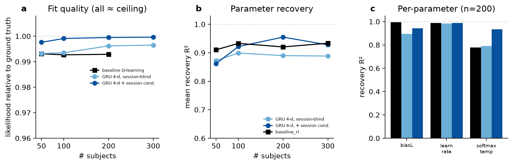

***Stage 2 — mild drift.** Combined recovery in the stage-1 format: fit quality relative to ground truth (a, all near ceiling), mean subject-parameter recovery R² vs #subjects (b), and per-parameter recovery at n=200 (c) for baseline_rl, GRU session-blind, and GRU session-conditioned (markers: baseline = square, GRU = circle). baseline_rl softmax-temperature uses a ROBUST R² with fitted inverse-temperature winsorized at 20 (true ceiling ~18.6): 5–10 near-deterministic subjects per run have divergent per-subject β MLEs, so raw R² is negative while rank recovery stays high (Spearman 0.92–0.96). Single seed (42) per cell — no error bars.*

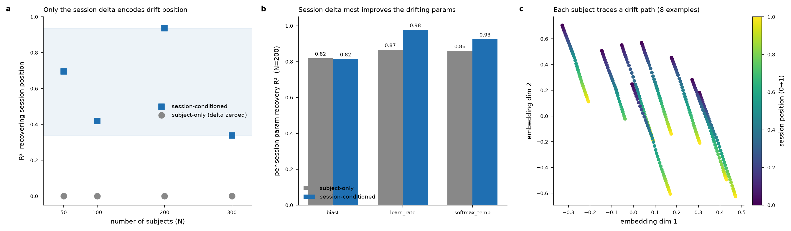

***Stage 2.** Only the session-conditioning MLP encodes drift position (subject-only delta-zeroed = R² 0.00 by construction); (c) each subject traces a drift path in embedding space.*

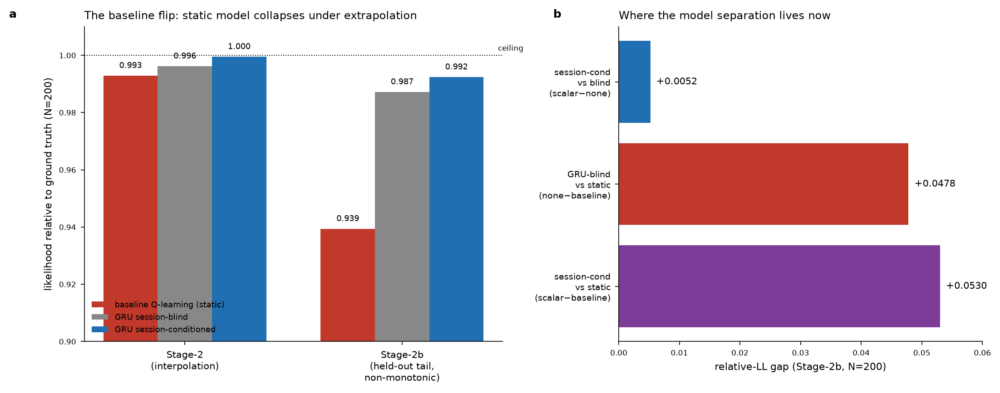

***Stage 2b — the baseline flip.** Static Q-learning collapses (0.939) under extrapolation while both GRUs stay >0.987 (a); (b) where model separation now lives.*

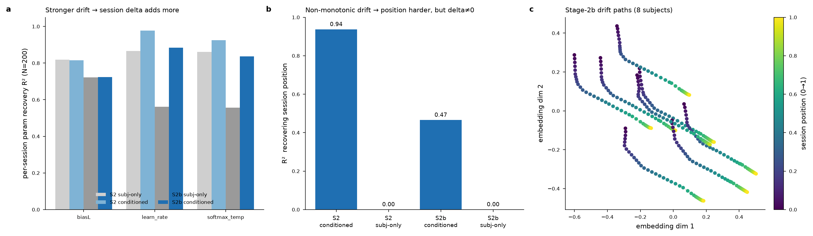

***Stage 2b.** Stronger, non-monotonic drift: session position is harder to recover (0.94→0.47) but the session delta still carries it; (c) drift paths.*

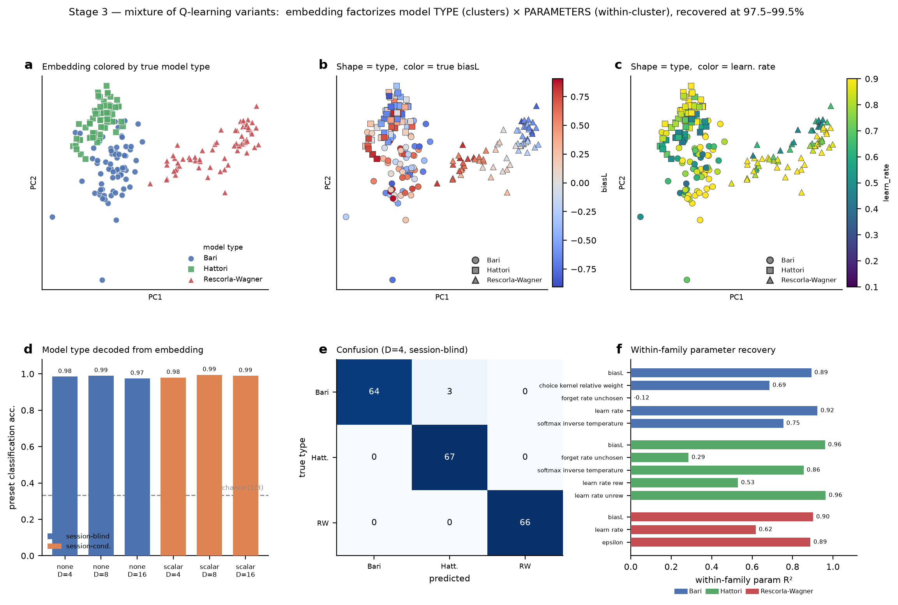

***Stage 3 — QL-variant mixture.** Embedding-space PCA colored by true type (a), biasL (b), learn_rate (c); type decoded at 97.5–99.5% (d), confusion (e), within-family parameter recovery (f). Model TYPE → cluster; PARAMETERS → position within.*

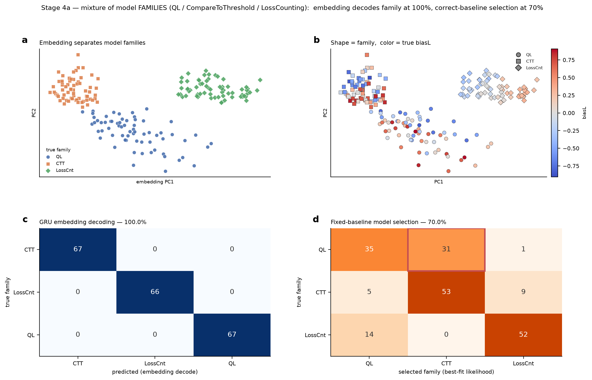

***Stage 4a — family mixture.** Embedding-space PCA separating the three families (a,b); GRU embedding decodes family at 100% (c) vs 70% fixed-baseline model selection (d).*

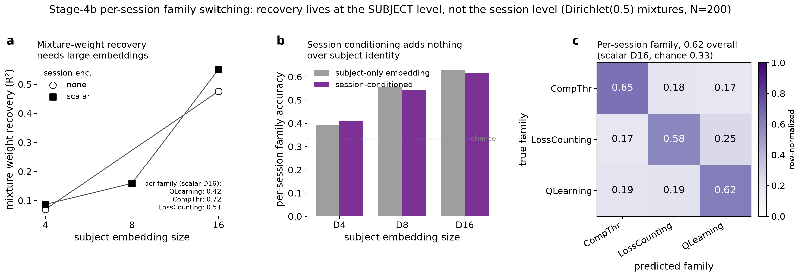

***Stage 4b — per-session family switching.** Mixture-weight recovery vs embedding size (a); subject-vs-session dissociation null (b); per-session family confusion (c).*
<!-- END result-1 -->

## Methods

All stages share one generator/estimator setup and differ only in the synthetic
generating process. Data: 40 sessions/subject × 650 trials, two-armed foraging
(random-walk reward probabilities, no baiting), single seed (42) per cell — so each
grid cell is one run and the figures carry no seed error bars. Training: multisubject
GRU, 50,000 steps, checkpoint every 5,000 steps. Stages with session conditioning
(2 onward) add `lambda_reg_session=1.0`; Stage 1 (`session_encoding_type=none`) has no
session term. The `baseline_rl` reference is the correctly-specified generating model
class, fit per subject. All runs are in W&B project `embedding_recovery` (entity `AIND-disRNN`).

**Recovery scoring** (`analysis/recovery_scoring.py`, model-agnostic). Two axes:
1. **Fit** — `likelihood_relative_to_groundtruth` = model NL ÷ generating-policy NL
   (ceiling 1.0), pulled from W&B.
2. **Recovery** — how well the learned subject-embedding table encodes the true
   generating parameters (`biasL`, `learn_rate`, `softmax_inverse_temperature`),
   scored as **cross-validated Ridge R²**: 5-fold CV R² predicting each true parameter
   from the standardized embedding (embedding → param, `Ridge(alpha=1)`) — the
   interpretable "can I read parameter X off the embedding?" score, robust to embedding
   dim ≠ 3. The stage-1 figure plots this for all three parameters (panel a vs cohort
   size; panel b recovered-vs-true, annotated R² is the same Ridge fit). Model-type /
   family recovery (Stages 3–4) is classification accuracy of a linear decoder on the
   embedding; session-position recovery (Stages 2/2b) is `GroupKFold`-CV
   LinearRegression R² of session phase, grouped by subject. (`recovery_scoring.py`
   also computes a canonical-correlation, CCA, summary as an internal cross-check that
   the embedding spans the parameter space; it saturates and is not dimension-comparable
   across embedding sizes, so it is neither reported nor plotted here.)

**Per-stage configuration.**

| stage | generator (`data/agent`) | between-subject structure | within-subject structure | GRU hidden / embedding sweep | session encoding |
|---|---|---|---|---|---|
| 1 | `hierarchical_rl_stage1` | static per-subject params | none | hidden {16,64,256} × embed {2,4,8}, N {50,100,200,300} | none |
| 2 | `hierarchical_rl_stage2` | static params | mild monotonic drift | hidden 16, embed 4, N {50,100,200,300} | none vs scalar |
| 2b | `hierarchical_rl_stage2b` | static params | strong, non-monotonic (sinusoidal) drift + noise, tail held out | hidden 16, embed 4, N=200 | none vs scalar |
| 3 | `hierarchical_rl_stage3` | mixture of QL variants (Bari/Hattori/RW), one preset/subject | per-preset drift | hidden 32, embed {4,8,16}, N=200 | none vs scalar |
| 4a | `hierarchical_rl_stage4a` | mixture of families (QL/CTT/LossCounting), one/subject | per-family drift | hidden 32, embed {4,8,16}, N=200 | none vs scalar |
| 4b | `hierarchical_rl_stage4b` | per-session family switching (Dirichlet 0.5) | family drawn each session | hidden 32, embed {4,8,16}, N=200 | none vs scalar |

Stage 1 settled the estimator config (hidden 16 / embed 4 recovers the static subject
centroid at ceiling; wider networks add nothing), which Stages 2–2b then fix; the
higher-diversity mixtures (Stages 3–4) sweep embedding size up to 16 because embedding
dimension — not hidden-unit count — is the identifiability knob.

## Discussion

The study climbs a ladder of increasingly rich synthetic generators, each with a
known ground truth, and at every rung compares the data-driven GRU against a
**correctly-specified** RL baseline (the same model class that generated the
data). The scientific point is not that the GRU beats a strawman — it is that a
correct baseline is *sufficient* only while the world is stationary or
interpolable, and the GRU's learned subject/session embedding keeps recovering
the true generative structure exactly where the baseline stops being sufficient:
under extrapolation (Stage-2b's tail-held-out non-monotonic drift) and under
mixed model structure (Stages 3/4).

The recovery axis is the complement of likelihood: even when several models sit
at the likelihood ceiling, only the GRU embedding linearly decodes the true
per-subject parameters, model variant, and model family. Embedding dimension —
not network width — is the identifiability knob; the higher-diversity mixture
generators (Stages 3/4) need D=16 to saturate recovery.

Stage-4b is the one rung where the recoverable signal sits entirely at the
subject level: with sparse Dirichlet(0.5) per-session family mixtures, subjects
are concentrated enough (mean dominant-family weight 0.70) that a session's
family is largely fixed by subject identity, so the session-conditioning MLP adds
nothing — a clean negative control against Stage-2b, where the session axis *did*
track a smooth within-subject trajectory.
