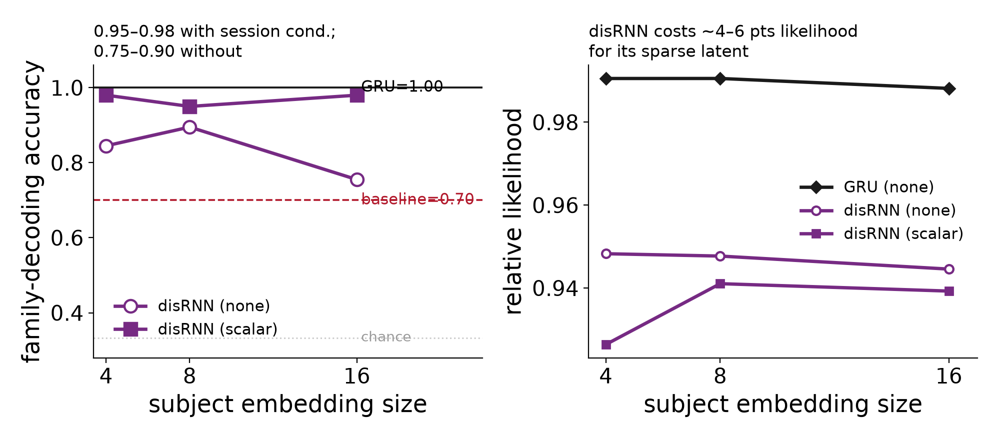

# Result 2 — the interpretable disRNN embedding recovers model family nearly as well as the GRU

<!-- BEGIN result-1 -->
[regenerated by `analysis/recovery_report.py` — do not edit by hand]

*disRNN family decoding (left) and likelihood cost (right) vs the GRU (=1.00 family, ~0.99 rel-LL) and the correct-baseline ceiling (0.70). N=200, Stage-4a generator.*

| enc | D | rel-LL | family-decoding acc |
|---|---|---|---|
| none | 4 | 0.9483 | 0.845 |
| none | 8 | 0.9477 | 0.895 |
| none | 16 | 0.9446 | 0.755 |
| scalar | 4 | 0.9264 | 0.980 |
| scalar | 8 | 0.9410 | 0.950 |
| scalar | 16 | 0.9393 | 0.980 |

- **Interpretability is nearly free for recovery.** The information-bottlenecked disRNN decodes model family at 0.95–0.98 (with session conditioning), nearly matching the GRU's 1.00 and far above the 0.70 baseline ceiling.
- **The bottleneck costs ~4–6 pts of likelihood** (rel-LL ~0.93–0.95 vs GRU ~0.99) — smallest for `none` D4 (4.2 pts), largest for `scalar` D4 (6.4 pts).
- **Session conditioning matters more for the disRNN.** Without it (`none`), decoding is lower and more variable (0.75–0.90); the GRU's raw embedding already hit 1.00.
<!-- END result-1 -->

## Discussion

Stage-4a is the cleanest recovery figure in the study — one model family per
subject, GRU family decoding at 100% vs a 70% correct-baseline ceiling — so it is
the natural entry point for the disRNN replication. The disRNN differs from the
GRU in one decisive way: it forces its latent state through an information
bottleneck to stay human-readable. The question is whether that interpretability
tax costs recovery.

It does not, materially. With session conditioning the disRNN embedding decodes
family at 0.95–0.98, essentially matching the GRU and far above the baseline
ceiling; the three families sit in visibly separate regions of the embedding. The
bottleneck does cost likelihood — a consistent ~4–6 points below the GRU's ~0.99
— but that is the price of the sparse, inspectable latent, not a loss of
identifiability. The one asymmetry worth carrying forward: the disRNN's raw
(session-blind) embedding is noisier (0.75–0.90) and benefits from the scalar
session-conditioning that the GRU did not need, which is consistent with the
bottleneck squeezing subject-identity information that conditioning helps recover.

Remaining ladder rungs (Stages 1/2/2b/3) have not yet been replicated with the
disRNN; the recovery analysis is model-agnostic (`analysis/recovery_report.py`
via `extract_subject_embeddings_from_params`) and reused as-is when they land.
