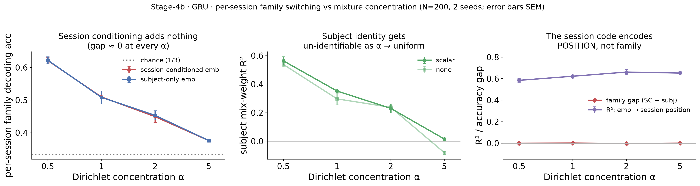

# Result 3 — session conditioning fails to recover discrete per-session regimes at *any* mixing level (the null is architectural)

**Question.** `gru-stage4b` found "session conditioning adds nothing" for per-session
family switching, but at a single Dirichlet **concentration α=0.5** — sparse enough
that a subject is nearly single-family, so a session's family is essentially fixed by
subject identity. Is that null a sparsity artifact, or fundamental? This sweeps
`subject_presets.session_switching.concentration ∈ {0.5, 1, 2, 5}` (sparse →
near-uniform mixtures), embedding size fixed at 16, N=200, 2 seeds.

<!-- BEGIN result-1 -->
[regenerated by `analysis/s4b_concentration_recovery.py` — do not edit by hand]

*Left: per-session family decoding from the session-conditioned embedding (red) vs the
subject-only embedding (blue) — they overlap at every α (gap ≈ 0). Middle: subject-level
mixture-weight R² collapses toward 0 as α → uniform. Right: the mechanism — the
session-conditioned embedding predicts session **position** (R² ≈ 0.6) but adds **~0**
for the per-session **family**. N=200, 2 seeds; error bars SEM.*

| α | per-session SC | per-session subj-only | **gap** | subject mix-R² | position-R² |
|---|---|---|---|---|---|
| 0.5 | 0.621 | 0.622 | **−0.001** | 0.55 | 0.584 |
| 1 | 0.510 | 0.508 | **+0.001** | 0.32 | 0.623 |
| 2 | 0.449 | 0.453 | **−0.004** | 0.23 | 0.661 |
| 5 | 0.376 | 0.376 | **0.000** | ~0 | 0.652 |
<!-- END result-1 -->

## Verdict

**The `gru-stage4b` null is robust and architectural, not a Dirichlet(0.5) artifact.**
Session conditioning adds nothing to per-session family decoding at *any* concentration —
the session-conditioned − subject-only gap is ≈0 across the full sparse→uniform range,
even at α=5 where subjects genuinely mix families session-to-session.

The mechanism (right panel) is the payoff: the session-conditioned embedding **does**
carry substantial information the subject embedding lacks — but it is smooth session
**position** (R² ≈ 0.6), not the discrete per-session **family** (gap ≈ 0). This is
expected from the architecture: `session_encoding_type ∈ {scalar, fourier}` is a smooth
delta-network function of the **session index**
(`aind-disrnn-wrapper/code/models/session_conditioning.py`), the right inductive bias for
Stage-2's smooth *drift* and the wrong one for a discrete i.i.d. regime draw. A continuous
position code is structurally unable to represent a categorical per-session family.

Two supporting reads: subject-level mixture recovery **falls monotonically with α**
(mix-R² 0.55 → 0; middle panel) because near-uniform mixtures make subjects mutually
un-identifiable — there is genuinely less subject identity to recover; and per-session
decodability itself **declines toward chance** (0.62 → 0.38, left panel) because a
near-uniform per-session family is barely predictable from *any* representation.

**Boundary of the method (not a bug).** Recovering discrete per-session regimes needs a
mechanism that is *content-inferred* and *discrete* — a Gumbel/VQ session code or a
mixture-of-experts gate (Bayesian MoE = a mixture/DP prior on a session latent). Design
sketch: [`docs/design-hierarchical-vi-foundation-model.md`](../../../../docs/design-hierarchical-vi-foundation-model.md).
If within-subject variation is instead **graded** (drift/engagement — the biologically
plausible case), Stage-2 already shows session conditioning recovers it and this boundary
does not bite.

## Provenance

Group `gru-stage4b-concentration@20260712-060852` (Beaker exp `01KXB73W3S8RDJTMAS5SAV4K18`),
16/16 runs. Subject-level + per-session metrics from the in-container recovery
(`aind-disrnn-wrapper code/analysis/stage4b_recovery.py`) →
`analysis/s4b_concentration_recovery.json`. The position-R² diagnostic is computed here
from the per-run session-embedding CSVs (`ctx_*.csv`) in the recovery job's Beaker result
dataset (`01KXBYQV5P9NSPWQ72WG7G2A87`; the CSVs are gitignored W&B-pull artifacts). A
future wrapper change could emit position-R² in-container for one-step reproducibility.
