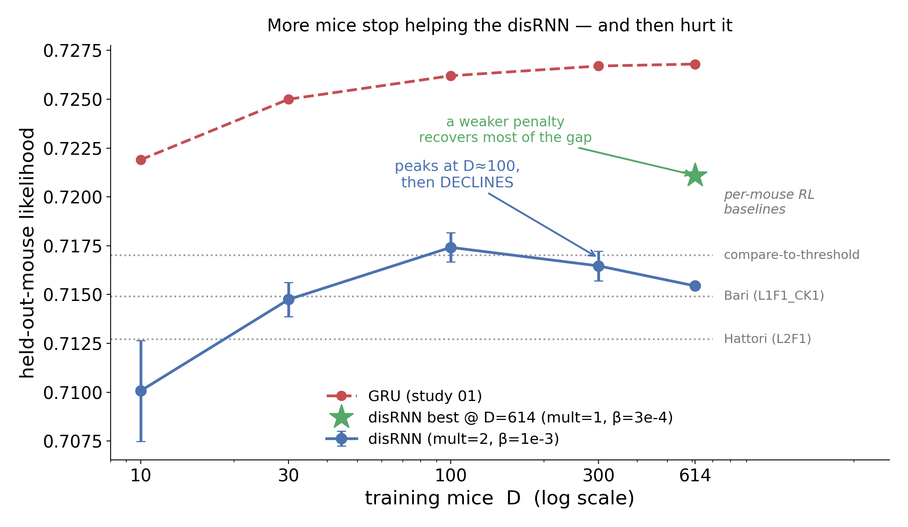

# r1 — Held-out transfer vs cohort size: the disRNN peaks at ~100 mice, then declines

**Question.** Does training the disRNN on more mice improve prediction of mice it has never seen?

<!-- BEGIN result-1 -->
| D | 10 | 30 | 100 | 300 | 614 |
|---|---|---|---|---|---|
| **disRNN** (mult=2, β=1e-3, 3 seeds) | 0.7101 | 0.7147 | **0.7174** | 0.7165 | 0.7154 |
| GRU (study 01) | 0.7219 | 0.7250 | 0.7262 | 0.7267 | 0.7268 |
| gap | −0.0118 | −0.0103 | −0.0088 | −0.0102 | −0.0114 |

Per-mouse RL baselines, same held-out cohort and metric: **compare-to-threshold 0.7170**,
Bari 0.7149, Hattori 0.7127.
<!-- END result-1 -->

## What it says

1. **The disRNN does not saturate the way the GRU does — it peaks at D≈100 and then declines.**
   The GRU rises and flattens; the disRNN rises, tops out at 0.7174, and gives ground at D=300 and
   D=614.

2. **It is not undertraining.** The obvious confound was tested and rejected:
   `checkpoint/eval_likelihood` is flat over the final checkpoints at both D=99 (Δ −0.0003) and
   D=614 (Δ +0.0002). D=614 in fact fits *better* within-subject (0.7243 vs 0.7212) while
   transferring *worse* — more mice genuinely improve the fit and genuinely hurt transfer **at this
   operating point**.

3. **At the full cohort the disRNN is beaten by a per-mouse classical RL model.** D=614 gives
   0.7154, below compare-to-threshold's 0.7170 — a baseline the GRU beats by +0.0098.

4. **The gap to the GRU is flat in D** (−0.009 to −0.012 at every cohort size). The disRNN's deficit
   is *not* a large-cohort phenomenon; it is present at D=10 and never closes. This is what motivated
   [`subject-capacity`](../../variants/subject-capacity/notes.md), which tests whether the *subject*
   bottleneck is the cause.

5. **The decline is largely our own operating point's fault** — see [r2](r2-sparsity-and-multiplier.md).
   At D=614 the best cell is mult=1/β=3e-4 → **0.7211** (green star), +0.0057 over the curve's D=614
   point, above the RL baseline and most of the way back to the GRU. A penalty tuned at D=100 is too
   strong at D=614.

## Caveats

- Held-out is **seed-stable**: SD at D=614 = 0.00046 across four seeds (0/1/2/42:
  0.7157 / 0.7153 / 0.7153 / 0.7163). The curve's shape is not a seed artifact.
- The y-axis is per-trial-normalised likelihood, which is **headroom-poor** (study 01: a new mouse
  is predicted to ~99.7% of its adapted likelihood from the population mean). Differences of 0.001
  are small per trial but compound across ~500-trial sessions.
