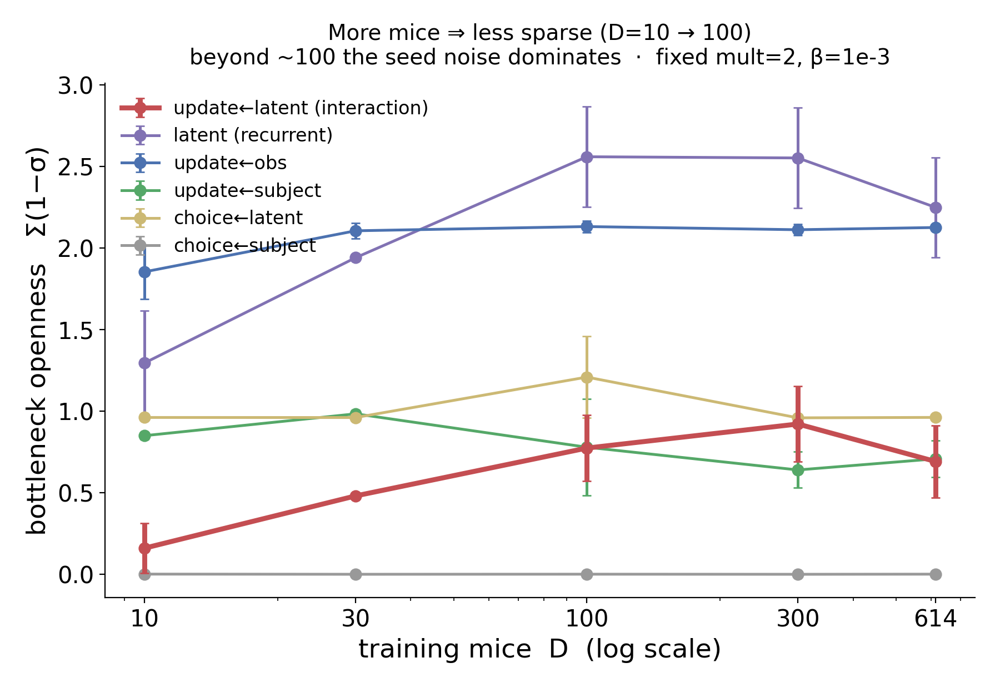
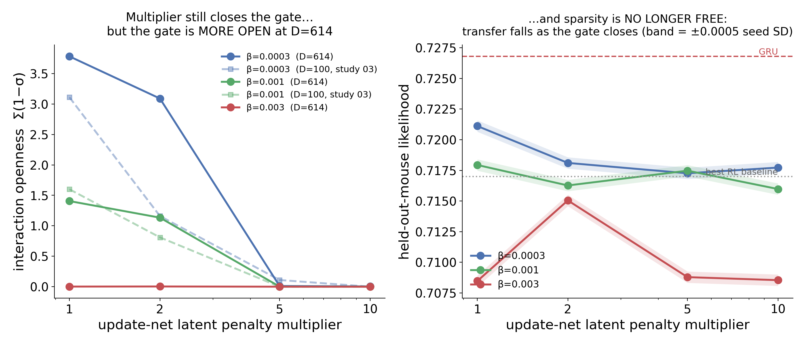

# r2 — Sparsity vs cohort size, and the multiplier at the full cohort

**Question.** Study 03 (at a fixed D=100) concluded that the multiplier monotonically closes the
interaction bottleneck and that **held-out transfer is flat across it — so sparsity is free**. Its
*founding premise*, though, was that the bottleneck fails to sparsify **when many mice are trained
together** — a claim it never tested against D. Does any of it survive at D=614?

> **Metric.** Openness is **`total_openness` = Σ(1−σ)**. Never `n_eff_open_frac` — it is
> scale-invariant and reads high even for a fully shut bottleneck (study 03 mis-ranked 19/43 runs
> with it).

## Sparsity vs D

<!-- BEGIN result-2a -->
Interaction (`update←latent`) openness Σ(1−σ) at fixed mult=2, β=1e-3, mean over 3 seeds:

| D | 10 | 30 | 100 | 300 | 614 |
|---|---|---|---|---|---|
| interaction openness | 0.161 | 0.481 | 0.774 | 0.922 | 0.692 |
| held-out LL | 0.7101 | 0.7147 | 0.7174 | 0.7165 | 0.7154 |
<!-- END result-2a -->

**More mice ⇒ less sparse — as a coarse trend.** The gate opens ~5× from D=10 to D≈100. Study 03's
founding premise is therefore **correct**, and now measured across D for the first time.

> ⚠️ **Do not read fine structure above D≈100.** The seed-to-seed SD of interaction openness at
> D=614 is **0.384** (per-seed: 1.136 / 0.467 / 0.474) — larger than the D=300-vs-614 difference.
> Openness is a highly seed-variable quantity at large cohort. An earlier draft of this study read
> the D=614 mean (0.692 < 0.922) as evidence of *non-monotonicity*; that was **noise**, and the
> claim is withdrawn. Only the coarse D=10 → 100 rise is above the seed noise.

The rest of the network is consistent: the recurrent `latent` gate also opens with D, `update←obs`
stays flat, and the **subject** channels *close* (`update←subject` 0.85 → 0.64; `choice←subject`
shut at ~0.001 throughout). As mice accumulate, the model moves capacity out of per-subject channels
into shared dynamics — it abandons personalisation. That observation is what
[`subject-capacity`](../../variants/subject-capacity/notes.md) exists to test.

## The multiplier at D=614

<!-- BEGIN result-2b -->
Interaction openness Σ(1−σ) at D=614 (seed 0), with study 03's D=100 value in brackets:

| β | mult=1 | mult=2 | mult=5 | mult=10 |
|---|---|---|---|---|
| 3e-4 | 3.78 [3.11] | 3.09 [1.16] | 0.011 [0.11] | 0.004 [0.00] |
| 1e-3 | 1.41 [1.60] | 1.13 [0.81] | 0.002 [0.00] | 0.002 [0.00] |
| 3e-3 | 0.002 | 0.004 | 0.000 | 0.000 |

Held-out likelihood at D=614 (seed 0):

| β | mult=1 | mult=2 | mult=5 | mult=10 |
|---|---|---|---|---|
| 3e-4 | **0.7211** | 0.7181 | 0.7173 | 0.7177 |
| 1e-3 | 0.7179 | 0.7163 | 0.7175 | 0.7160 |
| 3e-3 | 0.7085 | 0.7150 | 0.7088 | 0.7085 |
<!-- END result-2b -->

**1. The mechanism survives.** The multiplier still closes its target monotonically at the full
cohort (β=3e-4: 3.78 → 3.09 → 0.011 → 0.004).

**2. The gate is more open at D=614 than at D=100** for the same (mult, β) at weak/moderate β —
most starkly at the recommended operating point (mult=2, β=3e-4: **1.16 → 3.09**). A penalty tuned
at 100 mice does not hold the bottleneck shut at 614.

**3. THE HEADLINE — sparsity is no longer free.** Study 03's central selling point (held-out is flat
across the multiplier) **breaks at D=614**: at β=3e-4, held-out falls
**0.7211 → 0.7181 → 0.7173 → 0.7177**. Sparsification costs **~0.004**, about half the disRNN's
entire gap to the GRU. At 100 mice interpretability was free; at the full cohort **interpretability
and transfer are a genuine trade-off**.

## Noise check (this is why claim 3 stands and the openness claim does not)

Wave 2 is **single-seed by design** (a mechanism check, not an effect-size estimate), so both claims
were tested against the seed-to-seed SD measured *at the same config* from wave 1's three D=614 cells:

| quantity | seed SD at D=614 | effect | ratio | verdict |
|---|---|---|---|---|
| held-out LL | **0.00046** | multiplier spread 0.0039 | **8.4×** | real |
| interaction openness | **0.384** | D=300→614 diff ~0.23 | 0.6× | **noise** |

Held-out likelihood is remarkably seed-stable; openness is not. Any future claim about openness
needs seed replication, not a single run.
