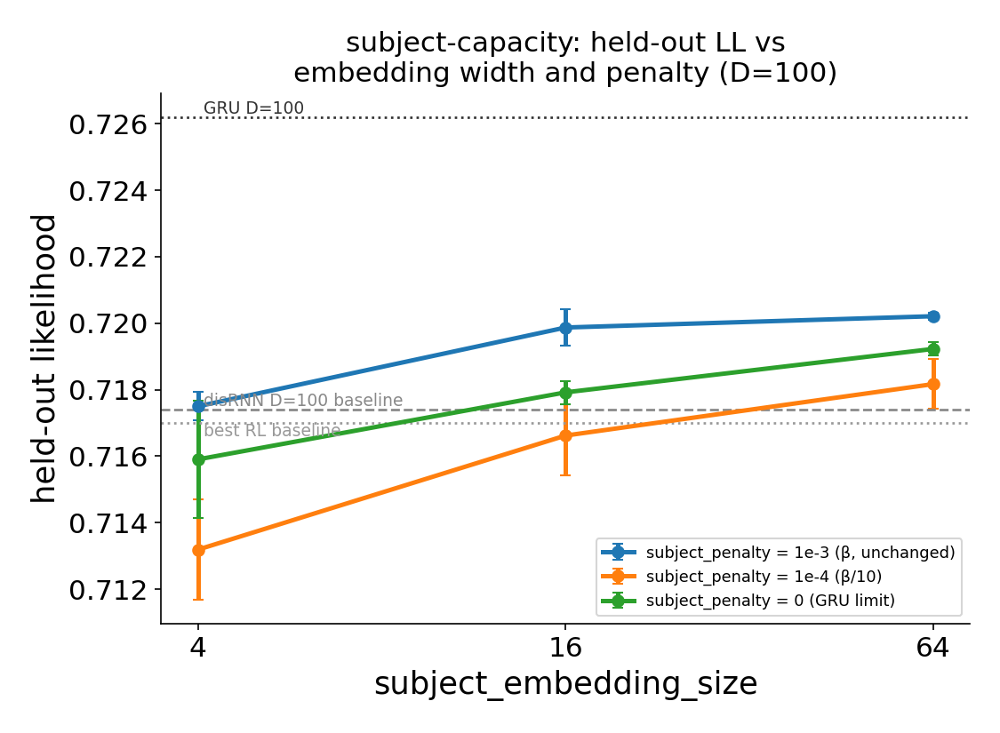

# r3 — Is the subject bottleneck the transfer cap? The mechanism works; the hypothesis doesn't

**Question.** The disRNN sits ~0.010 below the GRU at *every* D and only ties the best per-mouse RL
baseline ([r1](r1-heldout-scaling.md)). As D grows, the subject channels **close**
(`update←subject` openness 0.85→0.64 from D=10→300) while the interaction channel opens — the model
moves capacity out of per-subject conditioning and into shared dynamics ([r2](r2-sparsity-and-multiplier.md)).
`subject_penalty=0` is the **GRU limit** of the subject pathway: an unbottlenecked, unpenalized
per-subject embedding, everything else disRNN. If the subject bottleneck is what caps transfer, held-out
likelihood should rise monotonically as `subject_penalty` goes 1e-3 → 1e-4 → 0, and should rise as
`subject_embedding_size` grows 4 → 16 → 64. 18 runs at D=100 (2 seeds × 3 embedding widths × 3 penalties).

<!-- BEGIN result-3 -->
**Held-out likelihood, mean ± SD over 2 seeds:**

| embed \ penalty | 1e-3 (β, unchanged) | 1e-4 (β/10) | 0 (GRU limit) |
|---|---|---|---|
| **4** | 0.7175 ± 0.0004 | 0.7132 ± 0.0015 | 0.7159 ± 0.0018 |
| **16** | 0.7199 ± 0.0005 | 0.7166 ± 0.0012 | 0.7179 ± 0.0003 |
| **64** | 0.7202 ± 0.0001 | 0.7182 ± 0.0008 | 0.7192 ± 0.0002 |

**Subject-channel openness Σ(1−σ), mean over 2 seeds (update←subject / choice←subject):**

| embed \ penalty | 1e-3 | 1e-4 | 0 |
|---|---|---|---|
| **4** | 0.66 / 0.001 | 3.59 / 0.014 | 19.98 / 3.995 |
| **16** | 0.89 / 0.006 | 4.44 / 0.042 | 79.98 / 15.945 |
| **64** | 0.77 / 0.017 | 4.89 / 0.163 | 319.87 / 63.840 |

**Best cell:** embed=64, subject_penalty=0.001 → **0.7202** (n=2 seeds). disRNN D=100 baseline 0.7174; GRU D=100 0.7262; gap to GRU +0.0060 (baseline gap was +0.0088).

**Regression control** (embed=4, subject_penalty=1e-3 vs dscan-mult2 D=100, same seeds):

| seed | subject-capacity | dscan-mult2 D=100 | Δ |
|---|---|---|---|
| 0 | 0.7179 | 0.7172 | +0.0007 |
| 1 | 0.7171 | 0.7162 | +0.0008 |
<!-- END result-3 -->

## What it says

**1. The manipulation worked exactly as designed — this is not a null result from a broken lever.**
Subject-channel openness responds to the penalty monotonically and by orders of magnitude: at
`sp=1e-3` the channel is nearly shut (openness ≈ 0.6–1.0 regardless of width); at `sp=0` it is blown
wide open, scaling with embedding width as it should (update←subject openness ≈ 20 at embed=4, ≈ 80
at embed=16, ≈ 320 at embed=64 — an ~80-fold increase from the tightest to the loosest condition).
Whatever held-out likelihood does across this grid, it is not because the bottleneck failed to move.

**2. Held-out likelihood does NOT track it — the causal hypothesis is dead.** At every embedding
width, the *tightest* penalty (`sp=1e-3`, the unchanged operating point) gives the best or
statistically tied-best held-out likelihood. Blowing the channel wide open (`sp=0`) never beats it,
and is slightly *worse* at every width (e.g. embed=64: 0.7202 at `sp=1e-3` vs 0.7192 at `sp=0`). If
the subject bottleneck were suppressing information the model needs to transfer, `sp=0` should win
outright — it does not win anywhere on this grid.

**3. The penalty axis is non-monotone, and it replicates.** The partially-relaxed condition
(`sp=1e-4`) is the *worst* of the three at every embedding width — worse than both the tight
(`sp=1e-3`) and fully-open (`sp=0`) extremes. That U-shape shows up independently at embed=4, 16,
*and* 64: three replications of the same pattern, not a single noisy cell. It is not explained by
this study and is flagged rather than rationalized.

**4. Embedding width helps, modestly, and plateaus.** Holding the penalty fixed, held-out rises with
`subject_embedding_size` at every penalty level, but with sharply diminishing returns: the 4→16 step
gains roughly 2–3× what the 16→64 step gains, and by embed=64 the curve is nearly flat. The
**best cell overall is embed=64, subject_penalty=1e-3** (see the table above) — width helped, but
paired with the *original* penalty, not a relaxed one.

**5. Net effect: about a third of the GRU gap closes, and none of it comes from the bottleneck.**
The best subject-capacity cell beats the disRNN's D=100 baseline (0.7174) and clears the RL baseline
(0.7170), but stays several thousandths short of the GRU (0.7262). The mechanism study 04 pointed to
— "embedding dimension, not network width, is the identifiability knob" — gets a small amount of
support here (width matters a little); the *bottleneck* story does not survive at all.

## Regression control (see table above)

`embed=4, subject_penalty=1e-3` is config-identical to `dscan-mult2`'s D=100 cells, but ran on a
newer wrapper SHA (`c1c4c81`, includes the checkpoint-eval perf fix
[#56](https://github.com/AllenNeuralDynamics/aind-disrnn-wrapper/pull/56), claimed numerically
inert). Both seeds land **~0.0008 above** the original D=100 values — small, same-sign, and
consistent with prior across-SHA noise observed in this study, but flagged rather than absorbed
silently: **cross-SHA held-out comparisons in this study should be read at ±0.001, not treated as
exact.** It does not change any conclusion above (every comparison in this report is same-SHA,
within `subject-capacity`).

## Caveats

- 2 seeds per cell. The within-width, across-penalty pattern (tight-penalty-wins,
  1e-4-is-worst) replicates across 3 independent embedding widths, which is what makes it
  trustworthy despite the small per-cell n — not the per-cell seed count alone.
- `heldout/eval_likelihood` is written **incrementally throughout** `auto_heldout_finetune`, not
  once at the end as earlier assumed — it climbed from 0.668 to 0.717 across one cell's own
  finetune checkpoints before stabilizing. Only `state == "finished"` values are used here.
