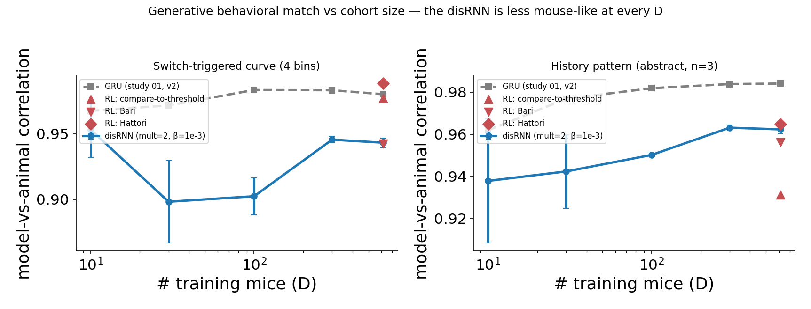

# r4 — Does the disRNN *behave* like a mouse? No: it is measurably less mouse-like than the GRU at every D

**Question.** Our first-order metric is **headroom-poor**: held-out likelihood puts the disRNN only
~0.010 below the GRU and merely level with a per-mouse RL baseline ([r1](r1-heldout-scaling.md)). A
generative test can discriminate where likelihood cannot — *does the interpretable model actually
behave like a mouse, or does it just assign similar per-trial probabilities?*

Each of the 15 `dscan-mult2` cells (5 D × 3 seeds) is rolled out **closed-loop** as an agent on the
task, one seeded rollout per real session with the trial count matched, and its behavior compared to
the real animal's on two curves. The disRNN counterpart of study 01's
[r9](../../../01-gru-scaling-law/analysis/reports/r9-generative-behavioral-match.md); metric,
curves, and held-out cohort are identical, so the two models are directly comparable.

<!-- BEGIN result-4 -->
**(a) Switch-triggered curve** — `post_switch_by_reward_and_run_length` (subject-mean correlation, 3 seeds):

| D | 10 | 30 | 100 | 300 | 614 |
|---|---|---|---|---|---|
| **disRNN corr** | 0.9532 | 0.8982 | 0.9024 | 0.9455 | 0.9433 |
| **GRU corr** | 0.9675 | 0.9717 | 0.9834 | 0.9833 | 0.9802 |
| **disRNN RMSE** | 0.0410 | 0.0375 | 0.0370 | 0.0414 | 0.0396 |
| **GRU RMSE** | 0.0416 | 0.0401 | 0.0366 | 0.0376 | 0.0379 |

**(b) History-pattern curve** — `history_dependent`, abstract encoding, n_back=3 (32 bins):

| D | 10 | 30 | 100 | 300 | 614 |
|---|---|---|---|---|---|
| **disRNN corr** | 0.9379 | 0.9424 | 0.9502 | 0.9631 | 0.9623 |
| **GRU corr** | 0.9619 | 0.9768 | 0.9819 | 0.9838 | 0.9841 |
| **disRNN RMSE** | 0.0247 | 0.0253 | 0.0228 | 0.0268 | 0.0249 |
| **GRU RMSE** | 0.0279 | 0.0293 | 0.0240 | 0.0255 | 0.0255 |

**(c) RL baselines at D=614** — per-subject fits (r1), rolled out through the SAME task construction as the disRNN/GRU rollouts (not a D-sweep: one fit per mouse, all 614 mice):

| model | switch corr | switch RMSE | history corr | history RMSE |
|---|---|---|---|---|
| **GRU** | 0.9802 | 0.0379 | 0.9841 | 0.0255 |
| Hattori | 0.9884 | 0.0452 | 0.9648 | 0.0313 |
| compare-to-threshold | 0.9770 | 0.0369 | 0.9313 | 0.0216 |
| Bari | 0.9425 | 0.0831 | 0.9561 | 0.0403 |
| **disRNN** | 0.9433 | 0.0396 | 0.9623 | 0.0249 |
<!-- END result-4 -->

## What it says

**1. The generative axis discriminates where likelihood could not — and this is the headline.**
On held-out likelihood the disRNN trails the GRU by ~0.010 in absolute units, a gap that is real but
hard to interpret. Rolled out as an agent, the disRNN's behavioral match is **worse than the GRU's at
every cohort size**, on both curves:

| D | 10 | 30 | 100 | 300 | 614 |
|---|---|---|---|---|---|
| switch-curve corr gap (disRNN − GRU) | −0.014 | −0.074 | −0.081 | −0.038 | −0.037 |
| history-curve corr gap | −0.024 | −0.035 | −0.032 | −0.021 | −0.022 |

The history-curve gap is the trustworthy one: its seed SD is **0.0008–0.0020** at D ≥ 100, so a
−0.02 to −0.03 gap is **10–20× the noise**. This is not a marginal effect.

**2. It gets the average right and the *shape* wrong.** Correlation drops while **RMSE does not** —
the disRNN's RMSE is comparable to the GRU's and at some D even lower (switch curve at D=30: 0.0375
vs 0.0401; history at D=10: 0.0247 vs 0.0279). A model can only lose correlation while holding
absolute error if its curve is **flatter than the animal's**: it reproduces roughly the right overall
switch *level*, but not the *pattern* of how switching depends on reward and history. That is exactly
the failure mode you would predict from a model whose bottlenecks have pruned history-dependence —
and it is invisible to a per-trial likelihood, which the flat curve scores nearly as well on.

**3. The behavioral deficit does not close with more mice.** Both gaps persist at D=614. Combined
with [r1](r1-heldout-scaling.md) (the likelihood gap is also flat in D) and
[r2](r2-sparsity-and-multiplier.md) (sparsification costs ~0.004 held-out at D=614), the picture is
consistent: **the disRNN's deficit is architectural, not data-limited.**

**4. Against classical RL, the disRNN's ranking depends entirely on which curve you ask.** r1 already
showed the disRNN *loses* to compare-to-threshold on held-out likelihood at D=614. Table (c) rolls
the same three per-mouse RL baselines out generatively (per-subject fits, same task construction as
every other model here — see
[`variants/generative-rl-baseline`](../../variants/generative-rl-baseline/notes.md)) and the answer
is not a clean "RL wins" or "RL loses":

- **On the switch curve**, two of three RL models beat the disRNN outright — **Hattori (0.9884)
  even edges out the GRU (0.9802)** — and compare-to-threshold (0.9770) is close behind. Only Bari
  (0.9425) sits at the disRNN's level.
- **On the history curve, the ranking inverts.** compare-to-threshold — the single best RL model on
  switch-triggered behavior — is the **worst model in the whole table** on history (0.9313, well
  below the disRNN's 0.9623). Bari also trails the disRNN here (0.9561). Only Hattori beats the
  disRNN on both curves.

So "does the disRNN behave more like a mouse than a simple RL model?" has no single answer — it
depends which behavioral signature you're asking about, and the three RL models themselves disagree
with each other about which task feature they capture. compare-to-threshold nails short-timescale
win-stay/lose-shift (the switch curve) while missing 3-trial-back structure entirely; the value-based
models (Bari, Hattori) are more even across both. Also notable: **Bari's RMSE is 2× everyone else's**
on both curves (0.083 switch, 0.040 history) despite a mid-table correlation — its curve *shape*
tracks the animal reasonably, but its absolute *level* is off by more than any other model here.

## Caveats

- **Do not read the dip at D=30/100.** Switch-curve correlation goes 0.953 → 0.898 → 0.902 → 0.946 →
  0.943, but the seed SD there is 0.032/0.014 — the dip is ~1–2 SD and **not robust**. The
  disRNN-vs-GRU *gap* is robust; its shape in D is not. (The history curve, with SD ≤ 0.002 at
  D ≥ 100, shows no such structure.)
- The GRU reference itself carries the pre-#60 wrong-task bug (see below), so the *absolute* gap is
  approximate. It is not plausibly an artifact of that bug, though: the bug would if anything hurt
  the GRU's numbers, and the GRU still wins.

## What the two curves are

- **Switch-triggered** (`post_switch_by_reward_and_run_length`, 4 bins) — for every choice switch,
  bin by (reward on the switch trial) × (length of the preceding same-choice run), and report
  P(switch again on t+1).
- **History-pattern** (`history_dependent`, `abstract`, n_back=3, 32 bins) — P(switch at t) given
  the last 3 trials' (choice, reward) pattern, with the first trial canonicalised so `LrR` and
  `Rlr` collapse.

Headline is the **subject-mean Pearson correlation** between the model's curve and the animal's;
companion is the **subject-balanced RMSE**. GRU reference is study 01's **v2** arm (session
conditioning active) — the arm architecturally matched to these runs.

## ⚠️ Read the absolute numbers with this caveat

The rollout is **curriculum-matched to the task FAMILY, not its PARAMETERS**. After wrapper
[#60](https://github.com/AllenNeuralDynamics/aind-disrnn-wrapper/pull/60) each session is simulated
on the family the animal actually ran (coupled vs uncoupled, baiting vs not — before that fix,
off-curriculum sessions were silently simulated as a default *uncoupled-baiting* task even when the
animal ran *Coupled Baiting*), but the task is then built with the **gym's default block/reward
parameters**. `current_stage_actual` is logged and unused.

So the animal behaves in its *real* environment and the model in a *generic* one of the same family.
Any mismatch is an **upper bound on the model's true error**. Comparisons *across* D and *against
the GRU* stay valid — the handicap is identical in every cell, and the GRU carries it too. Absolute
"how mouse-like is it" claims do not. See
[`variants/generative-dscan/notes.md`](../../variants/generative-dscan/notes.md).

> Study 01's r9 was computed **before** wrapper #60, so ~17% of sessions in its D=10 cohort were
> rolled out on the wrong task family. Its numbers are used here as the GRU reference and are
> **affected by that bug**; re-running r9 on the fixed wrapper is tracked and not yet done.
