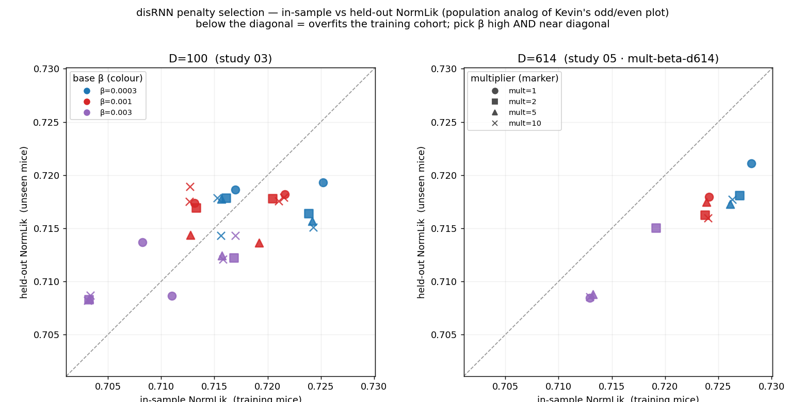

# r1 — Penalty selection: free at D=100, overfits at D=614 → why we run the grid

**Question.** Before committing GPU-hours to a big penalty scan, can we pick the disRNN bottleneck
penalty **β** from data we already have — and does the choice depend on cohort size **D**?

This is Kevin's model-selection idea (his "Example Rat / Different DisRNN Penalties" plot) applied to
our multi-subject setting. Kevin scores each model on **odd vs even sessions** of one rat (within-
subject reliability) and picks the penalty that sits "upper enough but not separated too far" from
the y=x diagonal — high likelihood *and* consistent across halves (not overfit). Our models are
population models, so we use the **population-transfer analog**:

- **x = in-sample NormLik** — eval on the **training** mice.
- **y = held-out NormLik** — eval on **unseen** mice (the fixed held-out cohort).

Same geometry: on the diagonal = no generalization gap; **below the diagonal = the penalty is too
weak and the model overfits the training cohort**. Built entirely from committed study 03 (D=100) +
study 05 (D=614) runs — no new compute. Both panels are **lr=1e-3** (study 03's raw grid mixes
lr∈{1e-3,5e-3} under a mislabeled column; the lr=1e-3 slice was recovered from W&B, see
`pull_selection_data.py`).

<!-- BEGIN result-1 -->
| D | β | held-out | in-sample | gap (in−heldout) | n |
|---|---|---|---|---|---|
| 100 | 0.0003 | 0.7170 | 0.7197 | +0.0027 | 9 |
| 100 | 0.001 | 0.7170 | 0.7168 | -0.0002 | 10 |
| 100 | 0.003 | 0.7107 | 0.7097 | -0.0009 | 10 |
| 614 | 0.0003 | 0.7186 | 0.7269 | +0.0083 | 4 |
| 614 | 0.001 | 0.7169 | 0.7240 | +0.0070 | 4 |
| 614 | 0.003 | 0.7102 | 0.7146 | +0.0043 | 4 |
<!-- END result-1 -->

> **gap > 0 = overfits the training cohort** (fits train mice better than it transfers). Values are
> centroids over the multiplier axis {1,2,5,10}; per-cell spread is the marker scatter in the figure.

## What it says

1. **At D=100, penalty is nearly free — and you cannot select β from held-out alone.** β=3e-4 and
   β=1e-3 give the *same* held-out transfer (0.7170 vs 0.7170) and both sit essentially on the
   diagonal (gap +0.0027 and −0.0002). This is study 03's "sparsity is free," now seen as
   reliability: at 100 mice the model is not data-starved enough for the penalty to matter. Only the
   strong β=3e-3 clearly underfits (0.7107, both halves low — lower-left).

2. **At D=614 the picture separates and overfitting emerges.** Every point drops **below** the
   diagonal, and the generalization gap **grows with cohort size**: β=3e-4's gap widens from +0.0027
   (D=100) to **+0.0083** (D=614). More mice let the model fit the training cohort harder without
   that fit transferring — exactly the regime where the penalty earns its keep.

3. **The two selection criteria disagree, and the disagreement is the point.** Pure held-out picks
   the *weakest* penalty (β=3e-4, highest held-out 0.7186 — study 05's "tuned" operating point), but
   that same cell has the **largest** reliability gap (most overfit). Kevin's criterion (high *and*
   near the diagonal) would temper toward β=1e-3 — which is the red penalty his own example selects.
   "Which β" is genuinely unsettled, and it **moves with D**.

4. **Two endpoints and one seed are not enough to locate that move.** We have only D∈{100, 614} on
   the penalty axis, single-seed at D=614, and the β optimum clearly shifts between them (free → costly).
   Where does the gap open up — D=200? 400? Does the held-out-vs-reliability tradeoff have a
   crossing β that is stable across D and seeds? **Neither can be read off two columns.**

## → Motivation for the grid

This is why the next step is the **D × multiplier × β** scan with seeds (the master queue): it fills
the intermediate cohorts (D=30, 300) on the penalty axis, replicates D=614 across seeds, and turns
this 2-panel sketch into the full surface — so β is selected on principled, multi-D, seed-averaged
grounds *before* it is fixed and the remaining hyperparameters are scanned (Kevin's workflow).

## Caveats

- **Not Kevin's exact axes.** Ours is *cross-mouse* transfer (in-sample vs held-out mice), not
  *within-subject* odd/even. It measures overfitting **to the training cohort** — the more relevant
  risk for a foundation model — but a true odd/even split would need a re-eval pass and is deferred.
- **β resolution is coarse** (only {3e-4, 1e-3, 3e-3}) vs Kevin's 10-point ladder; the grid can
  widen it if the selection turns out to sit between these.
- **Colour = base β, marker = multiplier.** Along the interaction bottleneck the effective penalty is
  ≈ mult×β, so each β colour already spans a range of effective penalties; read β as the *global*
  penalty knob (it squeezes all gates), which is what selection fixes first.
