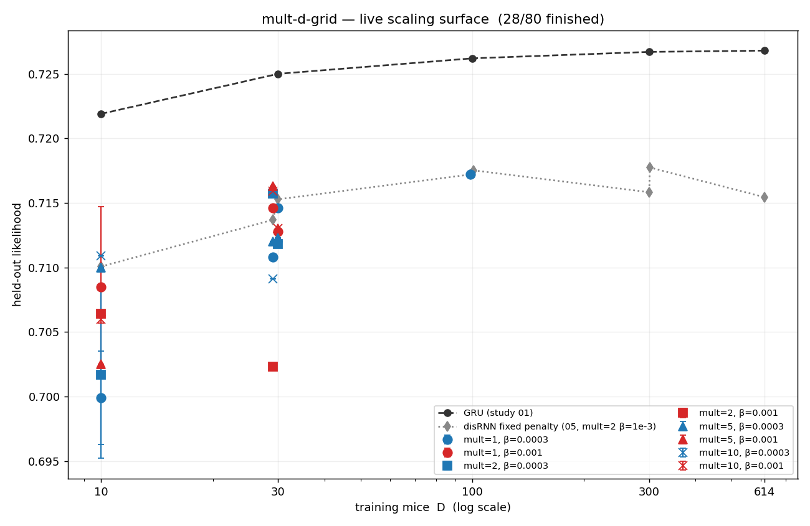

# r2 — The mult-d-grid held-out-transfer surface (live)

**Question.** r1 showed β can't be fixed a priori (it's free at D=100, costly at D=614) — does
some point on the full D×mult×β surface avoid study 05's peak-then-decline, and reach GRU/RL
parity at D=614?

This report is **live**: it regenerates as the 80-run grid progresses (`make pull && make r2`
from a checkout with `WANDB_API_KEY`, or `make r2` alone to re-render offline from the last pull).
Only `state == "finished"` runs contribute to the plotted means — `heldout/eval_likelihood` is
written incrementally throughout training, so in-flight runs are excluded until they finish.

<!-- BEGIN result-1 -->
**Progress: 28/80 finished, 23 running, 26 pending, 3 failed.**

| D | mult | β | held-out (mean) | sem | n seeds |
|---|---|---|---|---|---|
| 10 | 1 | 0.0003 | 0.6999 | 0.0036 | 2 |
| 10 | 1 | 0.001 | 0.7085 | 0.0062 | 2 |
| 10 | 2 | 0.0003 | 0.7017 | 0.0065 | 2 |
| 10 | 2 | 0.001 | 0.7064 | 0.0003 | 2 |
| 10 | 5 | 0.0003 | 0.7100 | 0.0000 | 1 |
| 10 | 5 | 0.001 | 0.7025 | 0.0000 | 1 |
| 10 | 10 | 0.0003 | 0.7109 | 0.0000 | 1 |
| 10 | 10 | 0.001 | 0.7060 | 0.0003 | 2 |
| 29 | 1 | 0.0003 | 0.7108 | 0.0000 | 1 |
| 29 | 1 | 0.001 | 0.7146 | 0.0000 | 1 |
| 29 | 2 | 0.0003 | 0.7157 | 0.0000 | 1 |
| 29 | 2 | 0.001 | 0.7023 | 0.0000 | 1 |
| 29 | 5 | 0.0003 | 0.7120 | 0.0000 | 1 |
| 29 | 5 | 0.001 | 0.7163 | 0.0000 | 1 |
| 29 | 10 | 0.0003 | 0.7091 | 0.0000 | 1 |
| 29 | 10 | 0.001 | 0.7159 | 0.0000 | 1 |
| 30 | 1 | 0.0003 | 0.7146 | 0.0000 | 1 |
| 30 | 1 | 0.001 | 0.7128 | 0.0000 | 1 |
| 30 | 2 | 0.0003 | 0.7118 | 0.0000 | 1 |
| 30 | 5 | 0.0003 | 0.7123 | 0.0000 | 1 |
| 30 | 5 | 0.001 | 0.7130 | 0.0000 | 1 |
| 30 | 10 | 0.001 | 0.7130 | 0.0000 | 1 |
| 99 | 1 | 0.0003 | 0.7172 | 0.0000 | 1 |
<!-- END result-1 -->

## Reading the figure

- **Grey dashed** = GRU (study 01) — the ceiling every disRNN curve is compared against.
- **Grey dotted** = study 05's fixed-penalty curve (mult=2, β=1e-3) — the curve this study is
  correcting; peaks at D≈100 then declines.
- **Coloured points** (colour = β, marker = mult) = this grid's cells, mean ± SEM over available
  seeds (1 or 2). A cell with only 1 seed done shows a point with no error bar.

## Caveats (carry into the final writeup)

- **Early cells are not representative of eventual coverage.** Which (D, mult, β, seed) cells
  finish first is a function of scheduling luck on the low-priority burst tier, not experimental
  design — don't read trends into a partial grid; wait for broad coverage across all 4 mult values
  and both β values at each D before drawing conclusions.
- **3 real failures observed during launch, all at D=10** (not preemptions — genuine
  `NaN in params during session-regularized training`, see `variants/mult-d-grid/notes.md` for the
  Beaker job IDs and error text). D=10 cells are undersampled by exactly these failures; final
  seed counts at D=10 may be 1 instead of 2 for the affected (mult, β) cells.
- **Budget asymmetry vs study 05**: n_steps=100000 here vs 60000 there (see study README) — a
  60k-checkpoint cross-check is needed before treating any D=10/D=614 direct comparison as
  isolating the penalty effect alone.
