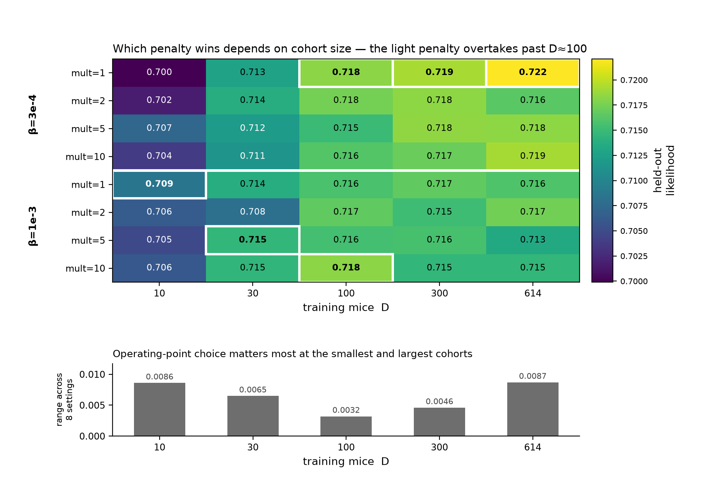
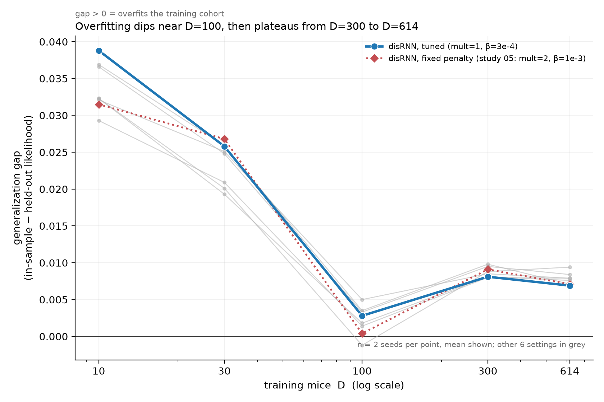
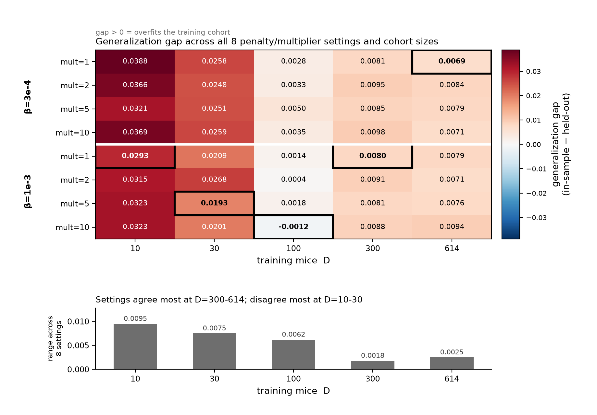

# r2 — The mult-d-grid held-out-transfer surface

**Question.** r1 showed β can't be fixed a priori (it's free at D=100, costly at D=614) — does
some point on the full D×mult×β surface avoid study 05's peak-then-decline, and reach GRU/RL
parity at D=614?

**Verdict: H1 confirmed — the decline is a penalty artifact, not an intrinsic disRNN property.**
At **mult=1, β=3e-4** held-out transfer rises monotonically across the whole cohort range
(0.6999 → 0.7127 → 0.7182 → 0.7192 → **0.7221**), with no peak-then-decline anywhere. At D=614 it
clears the best per-mouse RL baseline (0.7170) — which study 05's configuration did not — and
**halves the GRU gap**, from −0.0114 at study 05's fixed penalty to **−0.0047**. Study 05's
negative verdict was a consequence of holding a too-strong penalty fixed as the cohort grew.

The grid was complete at 80/80 usable runs, 2 seeds per cell, on 2026-08-02.

![Held-out likelihood vs cohort size. The tuned operating point (mult=1, β=3e-4) rises monotonically to 0.7221 at D=614, clearing the RL baseline and halving the GRU gap. Together with (mult=10, β=3e-4), it is one of only two of the 8 settings with no SEM-clearing dip anywhere in the range; among the other six, three have one real dip apiece at varying points in D, and three — including study 05's own fixed penalty — are flat within noise rather than genuinely declining. See point 2 in the text for the per-series breakdown.](../fig_scaling_surface.png)

## What the surface says

**1. Penalty strength must scale *down* as the cohort grows — the β×D interaction crosses over.**
Averaged over the multiplier, the two β values swap rank between the ends of the range:

| | D=10 | D=614 |
|---|---|---|
| β=3e-4 | 0.7031 | **0.7190** |
| β=1e-3 | **0.7064** | 0.7153 |

The lighter penalty is *worse* on small cohorts and *better* on large ones. This is exactly the
interaction r1 predicted from the widening generalization gap, and it is why no single β could
have been fixed a priori: study 03 (D=100) and study 05 (D=614) were each reading one side of a
crossover and reporting it as a global verdict.

**2. Only two settings never dip at all; among those that do, the dip is not always where it
looks.** Checking each of the 8 series step-by-step, and calling a "dip" only a drop that exceeds
its own combined SEM (a stricter bar than reading the mean curve by eye): **(mult=1, β=3e-4)**
and **(mult=10, β=3e-4)** rise at every step with no SEM-clearing drop anywhere. Three settings
have exactly one real dip — **(mult=2, β=3e-4)** and **(mult=5, β=1e-3)** dip at the *last* step
(D=300→614), and **(mult=10, β=1e-3)** dips earlier (D=100→300) then is flat to D=614. The
remaining three — (mult=1,β=1e-3), **(mult=2, β=1e-3) = study 05's own fixed point**, and
(mult=5,β=3e-4) — each have a small negative step (−0.0001 to −0.0015) that does **not** clear
its SEM, i.e. is statistically flat rather than a real decline. So of the seven non-focal
settings, three show a genuine SEM-clearing dip (at different points in D, not all "mid-range");
three are flat-with-noise; one (mult=10,β=3e-4) never dips at all and tracks the focal setting
closely. "Declines" describes 3 of 7, not a blanket majority — the cleaner statement is point 1's
crossover: every series with a real dip, and both series with none, sit at whichever β is doing
better at that end of the range.

**3. The winner is unambiguous but the margin over the runner-up is modest.** At D=614 the focal
cell reaches 0.7221 against 0.7191 for the next best (mult=10, β=3e-4) — a 0.0030 separation
against a seed SD of ≈0.0005 (study 05, same config family), so roughly 6σ and not seed noise.
But it remains 0.0047 below the GRU: **tuning the operating point closes half the gap, it does
not eliminate it.** The disRNN still pays for its sparse latent, just less than study 05 implied.

**4. The multiplier matters far less than β.** At fixed β=3e-4 and D=614, the spread across
mult∈{1,2,5,10} is 0.7164–0.7221; at fixed mult and varying β it is comparable or larger. Study
03's "sparsity is free" conclusion survives in weakened form — the multiplier is the cheaper of
the two levers, but "free" was a D=100 statement.

**5. The generalization gap (in-sample − held-out) tells a separate, simpler story than the
held-out surface above, and it's the same story at all 8 settings.** The gap falls sharply from
D=10 to a minimum near D=100 (where the model is not data-starved enough to overfit at all —
gap ≈0), rises again by D=300, then is **flat within seed noise from D=300 to D=614 for every one
of the 8 cells** (the 300→614 step is smaller than the per-seed spread at each cell — checked
individually, not eyeballed off the mean). The tuned operating point and study 05's fixed penalty
track each other closely throughout; the gap doesn't distinguish them. So the held-out advantage
of the tuned setting (points 1–3) is not explained by it overfitting less — both settings overfit
by about the same amount at D=614. It must come from the tuned setting fitting the training
cohort *and* transferring, not from suppressing overfitting relative to the fixed penalty.

The heatmap makes the "same story at all 8 settings" claim checkable cell-by-cell, and adds one
more point: the 8 settings **disagree with each other most at D=10–30** (gap range up to 0.0095,
falling monotonically to ≤0.0018–0.0025 by D=300–614). That pattern is *not* the same shape as
the held-out-likelihood sensitivity panel (point 2's companion figure), where the range across
settings is **U-shaped** — high at D=10 (0.0086) *and* at D=614 (0.0087), low only in the middle
(0.0032 at D=100). So at D=614 specifically, the 8 settings disagree a lot in held-out transfer
(range 0.0087) while agreeing closely in how much they overfit (range 0.0025) — the differences
in held-out performance there are not being driven by differences in overfitting.

## Caveats

- **Budget asymmetry vs study 05 is unresolved.** n_steps=100000 here vs 60000 there, so the
  direct D=614 comparison (0.7221 vs 0.7154) confounds penalty with training budget. The
  penalty *ranking within this grid* is budget-controlled and unaffected; the cross-study delta
  is not. A 60k-checkpoint re-score is the clean test and has not been run.
- **D=10 is the least trustworthy row.** It absorbed all 5 genuine training failures (NaN
  divergence under session-regularized training), and one cell — (D=10, mult=5, β=3e-4, seed 0) —
  diverged on 2 of 3 attempts before yielding a value. That cell's reported number comes from a
  third attempt and must always be read with its divergence history (see
  `variants/mult-d-grid/notes.md`): the honest claim is *this configuration diverges often at
  D=10*, never *it trains fine*.
- **6 of the 80 values were recovered post-hoc** by `backfill_lost_heldout.py` from the
  per-subject held-out table, after their runs completed training and held-out scoring but lost
  the final W&B summary write to a heartbeat timeout. They are exact, not imputed, and stay at
  `state=='crashed'` in `grid.csv`; `heldout_backfilled` flags them.
- **Two seeds per cell** bounds how finely adjacent cells can be ranked. The focal-vs-next-best
  margin clears seed noise comfortably; differences below ~0.001 elsewhere in the table do not.

<!-- BEGIN result-1 -->
**Progress: 80/80 usable, 0 running, 0 outstanding, 5 failed W&B runs.**

| D | mult | β | held-out (mean) | sem | n seeds |
|---|---|---|---|---|---|
| 10 | 1 | 0.0003 | 0.6999 | 0.0036 | 2 |
| 10 | 1 | 0.001 | 0.7085 | 0.0062 | 2 |
| 10 | 2 | 0.0003 | 0.7017 | 0.0065 | 2 |
| 10 | 2 | 0.001 | 0.7064 | 0.0003 | 2 |
| 10 | 5 | 0.0003 | 0.7072 | 0.0028 | 2 |
| 10 | 5 | 0.001 | 0.7048 | 0.0023 | 2 |
| 10 | 10 | 0.0003 | 0.7038 | 0.0071 | 2 |
| 10 | 10 | 0.001 | 0.7060 | 0.0003 | 2 |
| 30 | 1 | 0.0003 | 0.7127 | 0.0019 | 2 |
| 30 | 1 | 0.001 | 0.7137 | 0.0009 | 2 |
| 30 | 2 | 0.0003 | 0.7137 | 0.0019 | 2 |
| 30 | 2 | 0.001 | 0.7081 | 0.0058 | 2 |
| 30 | 5 | 0.0003 | 0.7121 | 0.0001 | 2 |
| 30 | 5 | 0.001 | 0.7146 | 0.0016 | 2 |
| 30 | 10 | 0.0003 | 0.7114 | 0.0023 | 2 |
| 30 | 10 | 0.001 | 0.7145 | 0.0014 | 2 |
| 100 | 1 | 0.0003 | 0.7182 | 0.0010 | 2 |
| 100 | 1 | 0.001 | 0.7157 | 0.0010 | 2 |
| 100 | 2 | 0.0003 | 0.7175 | 0.0009 | 2 |
| 100 | 2 | 0.001 | 0.7167 | 0.0015 | 2 |
| 100 | 5 | 0.0003 | 0.7150 | 0.0001 | 2 |
| 100 | 5 | 0.001 | 0.7155 | 0.0002 | 2 |
| 100 | 10 | 0.0003 | 0.7162 | 0.0012 | 2 |
| 100 | 10 | 0.001 | 0.7182 | 0.0003 | 2 |
| 300 | 1 | 0.0003 | 0.7192 | 0.0015 | 2 |
| 300 | 1 | 0.001 | 0.7167 | 0.0009 | 2 |
| 300 | 2 | 0.0003 | 0.7183 | 0.0001 | 2 |
| 300 | 2 | 0.001 | 0.7152 | 0.0014 | 2 |
| 300 | 5 | 0.0003 | 0.7184 | 0.0004 | 2 |
| 300 | 5 | 0.001 | 0.7156 | 0.0003 | 2 |
| 300 | 10 | 0.0003 | 0.7170 | 0.0009 | 2 |
| 300 | 10 | 0.001 | 0.7146 | 0.0019 | 2 |
| 614 | 1 | 0.0003 | 0.7221 | 0.0004 | 2 |
| 614 | 1 | 0.001 | 0.7160 | 0.0005 | 2 |
| 614 | 2 | 0.0003 | 0.7164 | 0.0008 | 2 |
| 614 | 2 | 0.001 | 0.7174 | 0.0002 | 2 |
| 614 | 5 | 0.0003 | 0.7183 | 0.0003 | 2 |
| 614 | 5 | 0.001 | 0.7134 | 0.0005 | 2 |
| 614 | 10 | 0.0003 | 0.7191 | 0.0004 | 2 |
| 614 | 10 | 0.001 | 0.7146 | 0.0010 | 2 |
<!-- END result-1 -->

## Reading the figure

- **Grey dashed** = GRU (study 01) — the ceiling every disRNN curve is compared against.
- **Grey dotted** = study 05's fixed-penalty curve (mult=2, β=1e-3) — the curve this study is
  correcting; peaks at D≈100 then declines.
- **Coloured points** (colour = β, marker = mult) = this grid's cells, mean ± SEM over available
  seeds (1 or 2). A cell with only 1 seed done shows a point with no error bar.

## Caveats (carry into the final writeup)

- **Early cells are not representative of eventual coverage.** Which (D, mult, β, seed) cells
  finish first is a function of scheduling luck on the low-priority burst tier, not experimental
  design — don't read trends into a partial grid; wait for broad coverage across all 4 mult values
  and both β values at each D before drawing conclusions.
- **3 real failures observed during launch, all at D=10** (not preemptions — genuine
  `NaN in params during session-regularized training`, see `variants/mult-d-grid/notes.md` for the
  Beaker job IDs and error text). D=10 cells are undersampled by exactly these failures; final
  seed counts at D=10 may be 1 instead of 2 for the affected (mult, β) cells.
- **Budget asymmetry vs study 05**: n_steps=100000 here vs 60000 there (see study README) — a
  60k-checkpoint cross-check is needed before treating any D=10/D=614 direct comparison as
  isolating the penalty effect alone.
