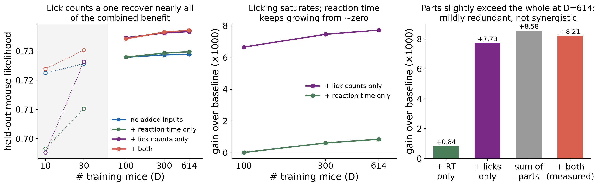
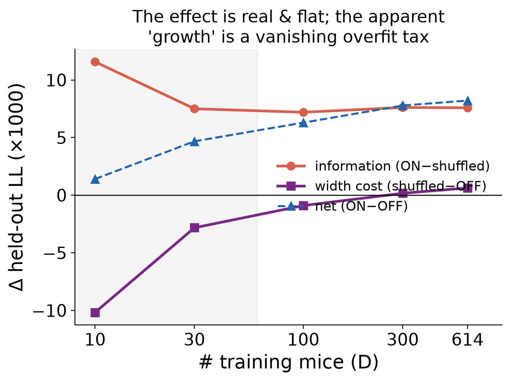
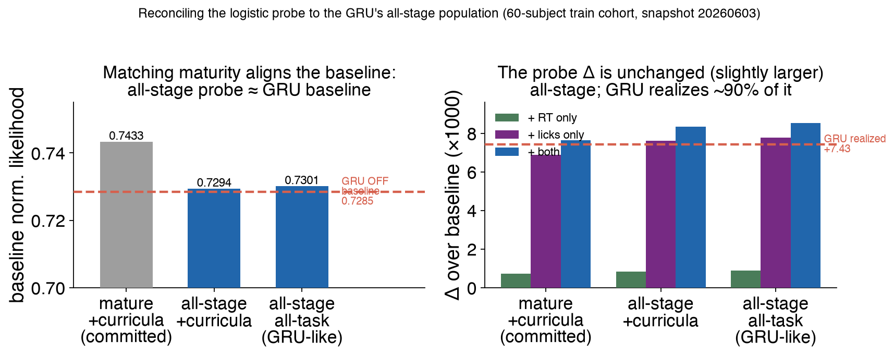

# r1 — Block decomposition: does previous-trial RT + licking help predict choice, and which block carries it?

Study cover (question, verdict, provenance): [../../README.md](../../README.md).

## Question

Study-07 adds two previous-trial quantities as GRU inputs — reaction time and
per-side lick counts — on top of the (prev choice, prev reward) baseline. Three
things need separating that a naive ON−OFF comparison conflates:

1. Is the gain real, and does it scale with training-cohort size?
2. How much is *information* versus the mechanical cost/benefit of a wider input
   vector? (The **shuffled** control permutes the added inputs within session —
   parameter- and scale-matched, trial alignment destroyed.)
3. Which block — reaction time or lick counts — carries it? (The **RT-only** and
   **licks-only** arms.)

## Result

<!-- BEGIN result-1 -->
[regenerated by `analysis/update_reports.py` — do not edit by hand]

*Held-out MOUSE likelihood. Five arms × D grid, 3 seeds/cell. D≤30 (shaded, open markers) is excluded from every estimate — see r2. Metric: `heldout/final/eval_likelihood`.*

Held-out likelihood by arm × D:

| D | OFF | RT-only | licks-only | both (ON) | shuffled |
|---|---|---|---|---|---|
| 10 | 0.72248 | 0.69664 | 0.69530 | 0.72388 | 0.71231 |
| 30 | 0.72568 | 0.71029 | 0.72639 | 0.73035 | 0.72285 |
| 100 | 0.72791 | 0.72793 | 0.73458 | 0.73421 | 0.72701 |
| 300 | 0.72869 | 0.72931 | 0.73616 | 0.73647 | 0.72886 |
| 614 | 0.72891 | 0.72975 | 0.73664 | 0.73712 | 0.72954 |

Decomposition over baseline (×1000 held-out LL):

| D | RT-only | licks-only | both (net) | information (ON−SHUF) | width cost (SHUF−OFF) |
|---|---|---|---|---|---|
| 10 | -25.84 | -27.18 | +1.40 | +11.57 | -10.17 |
| 30 | -15.38 | +0.72 | +4.68 | +7.50 | -2.82 |
| 100 | +0.01 | +6.67 | +6.30 | +7.20 | -0.90 |
| 300 | +0.61 | +7.47 | +7.78 | +7.61 | +0.17 |
| 614 | +0.84 | +7.73 | +8.21 | +7.58 | +0.63 |

- **Lick counts carry essentially the whole effect.** At D≥100, licks-only adds **0.00729** (98% of the combined **0.00743**); RT-only adds **0.00049** (7%).
- **The information effect is flat, not growing.** ON−shuffled holds at ~**0.00746** across the trustworthy D range; the apparent growth in the raw ON−OFF curve is the vanishing input-width overfitting penalty (shuffled−OFF), not information scaling with data.
- **Counter-intuitively, novel variance is not useful variance.** Reaction time is near-orthogonal to the existing (prev-choice, prev-reward) inputs yet contributes little; lick counts are heavily redundant with prev choice yet carry the effect.

Source W&B groups: `d100-bridge@20260821-221723`, `h128-dscan-licks-only@20260823-093110`, `h128-dscan-off-bigD@20260822-120421`, `h128-dscan-off-smallD@20260822-120445`, `h128-dscan-onprem@20260822-012657`, `h128-dscan-rt-only@20260823-093058`, `h128-dscan-shuffled@20260822-153424`, `h128-dscan@20260821-231253`.
<!-- END result-1 -->

## Discussion

The headline is that a single representational change — telling the model *how
fast* and *how much* the mouse responded last trial — beats a large increase in
the number of training mice, but only the shuffled control makes that legible:
the raw ON−OFF curve's apparent growth with cohort size is an overfitting-penalty
artifact, not the information becoming more valuable. The information contribution
itself is flat.

The RT/licks split is the scientifically interesting part. Reaction time is
almost entirely *new* variance (near-orthogonal to prev choice and prev reward)
yet contributes little on its own; lick counts are largely *redundant* with prev
choice (they encode which side, decisively) yet carry nearly the whole effect.
The value is in a non-linear read of a partly-redundant channel — a caution
against assuming an orthogonal feature is the useful one. Reaction time's share
is small but statistically real and, unlike licking, still growing at D=614,
which suggests it is the block that would benefit from a larger cohort.

Naming note: "timing" is a loose label. Only reaction time is a latency; the lick
features are *counts* over a fixed post-go-cue window — a vigor measure. The
accurate umbrella for both is the previous trial's **response**: its latency and
its vigor.

### Reconciliation: the probe's maturity scope vs the GRU's

The logistic probe (`calibrate_timing_features.py` in the wrapper) restricts to
mature (STAGE_FINAL/GRADUATED) sessions in the three curricula, whereas the
study-07 GRU runs use `data.mature_only: false` — **all-stage** trials, set by the
`mice_snapshot_scaling.yaml` the sweeps compose. Re-running the probe's *exact*
fit on the same seeded 60-subject train cohort with the maturity filter dropped
(`analysis/probe_maturity_reconciliation.py`) settles whether that mismatch
matters:

| probe scope | baseline | Δ(+RT&licks) |
|---|---|---|
| A mature+curricula (reproduces `timing_calibration.csv` exactly) | 0.7433 | +0.00764 |
| B all-stage+curricula | 0.7294 | +0.00834 |
| C all-stage, all-task (GRU-like) | 0.7301 | +0.00853 |

Two things follow. **The Δ is unchanged — slightly larger — all-stage**, so the
RT+lick effect does not depend on the maturity scope; if anything the committed
mature-only probe *understated* it. And **the mature-only baseline (0.7433) drops
to 0.7294 on all stages, landing on the GRU's own OFF baseline (0.7285)** — so the
probe and the GRU measure the same quantity once maturity is matched, and the
apparent baseline offset was the maturity scope, not the split or the method.
Variant A reproduces the committed `timing_calibration.csv` to full precision
(baseline 0.7433373188591836, Δ 0.00763794235061932, 421505 modelling trials on
the identical 60-subject list), so the A→B comparison isolates maturity cleanly.
Net: the linear-probe lower bound survives on the all-stage population the GRU
actually trained on, and the GRU realizes ~90% of it.
