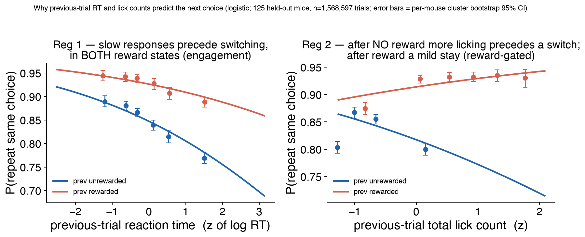

# r3 — Why previous-trial RT and lick counts predict the next choice

Study cover (question, verdict, provenance): [../../README.md](../../README.md).

## Question

r1 shows that adding the previous trial's reaction time and per-side lick counts
improves **held-out-mouse** choice prediction. This report asks the behavioural
*why*: what about a mouse's previous response carries information about whether it
repeats or switches on the next trial — and is that information reward-dependent?
It is a statement about the animals' behaviour, not the model: it fits logistic
regressions directly on the data, no GRU involved.

## Method

On responded trials, per session, define `stay = (this choice == previous
choice)` and shift the previous trial's features forward. Two logistic
regressions, each with a reward interaction so a reward-**independent** signal can
be told apart from a reward-**gated** one:

    Reg 1   stay ~ prev_reward * z(prev log RT)
    Reg 2   stay ~ prev_reward * z(prev total licks)

**Cohort: the held-out mice** — animals the study-07 GRU was *evaluated* on but
never trained on (the eligible cohort minus the union of every training cohort;
157 pinned in `analysis/provenance/heldout_subjects.txt`, of which **125 enter
the regressions** — the other 32 are early 2019–2020 *old-schema* sessions that
lack the `reaction_time` field and the in-session go-cue/choice-time columns
`build_sequence` needs to form previous-trial RT, so their RT is undefined and
they drop from the RT-dependent fit (their lick-time columns are present; it is
the RT that cannot be computed)). This is deliberate: the GRU's
likelihood gain is scored on held-out mice, so the behavioural coupling that
explains it is shown on the same population. All-stage sessions, snapshot 20260603,
n = 1,568,597 trials. (This approximates the GRU's 149-mouse eval set; the exact
list sits behind a denylisted W&B file, but the mechanism is population-general so
the few-mouse difference is immaterial.)

Uncertainty is a **per-mouse cluster bootstrap** (resample the 125 mice with
replacement, 95% CI). This is essential: trials within a mouse are not
independent, so naive trial-level SEs are anti-conservative by roughly an order of
magnitude here.

Producer: `analysis/why_features_help.py` (writes `fig_why_features_help.png` +
`why_features_help.csv` at the study root). Not part of the W&B `make` target — it
reads the behavioural DB directly.

## Result

Log-odds(stay) slope per +1 SD of the feature, by previous-trial outcome
(held-out mice, mouse-clustered 95% CI):

| feature | prev **unrewarded** | prev **rewarded** | reading |
|---|---|---|---|
| **reaction time** (log) | −0.29 [−0.34, −0.25] (z≈−13) | −0.23 [−0.29, −0.16] (z≈−6.9) | slower → switch, in **both** states |
| **total licks** | −0.28 [−0.33, −0.22] (z≈−9.3) | +0.21 [+0.11, +0.31] (z≈+3.9) | reward-**gated**: no-reward → abandon; reward → mild stay |

## Discussion

The two features carry **different** kinds of choice-relevant state, which is why
each adds something on top of `(prev choice, prev reward)`:

- **Reaction time is a reward-independent engagement signal.** A slower previous
  response predicts switching whether or not the previous trial was rewarded — the
  two slopes are both clearly negative and overlap heavily. This reads as a global
  engagement/lapse state that drifts on its own timescale, orthogonal to outcome.
  It matches r1's observation that RT is the block still growing at D = 614: novel
  variance (uncorrelated with the baseline inputs) that the network can only
  exploit once it has enough mice to estimate it.

- **Lick count is a reward-gated abandonment signal.** Its slope flips sign with
  outcome. After **no reward**, more licking on the chosen side predicts
  **abandoning** that side next trial (a vigorous-but-unrewarded response precedes
  a switch); after a reward, more licking mildly predicts **staying**
  (consummatory confirmation). Because this coupling is conditioned on reward, it
  is partly redundant with the reward history the model already has — consistent
  with r1 finding lick counts carry most of the *pooled* effect through a
  reward-interacted, nonlinear read rather than new marginal variance.

**Why held-out, and why it matters.** Showing the mechanism on the held-out mice
does two things. First, it is the population the GRU's likelihood gain is actually
scored on, so the behavioural coupling is tied directly to the metric it explains.
Second, it demonstrates the coupling is **population-general**: the identical trend
holds on the training mice (RT unrewarded −0.31 vs −0.29 here; lick unrewarded
−0.29 vs −0.28; lick rewarded +0.19 vs +0.21), only noisier at the smaller train
sample. That generalization is precisely what lets the model carry RT/lick
information to animals it never trained on.

**Clustering changes the strength, not the sign.** Naive trial-level SEs make both
effects look overwhelming (z in the tens). Under a per-mouse cluster bootstrap the
reaction-time effect stays robust in both reward states and the lick effect stays
firmly negative after no-reward; on the 125-mouse held-out set even the
rewarded-lick term is clearly non-zero (z ≈ +3.9), firmer than on the smaller
train draw (z ≈ +2.6). Any single-number claim about these mechanisms must be
mouse-clustered.
