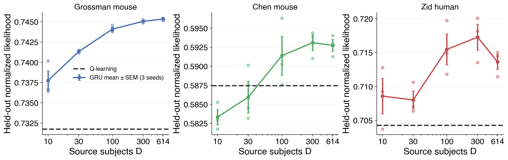

# Result 1 — Matched-half external transfer: GRU versus Q-learning

The source-trained H=128 GRU core is frozen. For each external subject, only its embedding
is adapted on one half of the target data, and the other half is scored. The subject-level
Q-learning baseline fits and scores the exact same halves.

<!-- BEGIN result-1 -->
[regenerated by `analysis/report_matched_half.py` — do not edit by hand]

### Trial-pooled held-out likelihood

Values are Q-learning or GRU mean ± SD across the three independently trained source cores.

| target dataset | Q-learning | GRU D=10 | D=30 | D=100 | D=300 | D=614 |
|---|---:|---:|---:|---:|---:|---:|
| Grossman mouse | **0.73177** | 0.73775 ± 0.00210 | 0.74134 ± 0.00020 | 0.74410 ± 0.00042 | 0.74506 ± 0.00019 | 0.74535 ± 0.00017 |
| Chen mouse | **0.58747** | 0.58332 ± 0.00178 | 0.58593 ± 0.00369 | 0.59139 ± 0.00448 | 0.59310 ± 0.00181 | 0.59275 ± 0.00140 |
| Zid human | **0.70427** | 0.70858 ± 0.00457 | 0.70801 ± 0.00231 | 0.71547 ± 0.00399 | 0.71727 ± 0.00336 | 0.71363 ± 0.00192 |

### Bottom line

- **Grossman mouse:** GRU is above Q at every source D and rises from 0.73775 at D=10 to 0.74535 at D=614 (D=614 minus Q: +0.01358).
- **Chen mouse:** the mean GRU is below Q at D=10/30, crosses above it at D=100, and reaches 0.59275 at D=614 (minus Q: +0.00528).
- **Zid human:** trial-pooled GRU is above Q at every D and peaks at D=300 (0.71727); D=614 remains +0.00936 above Q, but the subject-balanced comparison below is heterogeneous.

### Subject-balanced paired comparison

Each value is the per-subject GRU mean log-likelihood averaged across source seeds minus that subject's Q-learning value. Positive favors GRU.

| target dataset | source D | Δ log likelihood (nats/trial) | 95% CI | subjects GRU better |
|---|---:|---:|---:|---:|
| Grossman mouse | 10 | +0.00886 | [+0.00607, +0.01165] | 90% (48 subjects) |
| Grossman mouse | 30 | +0.01345 | [+0.01024, +0.01667] | 94% (48 subjects) |
| Grossman mouse | 100 | +0.01731 | [+0.01350, +0.02111] | 96% (48 subjects) |
| Grossman mouse | 300 | +0.01873 | [+0.01486, +0.02260] | 96% (48 subjects) |
| Grossman mouse | 614 | +0.01913 | [+0.01521, +0.02305] | 96% (48 subjects) |
| Chen mouse | 10 | -0.00649 | [-0.01299, +0.00002] | 31% (32 subjects) |
| Chen mouse | 30 | -0.00226 | [-0.00962, +0.00510] | 56% (32 subjects) |
| Chen mouse | 100 | +0.00660 | [-0.00015, +0.01334] | 66% (32 subjects) |
| Chen mouse | 300 | +0.00962 | [+0.00282, +0.01641] | 78% (32 subjects) |
| Chen mouse | 614 | +0.00908 | [+0.00229, +0.01588] | 75% (32 subjects) |
| Zid human | 10 | +0.00609 | [-0.02140, +0.03358] | 35% (258 subjects) |
| Zid human | 30 | +0.00529 | [-0.02216, +0.03274] | 38% (258 subjects) |
| Zid human | 100 | +0.01577 | [-0.01119, +0.04273] | 40% (258 subjects) |
| Zid human | 300 | +0.01829 | [-0.00866, +0.04523] | 40% (258 subjects) |
| Zid human | 614 | +0.01320 | [-0.01398, +0.04038] | 38% (258 subjects) |

### Verification

- Every target dataset has 15 finished GRU cells (5 source sizes × 3 seeds) and one Q run.
- GRU and Q prediction files have identical ordered `(subject, session, trial, choice)` keys within each target dataset; only the model probabilities differ.
- Grossman and Chen use odd-positioned sessions for adaptation and even-positioned sessions for test. Zid uses trials 0–149 for adaptation and 150–299 for test, with prefix replay only to establish state before suffix scoring.
- Nominal source D is the plotted axis. Realized source-subject counts were D=10: [10], D=30: [29, 30], D=100: [99, 101], D=300: [300, 301], D=614: [614].
- Q-learning has one fitted baseline per target dataset, so it has no source-training-seed error bar.
<!-- END result-1 -->

## Interpretation

This report tests transfer of the learned recurrent computation, not whether the GRU can be
retrained from scratch on each external dataset. Comparisons across source D use independent
Study 01 source-training seeds; the external target split stays fixed.
