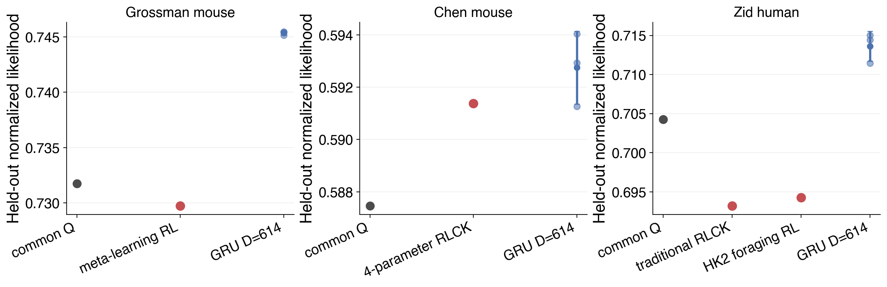

# Result 2 — Author-aligned behavioral baselines

This result asks whether the transferred GRU advantage survives comparison with the behavioral
model selected in each source paper, rather than only our common sticky Q-learning control.

<!-- BEGIN result-2 -->
[regenerated by `analysis/report_author_baselines.py` — do not edit by hand]

All models use the same subject-level adaptation/test split and score the exact same held-out trials. GRU is the mean ± SD across the three D=614 source-training seeds.

| target | published baseline | selected by authors? | parameters | common Q | published baseline | GRU D=614 |
|---|---|:---:|---:|---:|---:|---:|
| Grossman mouse | meta-learning RL | yes | 7 | 0.73177 | **0.72976** | 0.74535 ± 0.00017 |
| Chen mouse | 4-parameter RLCK | yes | 4 | 0.58747 | **0.59138** | 0.59275 ± 0.00140 |
| Zid human | traditional RLCK | no — paper comparator | 4 | 0.70427 | **0.69322** | 0.71363 ± 0.00192 |
| Zid human | HK2 foraging RL | yes | 5 | 0.70427 | **0.69427** | 0.71363 ± 0.00192 |

### Subject-balanced paired differences

Values are mean log-likelihood differences in nats/trial with 95% confidence intervals. Positive favors the model named first.

| target | published baseline | author − common Q | subjects author better | GRU D=614 − author | subjects GRU better |
|---|---|---:|---:|---:|---:|
| Grossman mouse | meta-learning RL | -0.00245 [-0.00442, -0.00048] | 19% (48) | +0.02158 [+0.01821, +0.02495] | 98% (48) |
| Chen mouse | 4-parameter RLCK | +0.00681 [+0.00163, +0.01198] | 69% (32) | +0.00228 [-0.00458, +0.00914] | 50% (32) |
| Zid human | traditional RLCK | -0.01582 [-0.03957, +0.00793] | 47% (258) | +0.02902 [-0.00599, +0.06404] | 39% (258) |
| Zid human | HK2 foraging RL | -0.01429 [-0.04819, +0.01961] | 48% (258) | +0.02750 [-0.00453, +0.05953] | 43% (258) |

### Bottom line

- **Grossman mouse:** meta-learning RL is -0.00201 versus common Q; D=614 GRU is +0.01559 versus that published baseline.
- **Chen mouse:** 4-parameter RLCK is +0.00392 versus common Q; D=614 GRU is +0.00136 versus that published baseline.
- **Zid human:** HK2 foraging RL is -0.01000 versus common Q; D=614 GRU is +0.01936 versus that published baseline.

### Verification

- Each published baseline was fitted independently per subject on the adaptation half; no paper-reported likelihood was copied.
- Published-baseline, common-Q, and GRU prediction files have identical ordered `(subject, session, trial, choice)` keys within each target dataset.
- Grossman and Chen use odd-positioned sessions for adaptation and even-positioned sessions for test. Zid adapts on trials 0–149 and scores trials 150–299 after state-only prefix replay.
- The Grossman, Chen, and selected Zid implementations follow the authors' published update equations; Zid traditional RLCK is retained as the paper's simpler comparator.
<!-- END result-2 -->

## Interpretation

These are refits on our matched split, not copied likelihoods from the papers. That keeps test
trials, information budget, scoring, and subject-level fitting identical across model families.
