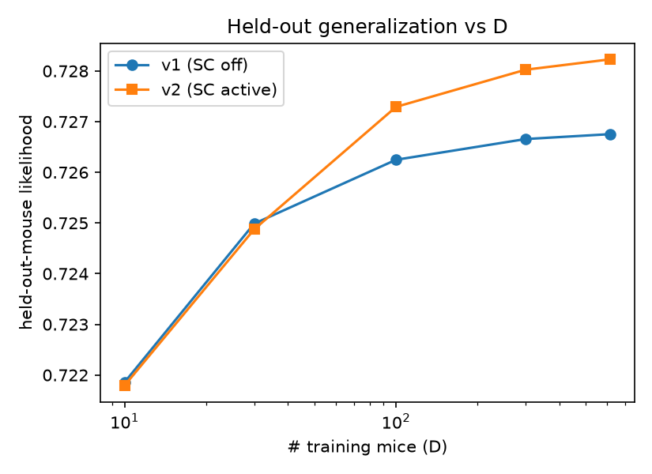
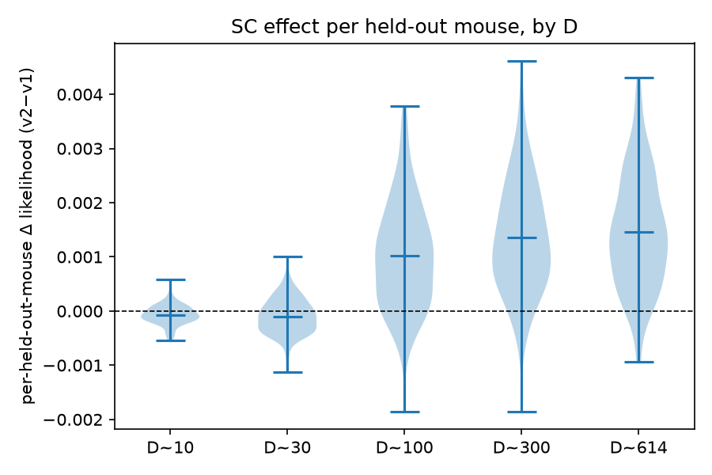
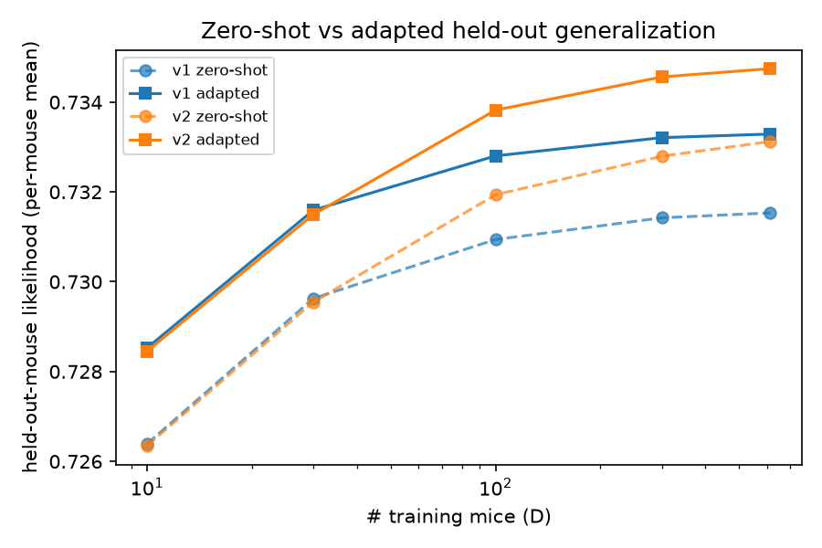

# Data-scaling law — does session conditioning help held-out-mouse generalization?

**TL;DR.** Training on more mice improves generalization to *unseen* mice. **Session conditioning (v2) is neutral-to-slightly-negative at small D, then adds a small, highly-significant gain that GROWS with the number of training mice** (robust from D≈100). Effect is tiny in absolute likelihood (~+0.0015 at the 614-mouse pool) but consistent across ~149 held-out mice and every seed.

Generated 2026-06-23. W&B project: https://wandb.ai/AIND-disRNN/mice_data_scaling

## Design
GRU H128, scalar session conditioning. v1 = SC never engaged (early-stopped in pretrain, λ=0); v2 = λ forward (full SC @50k) + gated early-stop @70k. Swept D = #training mice (10/30/100/300/614) × 3 seeds; held-out cohort fixed (~149 mice). v1 and v2 use IDENTICAL mice per (D,seed) → matched-pair comparison.

## Result 1 — held-out scaling curve (cell-level, n=15 matched pairs)

| D | v1 (SC off) | v2 (SC on) | Δ(v2−v1) |
|---|---|---|---|
| 10 | 0.7219 | 0.7218 | -0.00006 |
| 30 | 0.7250 | 0.7249 | -0.00011 |
| 100 | 0.7262 | 0.7273 | +0.00104 |
| 300 | 0.7267 | 0.7280 | +0.00137 |
| 614 | 0.7268 | 0.7282 | +0.00148 |

Paired across 15 cells: mean Δ=**+0.00074**, 12/15 positive, paired t p=**0.0015**, Wilcoxon p=**0.0043**. Power-law asymptote E: v1≈0.7248, v2≈0.7252.

## Result 2 — per-held-out-mouse repeated measures (n=149 mice/D, paired by mouse, avg over seeds)

| D | mean Δ | median Δ | % mice improved | Wilcoxon p |
|---|---|---|---|---|
| 10 | -0.00007 | -0.00008 | 34% | 3.2e-06 |
| 30 | -0.00010 | -0.00010 | 36% | 3.3e-04 |
| 100 | +0.00102 | +0.00096 | 85% | 1.3e-20 |
| 300 | +0.00135 | +0.00124 | 93% | 7.5e-24 |
| 614 | +0.00146 | +0.00138 | 95% | 1.5e-24 |

**Pairing by held-out mouse (n=149) makes the effect overwhelmingly significant** (p~1e-20–1e-24) and shows the shape clearly: **neutral-to-slightly-negative at small D** (D=10: only 34% of mice improve; D=30: 36%), then robustly positive and increasing (85%→95% of mice improve as D goes 100→614). The small-D per-mouse Δ agrees with the independent cell-level aggregate (both ≈−0.0001 at D=10), a consistency check.

> **Dedup note (2026-06-23).** The offline per-subject re-runs included a validation job + a mass-launch + BLAS-failure retries, giving duplicate offline runs for 10 of 30 (variant,ratio,seed) cells. `build_report.py` now keeps exactly one run per cell (latest). This corrected the D=10 per-subject Δ from a spurious +0.00031/68% (double-counted v1 seed-0) to −0.00007/34%; large-D results unchanged. Cell-level test was never affected (it reads the training-run groups).

## Interpretation
Session conditioning is **not** a small-data lever for held-out generalization (neutral-to-slightly-harmful there, consistent with Po-chen's within-population H128 finding). With enough training mice (D≳100) it gives a small, reliable per-mouse gain that scales with D. Actionable levers for a behavior foundation model: (a) more mice, (b) SC *in combination with* scale.

## Provenance
v1 group `v1-pretrain-phase@20260622-013415` (exp 01KVQ7EJ3C5YJ8FJVNJB8C8N36); v2 group `v2-sc-active@20260622-144622` (exp 01KVRMSAAJTRSJMFV5JT7JAP6X). Per-subject from offline re-runs (wrapper 4f29680), deduped to one run per (variant,ratio,seed). Report run: https://wandb.ai/AIND-disRNN/mice_data_scaling/runs/0fhvwwfu

## Result 3 — bootstrap CIs on the scaling shape (resample 149 held-out mice ×1000)
Within-cohort increments (paired across D on the same resampled mice) are tight even though
absolute per-D levels are not (mice vary in predictability). Per-mouse-mean LL (equal-weight),
distinct from the trial-weighted aggregate above.

| quantity | v1 (SC off) | v2 (SC on) |
|---|---|---|
| frac of total gain by D=100 | 0.90 [0.89, 0.91] | 0.85 [0.84, 0.87] |
| late gain D=100→614 | +0.00049 [+0.00042, +0.00056] | +0.00092 [+0.00084, +0.00100] |

Both late-gain CIs **exclude 0** → not perfectly saturated; a small real slope persists (≈2× larger
under SC). Power-law fit degenerate (Dc→0) → no clean exponent; curve is "fast early rise + shallow
continued slope". **Read:** ~85–90% of the data benefit is captured by ~100 mice; the residual is
statistically real but economically marginal — consistent with per-trial choice LL being near a
predictability ceiling. See FUTURE_DIRECTIONS.md for the axes (few-shot, N×D, OOD) that can show
foundation-model scaling with more headroom.

## Result 4 — zero-shot vs adapted held-out generalization

Zero-shot = held-out mouse assigned the **population-mean embedding**, NO adaptation (n_steps=0).
Adapted = embedding fine-tuned on ~half the mouse's sessions (test on the other half). Per-mouse means.

| D | v1 zero | v1 adapt | gap | v2 zero | v2 adapt | gap |
|---|---|---|---|---|---|---|
| 10 | 0.7264 | 0.7285 | +0.0021 | 0.7264 | 0.7285 | +0.0021 |
| 30 | 0.7296 | 0.7316 | +0.0020 | 0.7295 | 0.7315 | +0.0019 |
| 100 | 0.7309 | 0.7328 | +0.0019 | 0.7319 | 0.7338 | +0.0019 |
| 300 | 0.7314 | 0.7332 | +0.0018 | 0.7328 | 0.7346 | +0.0018 |
| 614 | 0.7315 | 0.7333 | +0.0018 | 0.7331 | 0.7347 | +0.0016 |

**Findings:**
- **Adaptation buys almost nothing (~+0.002) and the gap is flat across D.** The population-mean
  ("average mouse") already predicts a new mouse to within ~0.3% of full adaptation — subject-specific
  identity barely matters for next-trial LL. ⇒ "few-shot efficiency improves with scale" is unlikely
  to be the foundation-model win here; the adaptation headroom is tiny and doesn't grow with D.
- **Zero-shot DOES scale with D** (v1 +0.0051, v2 +0.0068 over D=10→614) but **saturates ~D=100**, same
  shape as adapted. So "more training mice → better unseen-mouse prediction with no adaptation" holds
  but is weak/saturating.
- **SC's large-D edge appears even at zero-shot** (v2>v1 by ~+0.0016 at D=614) — its frozen
  session-conditioning generalizes better when trained on more mice.

**Verdict (combined with Results 1–3):** on per-trial choice likelihood the system is near a
predictability ceiling — generalization to a new mouse is already ~99.7% of adapted from the population
mean, scales weakly with D, and saturates by ~100 mice. This metric does not validate "big data ⇒
materially better foundation model." The N×D grid (does capacity unlock more data benefit?) and a
headroom-ier metric (OOD task/rig transfer) remain the tests that could.
