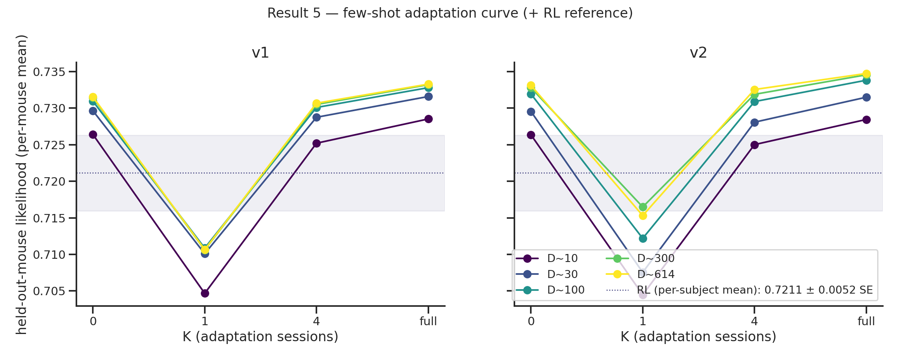
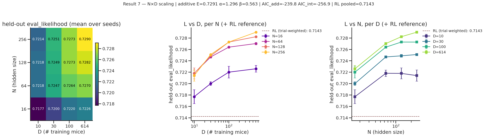
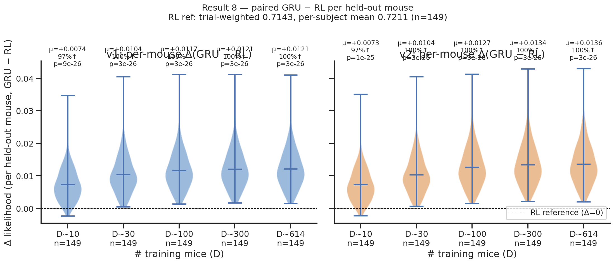

# Data-scaling law — does training on more mice (and session conditioning) help held-out-mouse generalization?

**TL;DR.** Training on more mice improves prediction of *unseen* mice, but the gain **saturates by ~100 mice** and the absolute ceiling is low — per-trial L/R choice likelihood is near a **predictability ceiling**. Session conditioning (v2) is neutral-to-slightly-negative at small D, then adds a **small, highly-significant gain that grows with D** (robust from D≈100); ~¾ of that gain persists on mature-only sessions, so it's mostly *not* a curriculum-stage artifact. The population-mean ("average mouse") already predicts a new mouse to within ~0.3% of full adaptation, so per-mouse few-shot adaptation is **not** where scale pays off. Effects are tiny per-trial but, being consistent across ~149 mice, are real evidence (a +0.001 per-trial-normalized LL ≈ ~2× per-session likelihood ratio). **The population GRU beats a per-mouse classical RL baseline (Bari L1F1_CK1) by +0.0136 at D=614 (100% of mice, Wilcoxon p~3e-26) — ~10× the SC effect and the dominant signal in this study** (Result 8). **Verdict: this metric does not validate "big data ⇒ materially better foundation model" on its own; the headroom bets are richer outputs (3-way ignore, lick/RT) and OOD transfer — but the GRU's win over per-mouse RL is a substantial separate result.**

Generated 2026-06-23 · W&B: https://wandb.ai/AIND-disRNN/mice_data_scaling

## Design
GRU H128, scalar session conditioning. **v1** = SC never engaged (early-stopped in pretrain, λ=0); **v2** = λ-forward (full SC @50k) + gated early-stop @70k. Swept **D = #training mice** (10/30/100/300/614) × 3 seeds; held-out cohort **fixed** (~149 mice). v1 and v2 use the **identical** mice per (D, seed) → matched-pair comparison. y = held-out fine-tune+test likelihood (per-trial normalized).

## Result 1 — held-out scaling curve (cell-level, n=15 matched pairs)

| D | v1 (SC off) | v2 (SC on) | Δ(v2−v1) |
|---|---|---|---|
| 10 | 0.7219 | 0.7218 | −0.00006 |
| 30 | 0.7250 | 0.7249 | −0.00011 |
| 100 | 0.7262 | 0.7273 | +0.00104 |
| 300 | 0.7267 | 0.7280 | +0.00137 |
| 614 | 0.7268 | 0.7282 | +0.00148 |

Paired across 15 cells: mean Δ=**+0.00074**, 12/15 positive, paired t p=**0.0015**, Wilcoxon p=**0.0043**. Curve is saturating over this D range. RL reference (trial-weighted pooled **0.7143**, dashed line on figure) is below every GRU cell — see Result 8 for the paired test.

## Result 2 — per-held-out-mouse repeated measures (n=149 mice/D, paired by mouse)

| D | mean Δ | median Δ | % mice improved | Wilcoxon p |
|---|---|---|---|---|
| 10 | −0.00007 | −0.00008 | 34% | 3.2e-06 |
| 30 | −0.00010 | −0.00010 | 36% | 3.3e-04 |
| 100 | +0.00102 | +0.00096 | 85% | 1.3e-20 |
| 300 | +0.00135 | +0.00124 | 93% | 7.5e-24 |
| 614 | +0.00146 | +0.00138 | 95% | 1.5e-24 |

Per-mouse pairing makes the effect overwhelmingly significant (p~1e-20–1e-24) and shows the shape: **neutral-to-slightly-negative at small D** (D=10: 34% improve), then robustly positive and increasing (85%→95% as D 100→614). The small-D per-mouse Δ matches the independent cell-level aggregate (both ≈−0.0001 at D=10) — a consistency check.

> **Dedup note.** Offline per-subject re-runs had duplicate runs for 10/30 (variant,ratio,seed) cells (validation + mass-launch + BLAS retries); `build_report.py` keeps one run/cell. This corrected D=10 from a spurious +0.00031/68% (double-counted v1 seed-0) to −0.00007/34%; large-D unchanged. The cell-level test (Result 1) was never affected.

## Result 3 — bootstrap CIs on the scaling shape (resample 149 held-out mice ×1000)
Per-mouse-mean LL (equal-weight; differs from the trial-weighted Result 1 levels). Within-cohort increments are tight even though absolute per-D levels aren't (mice vary in predictability).

| quantity | v1 | v2 |
|---|---|---|
| frac of total gain by D=100 | 0.90 [0.89, 0.91] | 0.85 [0.84, 0.87] |
| late gain D=100→614 | +0.00049 [+0.00042, +0.00056] | +0.00092 [+0.00084, +0.00100] |

Both late-gain CIs **exclude 0** → not perfectly saturated; a small real slope persists (≈2× larger under SC). A saturating fit `L = L∞ − A·D^−α` (seed-averaged) gives **v1: L∞=0.727, α=0.88** (asymptote essentially reached by D=614) and **v2: L∞=0.729, α=0.52** — SC's shallower exponent means it keeps rising, with the asymptote ~+0.001 above the observed D=614, echoing v2's ~2× late slope. **~85–90% of the data benefit is captured by ~100 mice.** The residual is small per-trial but statistically real and, per the per-session compounding (below), genuine evidence — just headroom-poor on this metric.

## Result 4 — zero-shot vs adapted held-out generalization

Zero-shot = held-out mouse assigned the **population-mean embedding**, no adaptation. Adapted = embedding fine-tuned on ~half its sessions (test on the other half). Per-mouse means.

| D | v1 zero | v1 adapt | gap | v2 zero | v2 adapt | gap |
|---|---|---|---|---|---|---|
| 10 | 0.7264 | 0.7285 | +0.0021 | 0.7264 | 0.7285 | +0.0021 |
| 100 | 0.7309 | 0.7328 | +0.0019 | 0.7319 | 0.7338 | +0.0019 |
| 614 | 0.7315 | 0.7333 | +0.0018 | 0.7331 | 0.7347 | +0.0016 |

- **Adaptation buys ~+0.002 and the gap is flat across D** — the "average mouse" already predicts a new mouse to within ~0.3% of full adaptation. Subject-specific adaptation barely matters ⇒ few-shot efficiency is unlikely to be the scaling win.
- **Zero-shot scales with D** (v1 +0.0051, v2 +0.0068 over D=10→614) but **saturates ~D=100**, same shape as adapted.
- **SC's large-D edge shows even at zero-shot** (v2>v1 ~+0.0016 at D=614) — the frozen shared session-conditioning generalizes better when trained on more mice.
- RL reference (per-subject mean **0.7211** ± 0.0052 SE, dotted band on figure) sits **below the zero-shot GRU curve at every D ≥ 30** — even a brand-new mouse with only the population embedding beats fitting that mouse's own data with a per-mouse Q-learner (see Result 8 for the paired test).

## Result 5 — few-shot adaptation curve (K = # new-mouse sessions used to adapt)

| var | D | K=0 (zero) | K=1 | K=4 | K=full(~8) |
|---|---|---|---|---|---|
| v1 | 10 | 0.7264 | 0.7047 | 0.7252 | 0.7285 |
| v1 | 614 | 0.7315 | 0.7107 | 0.7307 | 0.7333 |
| v2 | 614 | 0.7331 | 0.7153 | 0.7326 | 0.7347 |
(all 10 cells show the same shape)

**Non-monotonic:** K=1 craters LL by ~−0.02 (a 4-dim embedding overfits one session at 500 steps/lr=1e-3), recovers to ≈zero-shot by K=4, only exceeds zero-shot at K=full (+~0.002). The dip is **D- and variant-independent** (protocol property, not scale). Caveat: largely a **protocol artifact** (no L2-to-mean / early-stop / lr-scaling for small K) — a tuned few-shot likely wouldn't crash. *(Mature-only few-shot in progress to test whether the crash is also driven by adapting on naive early-stage sessions.)* RL reference (per-subject mean **0.7211**) is shown on the figure for scale — even the K=1 crash floor (~0.71) is close to the RL band, and K=full sits ~+0.013 above it.

## Result 6 — SC-stage verdict (mature-only eval)
Tests "is SC's benefit just accounting for curriculum/early-stage heterogeneity?" Re-ran held-out *adapted* on **mature sessions only** (STAGE_FINAL/GRADUATED) using the same all-stage-trained checkpoints (cohort 149→117; mature LL higher, ~0.745, as mature behavior is more predictable).

| D | Δ(v2−v1) all-stage | Δ mature-only |
|---|---|---|
| 100 | +0.00102 | +0.00073 |
| 300 | +0.00135 | +0.00106 |
| 614 | +0.00146 | +0.00116 |

Large-D mean v2−v1: **+0.00128 (all-stage) → +0.00098 (mature) = ~23% shrinkage** (mature still p~1e-15). **So ~¼ of SC's benefit was the early-stage heterogeneity (the design rationale was partly real), but ~¾ persists on mature animals → SC mostly captures general session structure (within-mature drift / within-session non-stationarity), not just training stage.** (Eval-level test; models still trained all-stage. A definitive "retrain mature-only" test is deprioritized given this.)

## Result 7 — N × D joint scaling grid (Chinchilla-style)

*Heatmap and paired slices through the N×D grid. D saturates by ~100 mice at each hidden size, while the fixed-D N gain grows modestly from D=10 to D=614.*

Grid: N (hidden_size) ∈ {16, 64, 128, 256} × D ∈ {10, 30, 100, 614} × 3 seeds (16 (N,D) cells). H128 column re-used from `v2-sc-active`; D=30 for H16/H64/H256 comes from the g6e gap-fill. Metric: aggregate `heldout/final/eval_likelihood` across the same fixed held-out mouse set (~149 mice).

Mean L grid (held-out eval likelihood):

| N | D=10 | D=30 | D=100 | D=614 | Δ (D100→D614) | frac of D-gain by D=100 |
|---|---|---|---|---|---|---|
| 16 | 0.7177 | 0.7200 | 0.7220 | 0.7226 | +0.0006 | 88% |
| 64 | 0.7218 | 0.7247 | 0.7264 | 0.7270 | +0.0006 | 88% |
| 128 | 0.7218 | 0.7249 | 0.7273 | 0.7282 | +0.0009 | 85% |
| 256 | 0.7214 | 0.7251 | 0.7273 | 0.7290 | +0.0017 | 77% |

- *D saturates by ~100 across every N tested* (mean 85% of D-gain captured by D=100). Saturation is *not* a hidden-size artifact — it persists from H=16 to H=256.
- *N-axis gain at fixed D grows weakly with D* (Chinchilla-style interaction). N=16→256 gain: +0.0037 at D=10, +0.0064 at D=614 (1.7×). Qualitative support for an N×D synergy, but absolute magnitudes are small (<0.01 nats/trial).
- Additive fit `L = E + A·N^{-α} + B·D^{-β}`: E≈0.729 (single irreducible floor), α≈1.30 (N), β≈0.56 (D); N-axis dominates within this grid.
- Interaction-term fit ΔAIC vs additive: -17.1; log-log interaction p=0.311. Treat the nonlinear interaction fit as descriptive because the grid remains small relative to the number of fit parameters.
- *Verdict*: same predictability ceiling story as Result 1; adding D=30 fills the low-data bend but does not by itself create new headroom. RL reference (trial-weighted pooled **0.7143**, dashed line on slice panels) sits below every (N, D) cell. See `nxd_scaling_verdict.md` for the fit details.

Source W&B groups: `nxd-grid@20260623-102649`, `nxd-grid@20260624-141106`, `v2-sc-active@20260622-144622`.
## Result 8 — paired GRU vs per-mouse RL on the same 149 held-out mice

RL reference: classical Bari Q-learning (`ForagerQLearning` L1F1_CK1 — 1 learn-rate, 1 forget-rate, 1-step choice kernel, softmax), one differential-evolution fit per held-out mouse on its train sessions, scored on its eval sessions. Same fixed n=149 cohort and eval sessions as the GRU (1.01M eval trials). Group `rl-baseline-simple@20260624-171829`, run `cdq292n5`. Aggregates: trial-weighted pooled LL **0.7143**, per-subject mean **0.7211** ± 0.0052 SE, median 0.7305. Per-curriculum (n=149): Uncoupled Baiting 71 (0.725), None 32 (0.683), Mixed 27 (0.733), Uncoupled Without Baiting 17 (0.773), Coupled Baiting 2 (0.613) — RL underperforms most on `None` (early-stage, less structured behavior).

Paired GRU mean (over 3 seeds) minus per-mouse RL, per (variant, D):

| variant | D | GRU mean | RL mean | meanΔ (GRU−RL) | %GRU wins | Wilcoxon p |
|---|---|---|---|---|---|---|
| v1 | 10  | 0.7285 | 0.7211 | +0.00738 | 97% | 9.0e-26 |
| v1 | 30  | 0.7316 | 0.7211 | +0.01045 | 100% | 3.4e-26 |
| v1 | 100 | 0.7328 | 0.7211 | +0.01166 | 100% | 3.4e-26 |
| v1 | 300 | 0.7332 | 0.7211 | +0.01206 | 100% | 3.4e-26 |
| v1 | 614 | 0.7333 | 0.7211 | +0.01214 | 100% | 3.4e-26 |
| v2 | 10  | 0.7285 | 0.7211 | +0.00731 | 97% | 9.8e-26 |
| v2 | 30  | 0.7315 | 0.7211 | +0.01035 | 100% | 3.4e-26 |
| v2 | 100 | 0.7338 | 0.7211 | +0.01268 | 100% | 3.4e-26 |
| v2 | 300 | 0.7346 | 0.7211 | +0.01342 | 100% | 3.4e-26 |
| v2 | 614 | 0.7347 | 0.7211 | +0.01360 | 100% | 3.4e-26 |

- **GRU beats per-mouse RL at every (variant, D) cell, including D=10.** A population GRU trained on as few as 10 other mice predicts a new mouse better than fitting *that same mouse's own data* with a classical Q-learner (97% of mice, p~1e-25). This is strong evidence the GRU exploits cross-mouse structure that per-mouse RL cannot.
- **Large-D gain over RL is the dominant signal in this study.** v2 D=614 vs RL: +0.0136 per mouse (100%, p=3e-26) — **~9× the v2−v1 SC effect (+0.0015)** and **~2× the within-GRU D=10→614 gain (+0.0063)**. The population-vs-per-mouse cognitive-model gap dwarfs both session conditioning and within-GRU data scaling.
- **SC's incremental win over RL is consistent with Result 1.** v2 D=614 beats RL by +0.0136; v1 D=614 by +0.0121 → v2 adds +0.00146 over v1, matching the matched-pair v2−v1 SC effect.

**Caveats** (also in `rl_baseline_verdict.md`): (a) the RL baseline has **no D-axis** — it is a per-mouse independent fit, not a population model; this tests "GRU vs classical RL on the same data" (yes), not "does more mice help a population RL?" (deferred hierarchical-Bayesian baseline; see `FUTURE_DIRECTIONS.md`); (b) **L1F1_CK1** is the simplest agent in this family — richer agents (more learn/forget rates; `ForagerLossCounting`; `ForagerCompareThreshold`) may close part of the gap; (c) single DE optimizer seed (DE is stable; add seeds [1, 2] for a tighter check).

## On effect sizes (Kevin Miller)
LL is per-trial-normalized (NL = exp(mean_t log p_t)). A *consistent* Δ=+0.001 ≈ +0.0014 nats/trial → ~0.7 nats over a ~500-trial session → **~2× per-session likelihood ratio**, compounding across sessions/mice. So the small SC / data-scaling deltas are genuine model evidence (per-mouse pairing p~1e-24 confirms), not noise — even though the metric is headroom-poor.

## Verdict
On **per-trial choice likelihood**, the system is **near a predictability ceiling**: a new mouse is predicted to ~99.7% of its adapted likelihood from the population mean; data-scaling rises fast then saturates by ~100 mice; per-mouse adaptation adds ~+0.002 (flat in D); SC adds a small, real, mostly-not-stage gain that grows with D. The **N×D joint scan (Result 7)** confirms D saturates at every N tested and the N-axis adds only a small (+0.004 to +0.006) gain that mildly grows with D — a weak Chinchilla-style interaction within this metric. **But the GRU beats a per-mouse classical RL baseline (Bari L1F1_CK1) by +0.0136 at D=614 on 100% of held-out mice (p~3e-26) — ~9× the SC effect and ~2× the within-GRU D-scaling effect (Result 8).** None of this *invalidates* the foundation-model idea — the effects are real and compound, and the cross-mouse vs per-mouse cognitive-model gap is substantial — but this **metric/task lacks the headroom** to demonstrate further big-data scaling within the GRU. The tests that could: **headroom-ier targets** — 3-way output incl. ignored trials, lick/RT modeling, OOD task/rig transfer, and **a fair-comparison population RL baseline** (hierarchical Bayesian fit with a D-axis; see `FUTURE_DIRECTIONS.md`).

## Status (2026-06-24)
Done: Results 1–6 + bootstrap + generative-validation + **N×D joint scan (Result 7)** + **simple per-mouse RL baseline (Result 8)**. In progress: mature-only few-shot (crash test), mass-generative behavioral-match-vs-D. Deferred: mature-only retrain (B); regularized few-shot; **hierarchical-Bayesian population RL** (the D-aware fair-comparison baseline).

## Provenance
Training variants: `v1-pretrain-phase@20260622-013415` (exp 01KVQ7EJ3C5YJ8FJVNJB8C8N36), `v2-sc-active@20260622-144622` (exp 01KVRMSAAJTRSJMFV5JT7JAP6X), `nxd-grid@20260623-102649`. Offline analyses (wrapper 4f29680 / few-shot knob bb4b052), one run/cell deduped: `heldout-rerun-*` (adapted), `heldout-zeroshot-*` (zero-shot), `heldout-rerun-*-fewshot-k*`, `heldout-rerun-*-mature2@` (mature), `generative-*`. RL baseline: `rl-baseline-simple@20260624-171829` (run `cdq292n5`, HPC CPU, 149 held-out mice, 1.01M eval trials). Artifacts in `analysis/` (`*.json`, `fig_*.png`, `rl_baseline.py`, `rl_baseline_verdict.md`). Report run: https://wandb.ai/AIND-disRNN/mice_data_scaling/runs/0fhvwwfu
